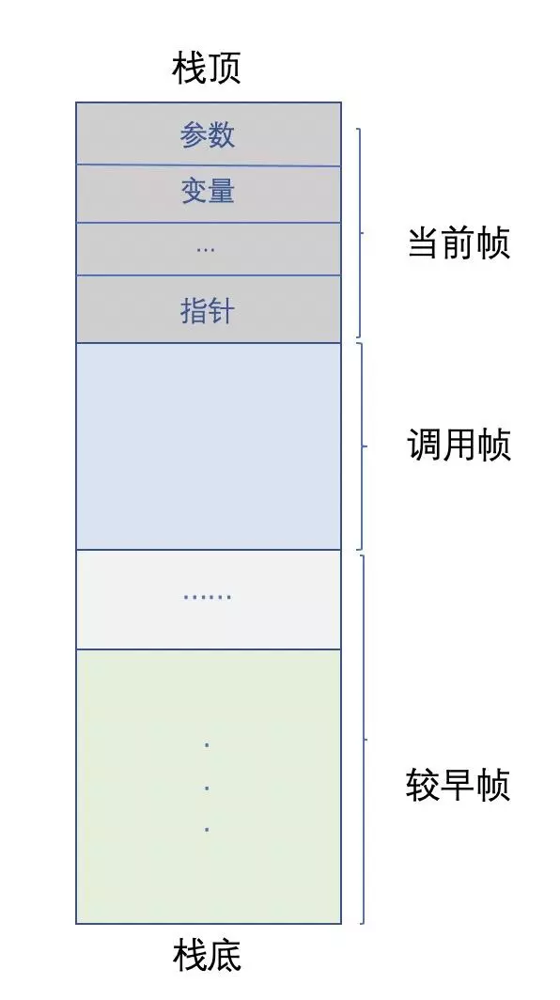
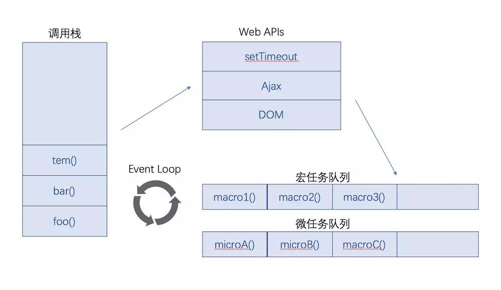

## 事件循环（EventLoop）
> 有没有想过，为什么有时候SetTimeout定时不准确？
> 
> 更新时间：2019-04-24

下面这道题，会输出什么？
```js
console.log(1)

setTimeout(() => {
    console.log(2)
}, 0)

Promise.resolve().then(() => {
    console.log(3)
    Promise.resolve().then(() => {
        console.log(4)
    }).then(() => {
        console.log(5)
    })
}).then(() => {
    console.log(6)
})

Promise.resolve().then(() => {
    console.log(7)
}).then(() => {
    console.log(8)
})

console.log(9)
```

### 1、执行栈（call stack）
当JS调用一个函数时，会产生这个函数对应的**执行上下文**（context），并把这个函数作为一个 *栈帧* 压入**执行栈**里。
> 执行上下文存放了这个函数的作用域、上层作用域的指向、函数的参数、函数中声明的变量等。



### 2、Web APIs
JS运行时是单线程，但是浏览器不是。浏览器提供了一些api供开发者使用。
 - 例如setTimeout、ajax(XMLHttpRequest)、DOM等。

### 3、宏任务（Macro Task）、微任务（Micro Task）
宏任务：当前**调用栈中、宏任务队列**中的任务。
 - 例如：主代码块（所有同步代码）、Ajax请求完毕后的回调函数、setTimeout、setInterval、setImmediate、I/O、
 - 宏任务由事件触发线程维护。

微任务：当前**微任务队列**中的任务。会在 **当前调用栈的所有任务执行完**、且在**下一个宏任务开始前**需要执行的任务。
 - 例如：Promise.then、catch、finally
 - 微任务队列由JS引擎线程维护。

 ### EventLoop


解释如下：
 - 1、*JS引擎* 首先会把 **主函数** 放入 `宏任务队列`（此时`宏任务队列`只有一个任务，那就是**主代码块**）
 - 2、从`宏任务队列`中取出一个`宏任务`
 - 3、从上往下执行。
    - 如果遇到`同步代码`，直接执行、输出
    - 如果遇到setTimeout之类的`宏任务`，将其进`宏任务队列`
    - 如果遇到Promise.then之类的`微任务`，将其送进`微任务队列`
 - 4、`当前执行栈中`的`宏任务`全部执行完毕，执行栈为空。*JS引擎* 会去检查`微任务队列`是否有任务在排队
 - 5、执行`微任务队列`中的`微任务`（先进先出）
 - 6、`微任务队列中`的`微任务`全部执行完毕，本轮事件循环结束
 - 7、回到第2步，检查`宏任务队列`中是否有未执行的`宏任务`，继续下一轮循环

注意：`Ajax请求完毕后`触发的回调函数会进入`宏任务队列`


参考链接：[JavaScript的Event Loop机制](https://www.jianshu.com/p/87a9e0068dd8)