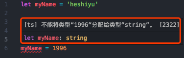
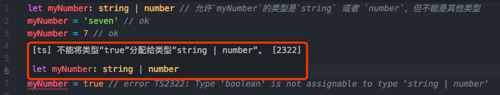
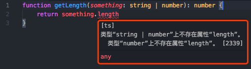
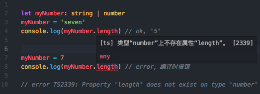

# 类型推论 && 联合类型

## 类型推论（Type Inference）
TypeScript和JavaScript不同，它有着 `这个变量能存 什么样类型 的数据`这个约束。

如果在声明变量时，没有明确指定类型，那么TypeScript会依照 `类型推论（Type Inference）`的规则推断出一个类型

（最差情况就是`any`）

```ts
let myName = 'heshiyu'
// 等价于：
// let myName: string = 'heshiyu'
myName = 1996

// error T2322: Type 'number' is not assignable to type 'string'
```


TypeScript会在没有明确地指定类型的时候推断出一个类型，这就是 **类型推论**。

 - 特别注意：如果声明时没有赋值，那TypeScript就不知道如何推断，那么都会推断成`any` 类型**（将完全不被类型检查）**：
 ```ts
 let myName
 // 等价于：
 // let myName: any
 myName = 'heshiyu'
 myName = 1996
 ```

## 联合类型（Union Types）
如果有些变量不确定为 **多类型里的哪一种**，那可以用联合类型。
```ts
let myNumber: string | number // 允许`myNumber`的类型是`string` 或者 `number`，但不能是其他类型
myNumber = 'seven' // ok
myNumber = 7 // ok
myNumber = true // error TS2322: Type 'boolean' is not assignable to type 'string | number'
```


联合类型使用 `|` 分割每个类型。

### 访问联合类型的属性（或方法）
当TypeScript不确定一个联合类型的变量到底是哪个类型的时候，我们只能访问此联合类型的`所有类型里的共有属性或方法`
```ts
function getLength(something: string | number): number {
    return something.length
}

// error TS2339: Property 'length' does not exist on type 'string | number'
```


因为`length`不是`string`和`number`的共有属性，所以会报错。

访问`something.toString()`是没问题的。
### 赋值时会推断出一个类型
联合变量的变量在`被赋值`的时候，会根据`类型推论（Type Inference）`规则推断出一个类型：
```ts
let myNumber: string | number
myNumber = 'seven'
console.log(myNumber.length) // ok, '5'

myNumber = 7
console.log(myNumber.length) // error，编译时报错

// error TS2339: Property 'length' does not exist on type 'number'
```


 - 注意：**每赋值一次，就（从多种类型中）推断出一次最新的**


### 参考链接
 [类型推论——xcatliu](https://ts.xcatliu.com/basics/type-inference.html)

 [联合类型——xcatliu](https://ts.xcatliu.com/basics/union-types.html)
