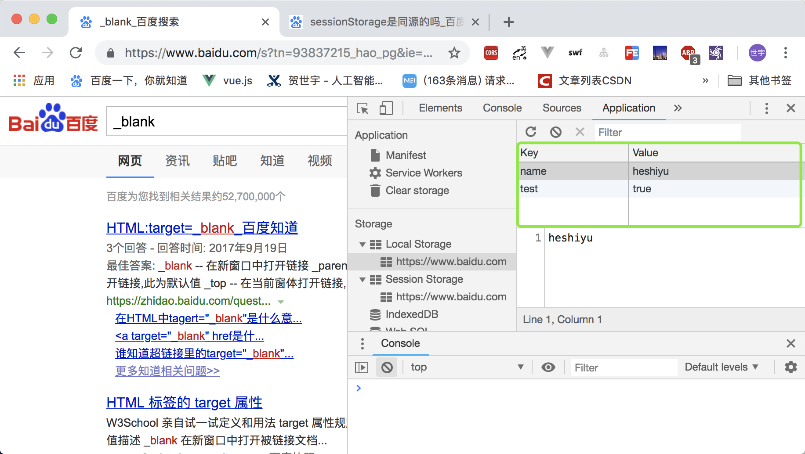
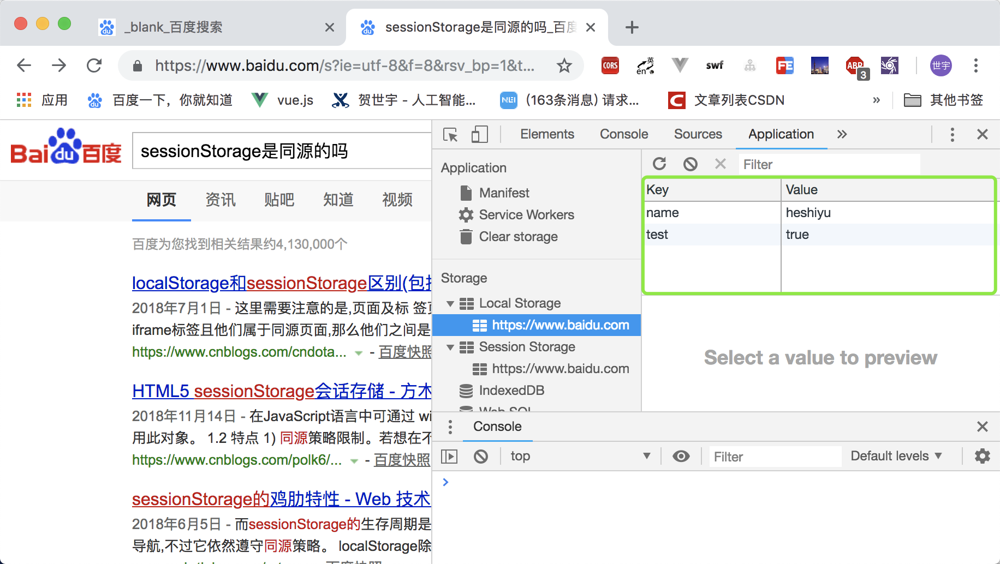
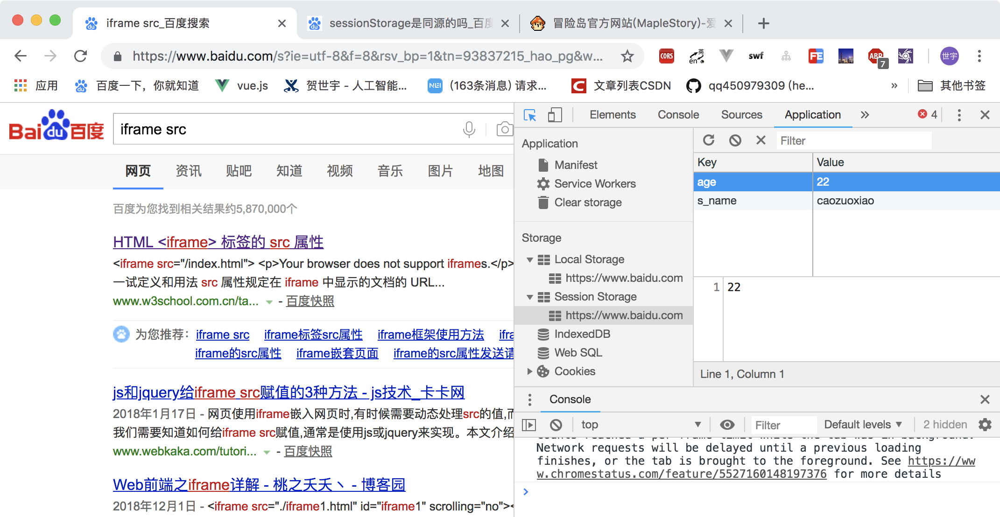
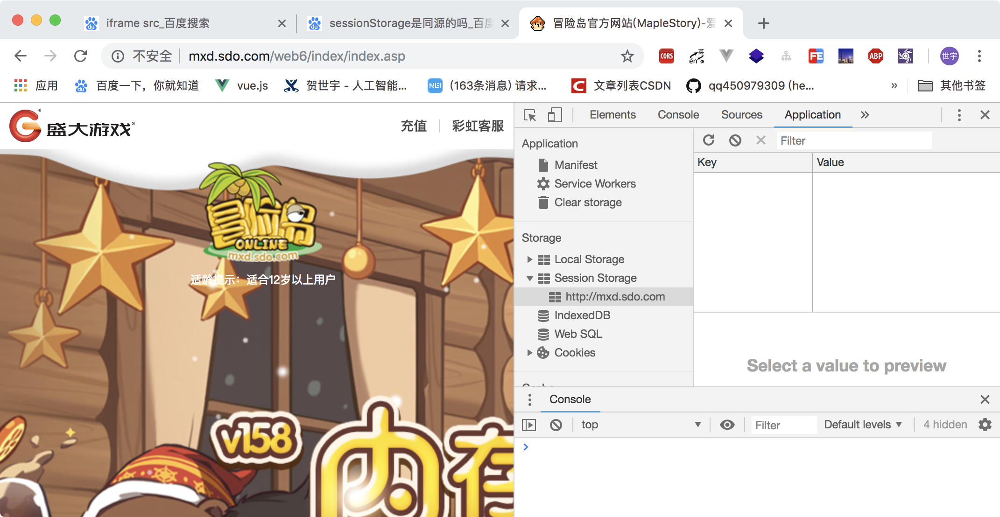
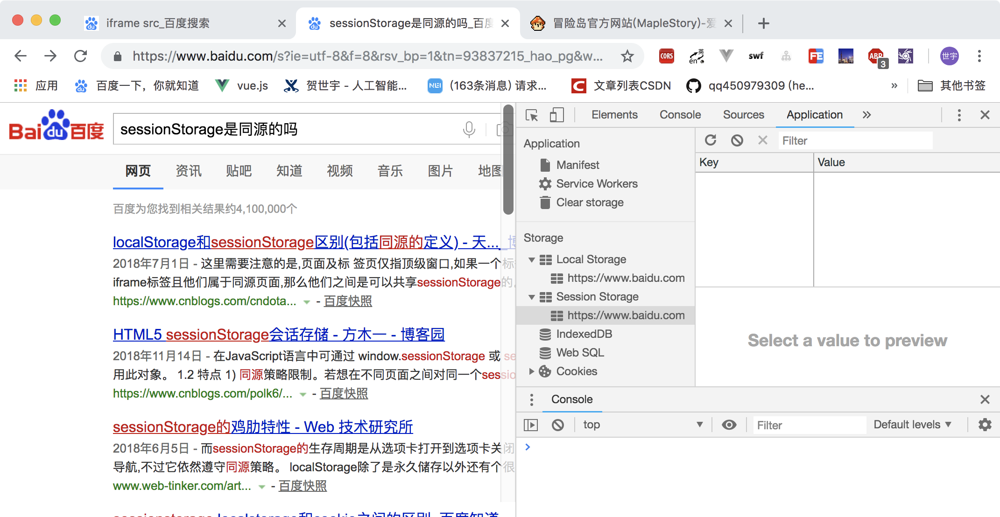

## web Storage
> 平时我们讲的HTML 5本地存储，多指的是web Storage
> 
> 更新时间：2019-01-13

我是导航条：

-> [API](#API)

-> [localStorage](#localStorage)

-> [sessionStorage](#sessionStorage)

-> [cookie](#cookie)

-> [localStorage、sessionStorage、cookie的区别](#localStorage、sessionStorage、cookie的区别)

-> [localStorage、sessionStorage、cookie的区别同源的规则判断](#同源的规则判断)

-> [图示](#图示)

### API
 - setItem(key, value)
    - 保存数据
 - getItem(key)
    - 获取数据
 - removeItem(key)
    - 删除单个数据
 - clear( )
    - 删除所有数据

### localStorage
#### 生命周期：永久。
即使关闭浏览器，也不会让数据消失（除非主动删除数据）

#### 大小：5MB。

#### 用法
```js
localStorage.setItem('name', 'heshiyu')
localStorage.getItem('name') // 'heshiyu'
localStorage.removeItem('name')
localStorage.clear()
```

### sessionStorage
#### 生命周期：浏览器关闭前。
即在整个浏览器未关闭前，其数据都是一直存在的。

#### 大小：5MB。

#### 用法
和localStorage类似

#### 特殊之处
 - 同一个浏览器、不同的Tab的sessionStorage各自独立（详见下方图示）
 - 同一Tab下的同源页面（即多个iframe）可以访问同一个sessionStorage
 - 页面刷新不会删除数据

### cookie
每次HTTP请求都会携带。
#### 生命周期：设置的过期时间内。
就算窗口或浏览器关闭，只要在设置的cookie过期时间内，都一直有效。

#### 大小：每个4KB，且一般不能超过20个

#### 用法
```js
// 设置cookie（expires是有效期）
document.cookie = 'name=' + myName + ';age=' + myAge + 'expires=' + exp.toGTMString()

// 读取cookie
let data = document.cookie // 然后按照需要，找到指定的key来分割
// 假设cookie的内容为：name=heshiyu;age=22;expires=Thu, 18 Dec 2043 12:00:00 GMT
let getName = document.cookie.split(';').split('=')[1]

// 修改cookie 类似于创建cookie

// 删除cookie 只需设置expires的时间为“已过期的时间”即可（此时浏览器关闭时会删除）
```

### localStorage、sessionStorage、cookie的区别
#### 共同点：
 - 都是保存在浏览器端、且同源（是按url归类）的
 - 均只能存储字符串类型

#### 区别：
 - 【大小】cookie大小不超过4KB（只适合保存很小的数据，如会话标识）；sessionStorage和localStorage有5MB或更大；
 - 【发送方式】
    - cookie数据始终在同源的http请求中携带（即使用不到）；
    - sessionStorage和localStorage不会自动把数据发送给服务器；
 - 【指定路径】cookie有路径（path）概念，可以限制cookie只属于某个路径下
 - 【有效期】
    - localStorage：始终有效；
    - sessionStorage：尽在当前浏览器窗口关闭前有效；
    - cookie：在过期时间前都有效（即使浏览器窗口关闭也不影响）；
 - 【事件通知】支持事件通知机制，可以将数据更新的通知发送给监听者
 - 【作用域】（具体图示见下方）
    - 同一浏览器、不同页面、只要同源，localStorage都可以共享；[图示](#图示)
    - 同一浏览器、不同页面（或同源但处于不同标签页），sessionStorage无法共享；[图示](#图示)
    - 同一标签页、带有多个属于同源页面iframe，这些iframe的sessionStorage可以共享

 ### 同源的规则判断
 ```
 http://www.test.com

 http://www.test.com:8080（不同源：端口不同）

 https://www.test.com（不同源：协议不同）

 http://my.test.com（不同源：主机名不同）
 ```

### 图示
#### 同一浏览器、不同页面、只要同源，localStorage都可以共享



#### 同一浏览器、不同页面（或同源但处于不同标签页），sessionStorage无法共享



