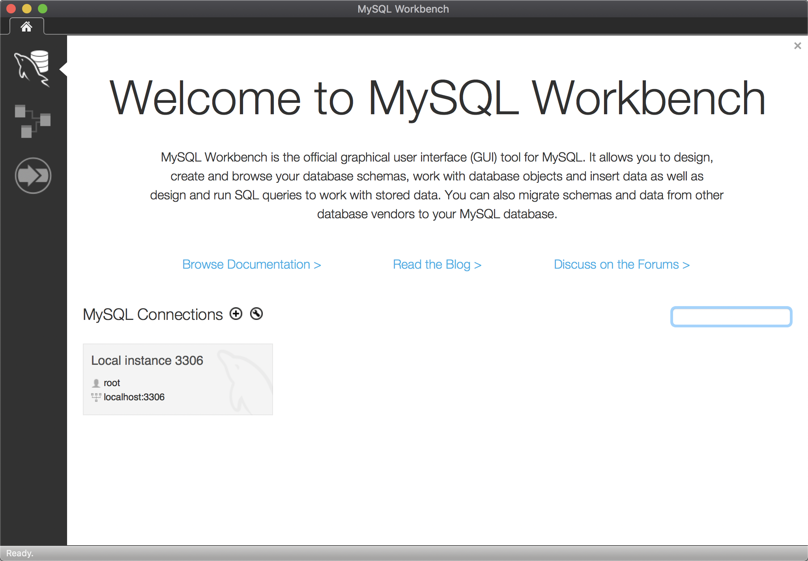
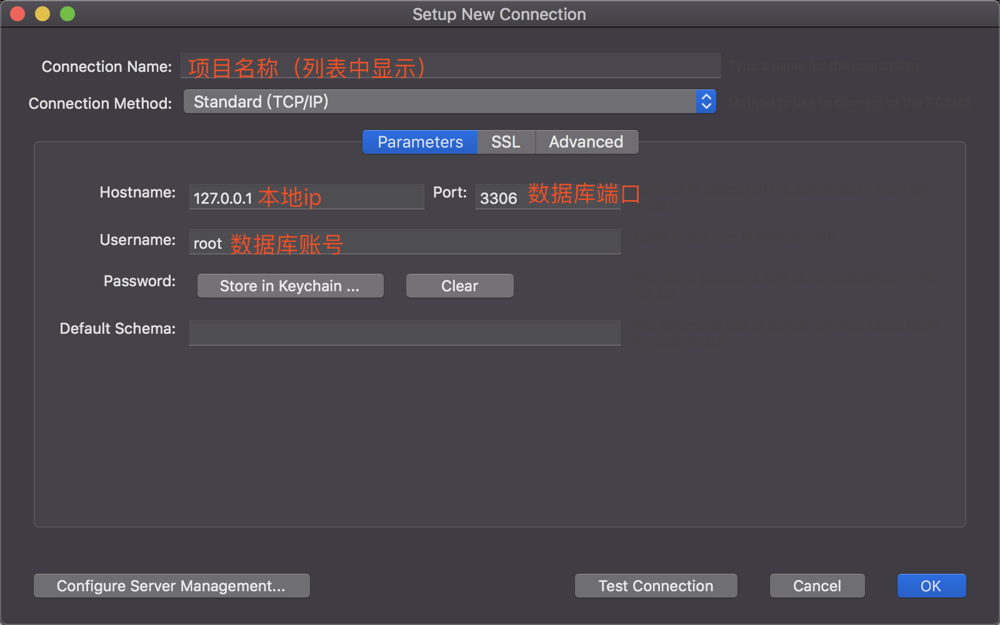
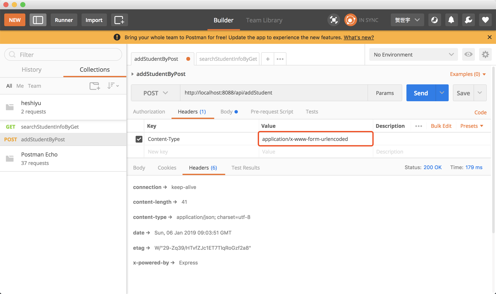
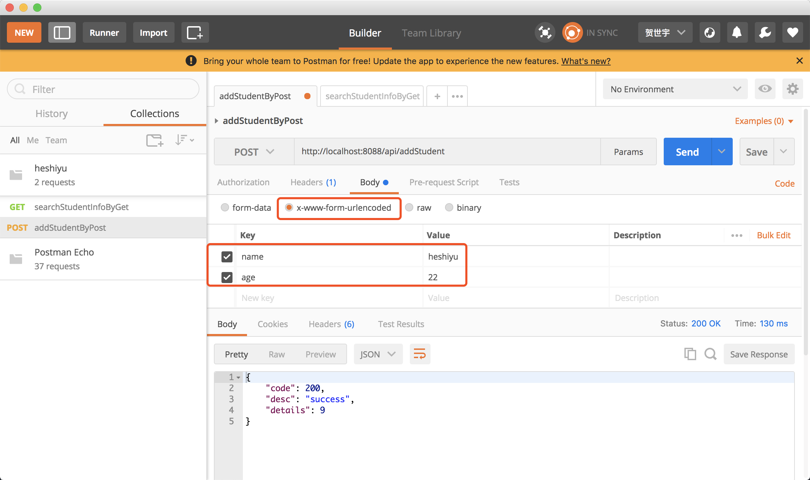
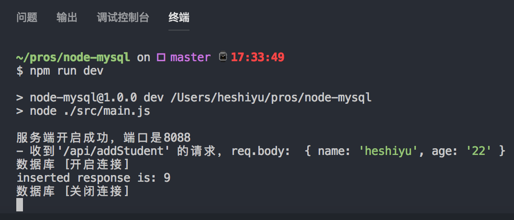

## Node-MySQL
> 很早之前就知道nodeJS也可以写后台，而且也有很成熟的http框架。也想自己搭建一个服务器来访问自己的本地数据库，平时可以联调下post请求之类的
> 
> 更新时间： 2019-01-06

我是导航条：
[准备工具](#准备工具) -> [安装MySQL](#安装MySQL) -> [安装WorkBench](#安装WorkBench) -> [在Node.js中的写法](#Node.js中的写法) -> [Postman的使用](#Postman的使用)

### 准备工具
 - Node.js
 （http://nodejs.cn/download/）
 - Mysql
 （https://dev.mysql.com/downloads/mysql/）
 - WorkBench
 （https://dev.mysql.com/downloads/workbench/）
 - Postman
 （https://www.getpostman.com/apps）


### 安装MySQL
1、打开dmg，一直下一步。注册本地数据库的账号、密码；

2、开启Mysql，在“系统偏好设置” - “mysql” - “start Mysql server”；

3、将Mysql加入系统环境变量，否则会提示“mysql commod not found”
```js
// 进入mysql的bin文件夹
cd /usr/local/mysql/bin

// 编辑环境变量文件
vim ~/.bash_profile

// 加入以下语句
PATH=$PATH:/usr/local/mysql/bin

// 使其生效
source ~/.bash_profile
```
4、修改密码：
```js
SET PASSWORD FOR 'root'@'localhost' = PASSWORD('newpass');
```
### 安装WorkBench
打开dmg，一直下一步。一般会自动扫描你本地的mysql版本，如果没有，就点击“+”，并填入刚刚注册的数据库账号密码



### Node.js中的写法
#### 准备的npm包
```json
  "dependencies": {
    "body-parser": "^1.18.3",
    "cookie-parser": "^1.4.3",
    "express": "^4.16.4",
    "multer": "^1.4.1",
    "mysql": "^2.16.0"
  }
```
#### 大致思路
1、引入express、body-parser中间件、数据库连接模块

2、实例化express对象，并对其进行body-parser注册

3、对实例进行操作

4、最后执行实例的listen方法，并制定监听的端口

（项目代码：https://github.com/qq450979309/node-mysql）

#### 注意的点
 - 如果没有注册body-parser，那将`req.body`将是 **undefined** 的

### Postman的使用
#### 以Post为例
1、设置请求的Headers，`Content-Type`设置为`application/x-www-form-urlencoded`


2、设置请求的Body的key/value，并将body的类型设置为`x-www-form-urlencoded`


3、可以从本地node服务器接受到来自postman的请求，并且通过`req.body`可以拿到参数
