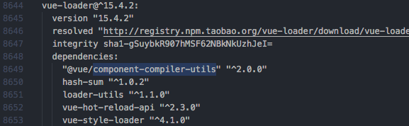
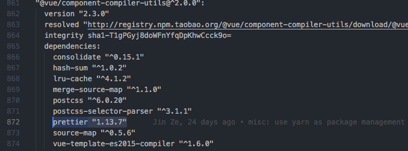
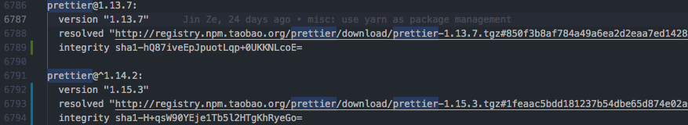

## 在Vue里用Prettier为什么这么难！
> Prettier
### 使用vue-cli 3.0内置的prettier
```json
// package.json

"devDependencies": {
    "@vue/eslint-config-prettier": "^3.0.1"
}
```
*希望代码实施保存时校验：*
```js
// .eslintrc.js

extends: ['@vue/prettier']
```
不足：
有坑

因为vue-loader有规定的prettier版本（可能比目前的低）：





所以可能会出现`实时保存的校验`跟`yarn run format`的规则不一致。比如`实时保存`是prettier(v.1.15.3)的规则，但`yarn run format`让你回到prettier(v1.13.7)的规则。（我也不知道为啥是这样啊……）

因为yarn会安装package.json里面所有可能出现的包？（包括script里面用到的，因为我尝试删除scripts里含有prettier语句的format脚本就不会有两个版本的prettier了）于是就有了两个prettier：



所以不推荐使用vue-cli 3.0内置的prettier。

### （推荐！）使用单独的prettier
```json
"devDependencies": {
    "prettier": "^1.14.2",
}
```
*希望代码实施保存时校验：*
```json
// package.json

"devDependencies": {
    "eslint-plugin-prettier": "^3.0.0"
}
```
```js
// .eslintrc.js

plugins: ['prettier'],

rules: {
    "prettier/prettier": "warn"
}
```
------
说下之前的项目情景：

1、之前一直用的是vue-cli 3.0内置的prettier、同时一起的也有用单独的prettier包（我也没发现当时居然引入了两个prettier！而且2018-11-07才发布1.15.0，之前是1.14.x。前者支持vue的格式化），当时也有配置了 **提交前代码格式化**的判断：
```json
// package.json

"scripts": {
    "precommit": "npm run format && npm run lint && git add .",
    "format": "prettier --write './src/**/*.{js,vue,json}'",
},
"devDependencies": {
    "husky": "^0.14.3",
    "@vue/eslint-config-prettier": "^3.0.1",
    "prettier": "^1.14.2",
}
```
```js
// .eslintrc.js

extends: ['plugin:vue/essential', 'eslint:recommended', '@vue/prettier'],
```

这样的效果是，git提交前会通过`prettier`来进行代码格式检查，如果检查不通过，**会不允许你push**！！（和我们当时的husky的配置有关）！

2、后来泽哥推荐使用yarn来安装依赖包，随后廖峭发现项目引入了两个prettier，就**删除了vue-cli 3.0内置的prettier**，去掉了 **.eslintrc里的extends** ，并更新了 **husky** 的版本
```json
"husky": {
    "hooks": {
      "pre-commit": "npm run format && npm run lint && git add ."
    }
},

"dependencies": {
    "husky": "^1.1.3",
}
```
3、之后的代码实时保存没有了任何的提示。理由很简单，因为没有将`eslint`和`prettier`结合起来。但是这版本的配置有个优点就是，husky会**自动格式化好代码**，然后 **自动** 再提交到git上。同时会影响到vue的template（2018-11-07发布prettier 1.15.0发布的新特性）

4、目前，我安装了`eslint-plugin-prettier`，并把`prettier`加入到了`.eslintrc.js`的`plugins`、`rules`中（详见下面代码）。所以现在不仅可以**保存实时校验**，也可以做到**提交前校验代码并自动修正**（因为自动修正，所以不会阻拦提交）了
```json
// package.json
"devDependencies": {
    "eslint-plugin-prettier": "^3.0.0"
}
```
```js
// .eslintrc.js
plugins: ['prettier'],

rules: {
    "prettier/prettier": "warn"
}
```

最后，建议项目里单独使用`prettier`包。如果希望保存时校验，就在`.eslintrc.js`的`plugins`、`rules`加入就行。