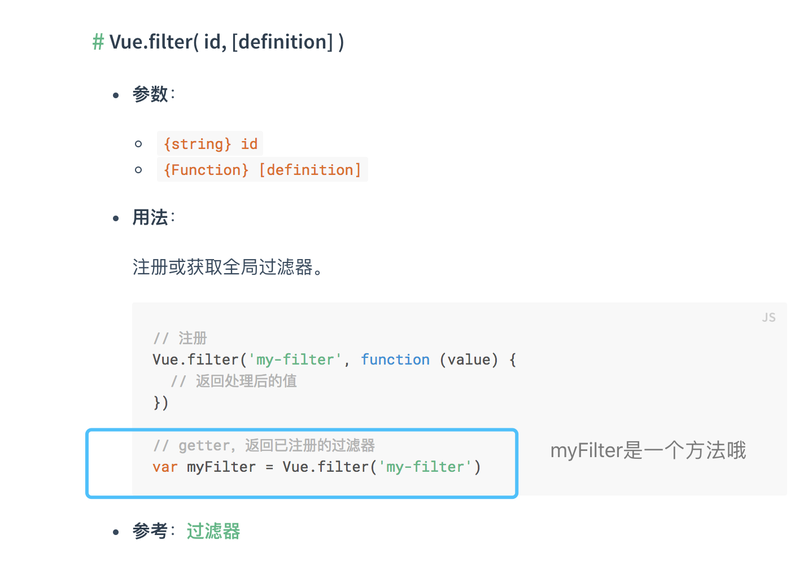

## Skill
> 平时做项目的时候经常会碰到一些零散的小技巧！虽然不成体系，也不知道收纳到哪里才好，也想记录下来，那就都先放在这里吧！
> 
> 更新时间：2019-01-06

### vuelidate
`vuelidate`是一款很轻量的校验框架。其中的`helpers.req()`让我经常弄不懂，总结一下：

#### helpers.req()
 - helpers.req(value)：表示`未填时，为false`，`填了才为true`（**作用和required一样**）
 - !helpers.req(value)：表示`未填时，为true`，`填了会为false`，此时要**搭配后面一个条件才为true**（**作用和可选一样**）。
    - 例如：`return !helpers.req(value) || value.length > 2`，它表示：未填时，为true；但一旦填了，那就要长度大于2才为true了

### console.assert()
`console.assert()`是断言工具函数。

使用方法：
```js
console.assert(5 === 3, '前面的不成立啦！')
// Assertion failed: 前面的不成立啦！
```
类型讲解：

`console.assert(expression, errorTip)`
 - 参数1：
    - 类型：`Boolean`
    - 要判断的 **逻辑表达式**
 - 参数2：
    - 类型：`String`
    - 错误后的提示语句

### 如何将字符串"false"转布尔值？
```js
// 明显这样是不行的：
Boolean('false') // true
Boolean('true') // true

// 可以通过这样：
JSON.parse('false') // false
JSON.parse('true') // true
```
尽管如此，还是推荐用`0代表false`，`1代表true`

```js
!!1 // true
!!0 // false
```

### git的.gitignore文件不生效解决方法
原因：新建的文件在git中会有缓存。如果某些文件已经被纳入了版本管理中（也就是上次已经成功提交过一次上去了），就算在`.gitignore`中已经声明了忽略路径也是不起作用的。所以需要把本地缓存删除，在进行`git push`
```bash
// git清除本地缓存命令
git rm -r --cached .
git add .
git commit -m "update .ignore"
```

### JS 获取DOM节点宽高与绝对位置
```js
document.getElementById('hsy').getBoundingClientRect()

{
    top: 11,
    left: 22,
    bottom: 33,
    right: 44,
    width: 55,
    height: 11
}
```

### 滑动到滚动条底部
首先要找到`overflow: scroll`的dom节点
```js
// 滚动至tbody中的最后一条，（有平滑效果）
this.$nextTick(() => {
    let tbodyDom = document.getElementsByTagName('tbody')[0]
    tbodyDom.scrollTo({ top: tbodyDom.scrollHeight, behavior: 'smooth' })
})
```

### Vue.filter的返回值可以当做方法来用


### const和map
有时候const定义常量时，需要status对应的text的话可以这样写：
```js
const TRAIN_STATUS = {
    NEW: '0',
    SUCCESS: '1',
    FAILED: '2'
}

const MAP_TRAIN_STATUS_TXT = {
    [TRAIN_STATUS.NEW]: '未训练',
    [TRAIN_STATUS.SUCCESS]: '训练成功',
    [TRAIN_STATUS.FAILED]: '训练失败',
}
```

### Vue里的v-for数组和对象
v-for ... in里对于数组和对象遍历的是不一样的
```js
// array
<div v-for="(item, index) in array"></div>

// obj
<div v-for="(val, key, index) in object"></div>
```

### Vue的data()实例选项
data实例选项里的字段只能用作初始化，而且这个初始化只能初始化静态的内容
```js
// parent.vue
<child :startTime="searchParam.startTime"></child>

data() {
    return {
        searchParam: {
            startTime: '2010-11-11'
        }
    }
},
methods: {
    // 拉取接口后，searchParam.startTime变成了'2012-12-12'
}


```

```js
// child.vue
props: [
    startTime: { type: String }
],
data() {
    return {
        // 1、startTime变化时，这里earliestDay能不能收到??答案：收不到，只是初始化
        // 2、而且，这个初始化只能是收到'2010-11-11'
        earliestDay: this.startTime
    }
}
```

### 下载时自定义文件名（?download=）
需要下载的文件要自定义文件名，可以在url后面跟一个参数`?download=我要的名字.png`

 - 如果是中文，还要担心encode问题，可以使用 `encodeURIComponent` 来转码：
```js
`https://www.baidu.com/heshiyu.png?download=${encodeURIComponent('麦当劳.png')}`
```

### package.json中的^和~
#### ~
    "vue": "~2.5.17"
    // 意思是[2.5.17, 2.6.0)

#### ^
    "jquery": "^3.3.1",
    // 意思是[3.3.1, 4.0.0)

## 文件上传(type=file)
```html
<input ref="nodeFile" type="file" name="file" @change="changeFile($event)" />

checkFile(ev) {
    let file = ev.tartget.files[0]
    if(!file) return
}
```
问题：每次上传文件时，都会将文件存放在ev.target.value中。导致当第二次选择文件时，由于两次ev.target.value相同，而不会触发change事件

解决方案：在input绑定的change事件中，在最后将ev.target.value置空，例如：
```js
ev.target.value = null
```