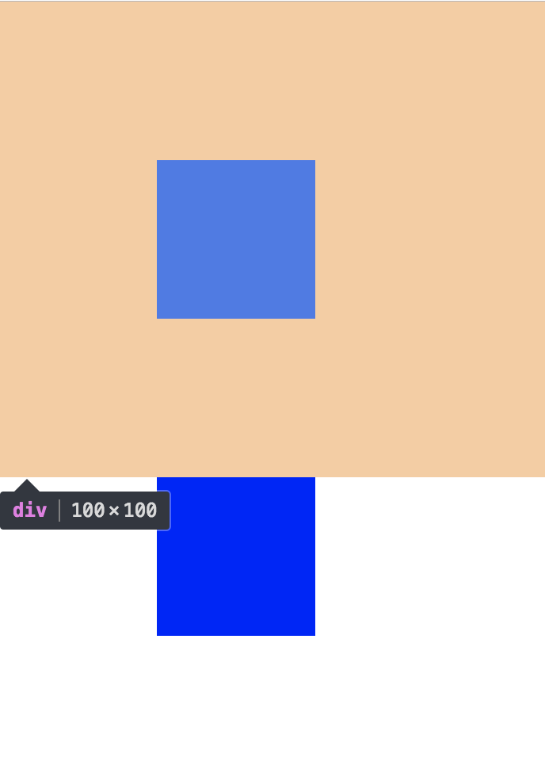
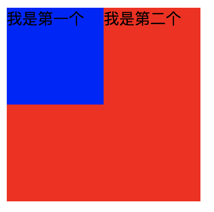
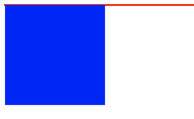

# 2019-03-14
### [css]设置元素不可见的方法
```css
/* 1 */
.child {
   display: none;
}

/* 2 */
.child {
   visibility: hidden;
}

/* 3 */
.child {
   position: absolute;
   top: -999999px;
}

/* 4 */
.child {
   opacity: 0;
}
```

### [css]网页中的布局格式
 - 标准流
   - 行内元素在同一行，块级元素上下显示
 - 浮动流
   - 脱离标准流的第一种方式，但 **会影响** 标准流的排列
 - 定位流
   - 脱离标准流的第二种方式，**不会影响** 标准流的排列

### [css]浮动是什么？
浮动的目的：**一行显示多个div元素**

规则：若元素A是浮动的：
 - 若他前一个元素也是浮动的，那会跟随前一个元素的**后边**
 - 若他前一个元素是在标准流的，那会和前一个元素的**底部对齐**

 牢记：`clear`规则只能影响`使用清除的元素本身`（**可以使xx元素的左/右边不允许出现浮动元素**）
 
 例子：
 `div1`、`div2`都是浮动的，希望做到`div2`紧跟`div1`底部对齐
 

 解决方法：
 ```css
 .div2 {
    clear: left; /* 指定 div2元素左边 不允许出现浮动元素 */
 }
 ```
 

 #### 清除浮动
  - 在父元素最后一个子元素后，再加一个子元素，属性为`clear: both;`
  - 在父元素新增伪类：
  ```css
  .parent:after {
     display: block;
     content: ' ';
     clear: both;
  }
  ```
  - 给父元素`overflow: hidden;`（利用BFC的原理）

### [css] BFC是什么？
`BFC`指的是`块级格式化上下文`，可以把BFC理解为一个封闭的大箱子，箱子内部的元素无论如何都不会影响到外部。

#### 触发BFC的条件
 - 根元素（body）
 - 浮动元素
 - 绝对定位元素（absolute、fixed）
 - display为`inline-block`、`table-cell`、`flex`
 - overflow为`hidden`、`scroll`、`auto`

 触发某元素的BFC特性 = 将某元素放到BFC容器中

#### BFC的特性及应用
 - `在同一个BFC里`的元素的`外边距`会发生重叠
 ```html
 <style>
    div {
       width: 100px;
       height: 100px;
       background: blue;
       margin: 100px;
    }
 </style>
 <body>
    <div></div>
    <div></div>
 </body>
 ```
 由下图可知，两个div元素都`处于同一个BFC容器下`（指body元素）。
 
 上一个div的`margin-bottom: 100px;`，下一个div的`margin-top: 100px;`，可看出margin是重叠过的（即两个100px只算一个）

 

 > 解决方法：为了 避免外边距（margin）重叠，可以将它们放到 `不同的BFC容器`中（每个div外包一个`overflow: hidden;`的父容器）

- `BFC`可以阻止元素`被浮动元素覆盖`
```html
 <style>
    .first {
       float: left;
       width: 100px;
       height: 100px;
       background: blue;
    }
    .second {
       width: 200px; /* 不设定宽度可以实现 两列自适应布局 */
       height: 200px;
       background: red;

       overflow: hidden; /* 该元素放在一个新的BFC容器 */
    }
 </style>
 <body>
    <div class="first">我是第一个</div>
    <div class="second">我是第二个</div>
 </body>
```
由下图可知，第一个div元素有自己的BFC容器，但是对于第二个div元素处于标准流会被覆盖。

> 解决办法：为了 阻止浮动元素（float）的覆盖，可以触发该元素的BFC特性。

 - before

 
 
 - after

 

 - `BFC`可以包含浮动的元素（即通常说的清除浮动）
```html
<style>
   .parent {
      border: 1px solid gray;
   }
   .child {
      float: left;
      width: 100px;
      height: 100px;
      background: orange;
   }
</style>
<body>
    <div class="parent">
        <div class="child"></div>
    </div>
</body>
```
 由下图可知，BFC容器内的浮动元素脱离标准流后，容器只剩下2px的边距高度。

 > 解决办法：为了 包含浮动元素（float），可以触发父元素的BFC特性

 
 