# 基础知识
转载请注明出处: [https://github.com/Heshiyu1996/blogs](https://github.com/Heshiyu1996/blogs)

- HTML部分
    - [Web-Worker](#HTMLWeb-Worker)
    - [HTML5的新语法](#HTMLHTML5的新语法)
    - [WebStorage](#HTMLWebStorage)
    - [行内元素、块级元素有哪些](#HTML行内元素、块级元素有哪些)
- CSS部分
    - [CSS3的新属性](#CSSCSS3的新属性)
    - [盒模型](#CSS盒模型)
    - [弹性盒模型](#CSS弹性盒模型)
    - [完美居中的方案](#CSS完美居中的方案)
    - [CSS定位](#CSSCSS定位)
    - [rem](#CSSrem)
    - [Css-Hack](#CSSCss-Hack)
    - [粘性定位（Sticky）](#CSS粘性定位（Sticky）)
    - [设置元素不可见的方法](#CSS设置元素不可见的方法)
    - [CSS布局格式](#CSSCSS布局格式)
    - [浮动](#CSS浮动)
    - [块级格式化上下文（BFC）](#CSS块级格式化上下文（BFC）)
    - [margin重叠问题](#CSSmargin重叠问题)
    - [z-index和position的关系](#CSSz-index和position的关系)
    - [纯CSS画三角形](#CSS纯CSS画三角形)
    - [【布局题】利用margin/padding实现宽高自适应](#CSS【布局题】利用margin/padding实现宽高自适应)
    - [三列布局的实现](#CSS三列布局的实现)
    
- JavaScript部分
    - [闭包](#JS闭包)
    - [事件委托](#JS事件委托)
    - [回调函数](#JS回调函数)
    - [设计模式](#JS设计模式)
    - [原型、构造函数、对象和原型链](#JS原型、构造函数、对象和原型链)
    - [callback、Async/Await和Promise](#JScallback、Async/Await和Promise)
    - [函数防抖、函数节流](#JS函数防抖、函数节流)
    - [call、apply、bind](#JScall、apply、bind)
    - [new操作符经历了哪些步骤](#JSnew操作符经历了哪些步骤)
    - [window对象和document对象的区别](#JSwindow对象和document对象的区别)
    - [let、var](#JSlet、var)
    - [Promise.all()的用法、异常处理](#JSPromise.all()的用法、异常处理)
    - [ES5、ES6、ES7的区别](#JSES5、ES6、ES7的区别)
    - [DOM节点的操作](#JSDOM节点的操作)
    - [JS交换两个节点的方法](#JSJS交换两个节点的方法)
    - [正则表达式](#JS正则表达式)
    - [js数组的方法](#JSjs数组的方法)
    - [去重](#JS去重)
    - [for...in和for...of](#JSfor...in和for...of)
    - [Generator函数](#JSGenerator函数)
    - [Math.floor、parseInt](#JSMath.floor、parseInt)
    - [this的指向](#JSthis的指向)
    - [Ajax](#JSAjax)
    - [DOM绑定事件的三种方式](#JSDOM绑定事件的三种方式)
    - [三种事件流模型](#JS三种事件流模型)
    - [target、currentTarget](#JStarget、currentTarget)
    - [检测变量类型](#JS检测变量类型)
    - [script标签的加载规则](#JSscript标签的加载规则)
    - [通过Object.defineProperty给对象添加属性](#JS通过Object.defineProperty给对象添加属性)
    - [扩展运算符（...）、Object.assign()](#JS扩展运算符（...）、Object.assign())
    - [模块规范一：AMD和CMD](#JS模块规范一：AMD和CMD)
    - [模块规范二：ES6模块和CommonJS模块](#JS模块规范二：ES6模块和CommonJS模块)
    - [Generator](#JSGenerator)
    - [暂时性死区](#JS暂时性死区)
    - [EventLoop](#JSEventLoop)
    - [reduce()](#JSreduce())
    - [函数的内部属性()](#JS函数的内部属性())
    - [事件处理函数和默认行为的执行顺序](#JS事件处理函数和默认行为的执行顺序)
    - [for...in、Object.keys()、Object.getOwnPropertyNames()](#JSfor...in、Object.keys()、Object.getOwnPropertyNames())
    - [async/await](#JSasync/await)
    - [[JS]计算随机数0-5、95-99](#JS[JS]计算随机数0-5、95-99)
    - [柯里化](#JS柯里化)
    - [this的各种情况](#JSthis的各种情况)
    - [异步解决方案的发展历程](#JS异步解决方案的发展历程)
    - [ES6新数据结构Set、Map](#JSES6新数据结构Set、Map)
    - [==和===的区别](#JS==和===的区别)
    - [异步解决方案的发展历程](#JS异步解决方案的发展历程)
    - [JS的继承](#JSJS的继承)
    - [垃圾回收机制](#JS垃圾回收机制)
    - [toString()、valueOf()](#JStoString()、valueOf())
    - [类数组对象、可遍历对象](#JS类数组对象、可遍历对象)
    

### [HTML]Web-Worker

Web Worker是HTML5的新功能，用于实现JS的多线程操作。

*但Web Worker子线程`完全受主线程控制`，无法操作DOM，所以**本质上JS还是单线程的**。*

它包含两部分：
 - **Worker对象**
    - 该对象暴露给 **创建该Web Worker的线程** 用的
 - **WorkerGlobalScope**
    - 这是一个用来表示 **新创建的Worker的全局对象**（也是Worker线程内部使用的对象）

外界：
 - 实例化一个worker对象
 ```js
 var worker = new Worker('./my/path/to/async.js')
 ```
 - 发送消息给worker内部
 ```js
 worker.postMessage('Hello')
 ```
 - 注册事件处理程序
 ```js
 worker.onmessage = function(e) {
     // ...
     worker.terminate() // 关闭 Worker线程
 }
 ```
worker内部
 - 注册事件处理程序
 ```js
 // WorkerGlobalScope是一个供Worker使用的全局对象
 // 因此postMessage、onmessage看起来像全局函数和全局变量
 onmessage = function(e) {
     postMessage(123)
 }
 ```
#### WebWorker 会用在哪些场景？
 - 完成轮询，以便第一时间得知状态改变

### [HTML]HTML5的新语法
#### 语法优化
 - DOCTYPE html 简化
    - 字符编码更简洁
    - 不区分大小写

#### 新增标签（语义化）
 - 结构标签
    - header（头部信息、标题）
    - nav（导航条）
    - section（内容区块）
    - article（核心内容）
    - footer（底部信息）

 - 表单标签（input的type属性）
    - email
    - url
    - number
    - range
    - Date
    - search
    - color

 - 媒体标签
    - video
    - audio
    - embed（嵌入内容，包括各种媒体：PDF、MP3等）

### [HTML]WebStorage
  * [sessionStorage、localStorage、cookies的区别（2019-01-13）](/src/Browser/webStorage.md)

### [HTML]行内元素、块级元素有哪些
#### 行内元素
`a`、`img`、`input`、`label`、`select`、`span`、`textarea`

#### 块级元素
`div`、`form`、`h1`、`ol`、`ul`、`li`、`p`、`table`

 > 行内替换元素（例如`img`）。`height`、`width`、`padding`、`margin`均可用（效果等于块元素）


### [CSS]CSS3的新属性
CSS3样式提纲：
 - 圆角（border-radius）、阴影（box-shadow、text-shadow）、渐变（gradient）、滤镜（filter）、文字省略（text-overflow: ellipsis）
 - 动画（animation）
 - 过渡（transition）、变换（transform）
 - 新增盒模型——弹性盒模型（Flexbox）
 - 新增box-sizing：content-box（即标准盒模型）、border-box（即IE盒模型）

### [CSS]盒模型
 - 标准盒模型
 width、height、padding、border、margin 五个独立，所设及所得

 - IE盒模型
 width（height）包括了padding、border，（`margin依旧独立`），故最终width会小一些

### [CSS]弹性盒模型
*（关于弹性盒模型的内容已更新完全）*

采用Flex布局的元素，成为`Flex容器`，它的子元素自动成为`Flex项目`

容器存在两根轴：`主轴（水平）`、`交叉轴（垂直）`。【`项目`默认沿主轴排列】

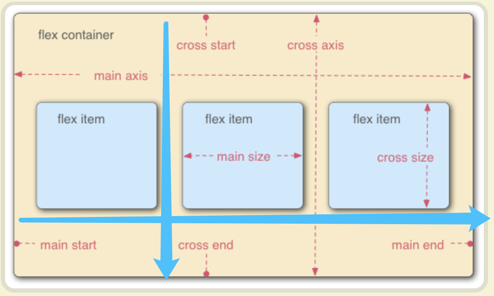

 - 容器的属性
    - **justify-content** // 主轴上项目的对齐方式 
        - { flex-start（默认） | flex-end | center | space-between | space-around }
        - 依次代表：左对齐、右对齐、居中对齐、两端对齐（两两间距相等）、两端对齐（两两间距 = 端点与边距 x 2）
        - 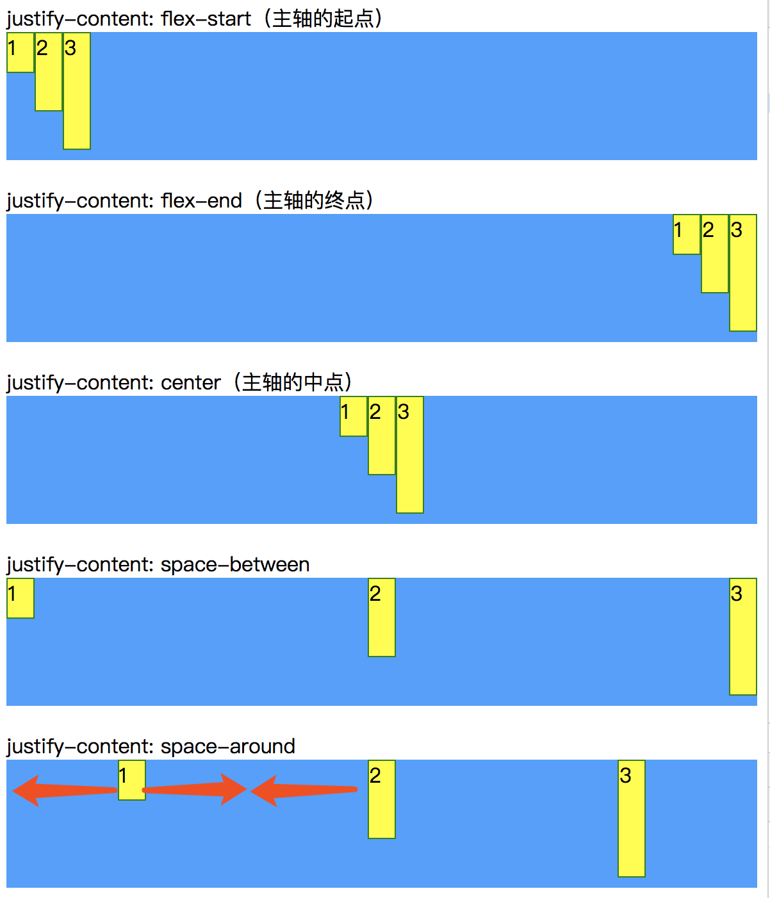
    - **align-items** // 交叉轴上项目的对齐方式 
        - { flex-start | flex-end | center | baseline | stretch（默认） }
        - 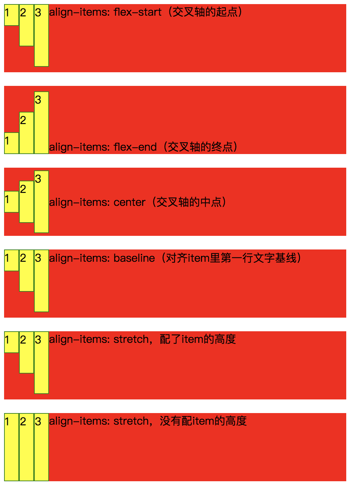
    - **align-content** // 定义多根轴线的对齐方式（若只有一根轴线，该属性不起作用）
    - **flex-direction** // 主轴的方向
        - { row（默认） | row-reverse | column | column-reverse }
        - 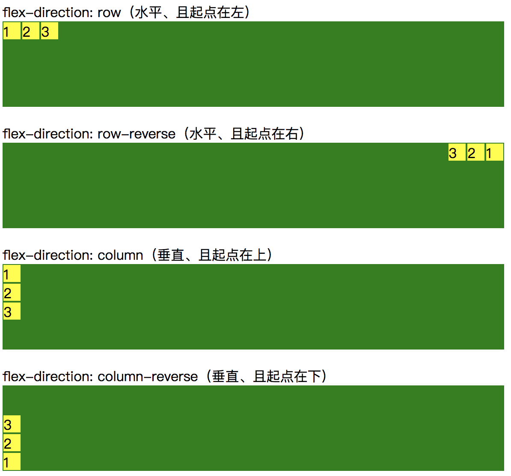
    - **flex-wrap** // 主轴是否换行（换行表示接受压缩）
        - { nowrap（默认） | wrap | wrap-reverse }
        - 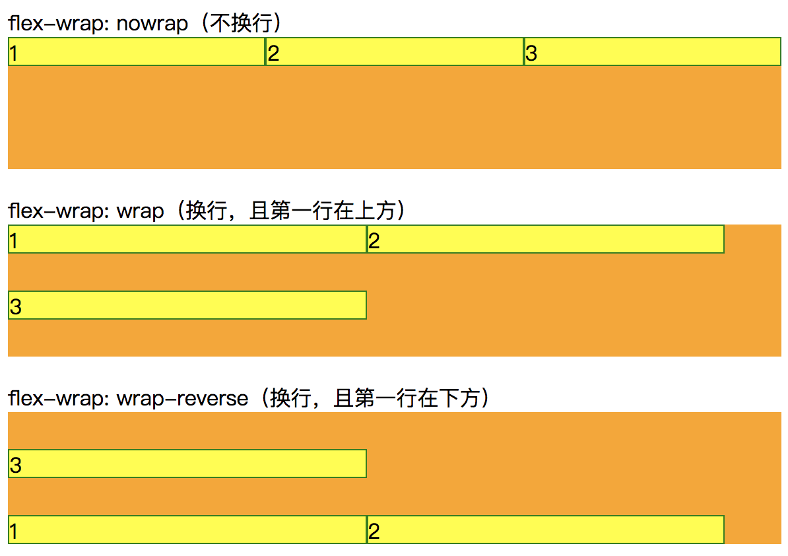
    - **flex-flow** // 主轴方向、主轴换行的缩写
        -  { flex-direction || flex-wrap }

 - 项目的属性
    - **order** // 项目各自的排列顺序
        - 数值越小，越靠前（默认为0）
        - 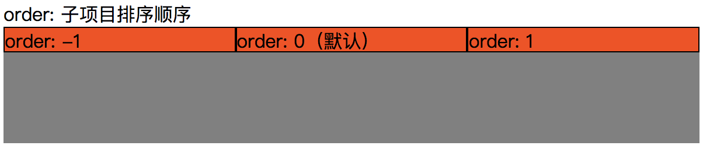
    - **flex-grow** // 放大比例
        - 数值代表放大比例，默认为0。
        - 数值代表瓜分父容器的剩余空间
        - 数值越大，放大得越厉害
        - 若存在子项目**设置了宽度**，剩余空间要减掉这部分宽度才算剩余空间，即`最终宽度 = 本身宽度 + 最终剩余空间 * flex-grow所占比例`
        - 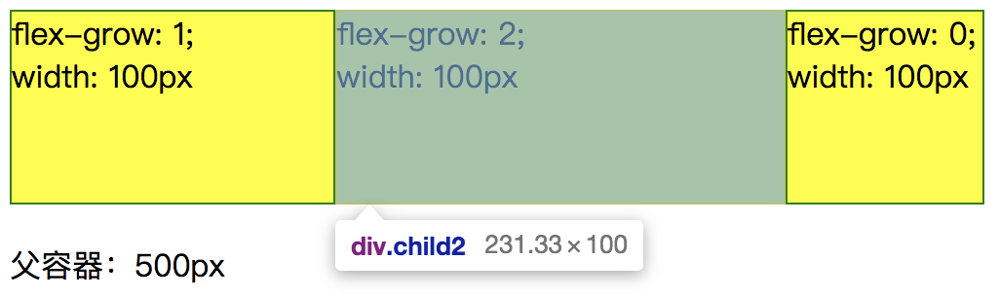
        - 若子项目**没有设置宽度**，剩余空间被子项目瓜分，即`最终宽度 = 最终剩余空间 * flex-grow所占比例`
        - 
    - **flex-shrink** // 缩小比例
        - 数值代表缩小比例，默认为1
        - 数值越大，缩小得越厉害
        - 若存在子项目**设置了宽度**，则看占超出空间的多少，即`最终宽度 = 本身宽度 - 超出空间 * shrink所占比例`
        - 
    - **flex-basis** // 分配多余空间前，子项目占据的**主轴空间（main-size）**
        - { auto（默认） | 固定px }
        - 长度px固定，相当于`直接设定宽度一样`，会`覆盖width`
        - 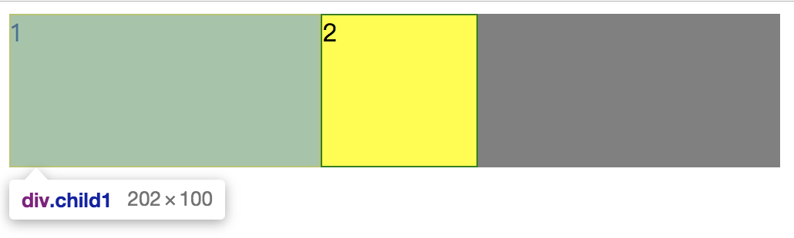
    - **flex** // 上三个的缩写
        - 顺序：flex-grow、flex-shrink、flex-basis
        - 常见缩写规则：
        ```css
            .item {
                flex: 1
            }
            /* 等价于 */
            .item {
                flex-grow: 1;
                flex-shrink: 1;
                flex-basis: 0%;
            }

            .item {
                flex: auto;
            }
            /* 等价于 */
            .item {
                flex-grow: 1;
                flex-shrink: 1;
                flex-basis: auto;
            }

            .item {
                flex: 10%; /* 或固定值px */
            }
            /* 等价于 */
            .item {
                flex-grow: 1;
                flex-shrink: 1;
                flex-basis: 10%; /* 或固定值px */
            }

            .item {
                flex: 2 3;
            }
            /* 等价于 */
            .item {
                flex-grow: 2;
                flex-shrink: 3;
                flex-basis: 0%;
            }
        ```
    - **align-self** // 覆盖父元素align-items，使`指定子项目`可以有不一样的交叉轴上对齐方式
        - { auto（默认） | flex-start | flex-end | center | baseline | stretch }
        - 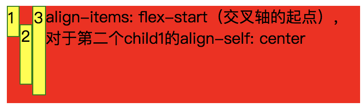

兼容性：IE10 `及以上`

### [CSS]完美居中的方案
#### `行内元素`：
 - 水平居中：
```css
/* A1 */
.parent {
    text-align: center;
}
```
 - 垂直居中：
```css
/* B1 */
.parent {
    height: 100px;
    line-height: 100px;
}

/* B2 */
.parent {
    display: table-cell;
    vertical-align: middle;
}
```
 - 水平垂直居中：
 ```css
 /* 不兼容flexbox */
    /* `A1` 与 `B1/B2`混合搭配  */
 
 /* 兼容flexbox */
    .parent {
        display: flex;
        justify-content: center;
        align-items: center;
    }
 ```

#### 块级元素：
 - 水平居中：
 ```css
 /* C1 */
 .child {
     margin: 0 auto;
 }
 /* C2 */
 .child {
     position: relative;
     margin: auto;
     left: 0;
     right: 0;
 }
 /* C3 */
 .parent {
     display: flex;
     justify-content: center;
 }
 ```
 - 垂直居中：
 ```css
 /* D1 */
 .parent {
     display: table-cell;
     vertical-align: middle;
 }
 ```
 - 水平垂直居中：
 ```css
 /* 不兼容flexbox */
    /* `C1/C2/C3` 与 `D1`混合搭配  */
 
 /* 兼容flexbox */
    .parent {
        display: flex;
        justify-content: center;
        align-items: center;
    }
 ```

### [CSS]CSS定位
 - 绝对定位
    - position: absolute | fixed（前者相对非static的父元素、后者相对浏览器的左上角）
 - 相对定位
    - position: relative（相对本身所在位置）

### [CSS]rem
`rem`是相对于（相对于`html`的字体大小）

默认：1rem = 16px

要设置成：1rem = 10px，则需要：

```css
html {
    font-size: 62.5% /* 10 / 16 * 100% */
}
```

### [CSS]Css-Hack
`Css Hack`，指的是当不同浏览器对某些css属性做解析的时候，出现差异；然后去弥补这些差异的过程。

分为：
 - 条件hack
 ```html
 <!--[if le IE 8]>
 <style>
    .test2 {
        width: 100px;
    }
 </style>
 <![endif]--

 /* 上面是表示当浏览器是小于ie8以下的 */
 ```
 - 属性hack
 ```css
 #test {
     color: #c30; /* For Firefox */
     color: red\0; /* For Opera */
     color: yellow\9; /* For IE8 */
     *color: blut; /* For IE7 */
     _color: #ccc; /* For IE6 */
 }
 ```
 - 选择符hack
 ```css
 * html .test {
     color: red; /* For IE6 and earlier */
 }
 * + html .test {
     color: yellow; /* For IE7 */
 }
 .test:lang(zh-cn) {
     color: white; /* For IE8+ and not IE */
 }
 .test:nth-child(1) {
     color: black; /* For IE9+ and not IE */
 }
 ```

### [CSS]粘性定位（Sticky）
 `Sticky`是position的粘性属性。它是在`relative`和`fixed`中切换，具体看是否要移出`viewPort`。
 ```css
 div.sticky {
     position: sticky;
     top: 10px;
 }
 ```
 也就是说：当滚动时，这个元素有移出的倾向，则切换为`fixed`（通过阈值来进行一些buff的作用）
 - 阈值是：`top`、`bottom`、`left`、`right`，必须设置四者之一
 - 若设定了阈值为`top: 10px`，则表示：当距离`viewPort的顶部`提前到`10px`的位置就切换`fixed`
 - 该元素并`不脱离文档流`，**仍然保留**元素原本在文档流中的位置

### [CSS]设置元素不可见的方法
```css
/* 1 */
.child {
   display: none;
}

/* 2 */
.child {
   visibility: hidden;
}

/* 3 */
.child {
   position: absolute;
   top: -999999px;
}

/* 4 */
.child {
   opacity: 0;
}
```

### [CSS]CSS布局格式
 - 标准流
   - 行内元素在同一行，块级元素上下显示
 - 浮动流
   - 脱离标准流的第一种方式，但 **会影响** 标准流的排列
 - 定位流
   - 脱离标准流的第二种方式，**不会影响** 标准流的排列

### [CSS]浮动
浮动的目的：**一行显示多个div元素**

 规则：若元素A是浮动的：
 - 若他前一个元素也是浮动的，那会跟随前一个元素的**后边**
 - 若他前一个元素是在标准流的，那会和前一个元素的**底部对齐**

 牢记：`clear`规则只能影响`使用清除的元素本身`（**可以使xx元素的左/右边不允许出现浮动元素**）
 
 例子：
 `div1`、`div2`都是浮动的，希望做到`div2`紧跟`div1`底部对齐
 

 解决方法：
 ```css
 .div2 {
    clear: left; /* 指定 div2元素左边 不允许出现浮动元素 */
 }
 ```
 
 
 #### 浮动会带来什么问题？
  - 多个浮动元素可能导致父元素高度无法撑开
  - 浮动元素后面的非浮动元素（内联元素），会跟随其后
  - 浮动元素前面的非浮动元素，会影响页面的结构

 #### 清除浮动
  - 在父元素最后一个子元素后，再加一个子元素，属性为`clear: both;`
  - 在父元素新增伪类：
  ```css
  .parent:after {
     display: block;
     content: ' ';
     clear: both;
  }
  ```
  - 给父元素设为`overflow: hidden;`（利用BFC的原理）
  - 给父容器设为`float: left;`（利用BFC的原理）

### [CSS]块级格式化上下文（BFC）
`BFC`指的是`块级格式化上下文`，可以把BFC理解为一个封闭的大箱子，箱子内部的元素无论如何都不会影响到外部。

#### 触发BFC的条件
 - 根元素（body）
 - 浮动元素
 - 绝对定位元素（absolute、fixed）
 - display为`inline-block`、`table-cell`、`flex`
 - overflow为`hidden`、`scroll`、`auto`

 触发某元素的BFC特性 = 将某元素放到BFC容器中

#### BFC的特性及应用
 - `在同一个BFC里`的元素的`外边距`会发生重叠
 ```html
 <style>
    div {
       width: 100px;
       height: 100px;
       background: blue;
       margin: 100px;
    }
 </style>
 <body>
    <div></div>
    <div></div>
 </body>
 ```
 由下图可知，两个div元素都`处于同一个BFC容器下`（指body元素）。
 
 上一个div的`margin-bottom: 100px;`，下一个div的`margin-top: 100px;`，可看出margin是重叠过的（即两个100px只算一个）

 

 > 解决方法：为了 避免外边距（margin）重叠，可以将它们放到 `不同的BFC容器`中（每个div外包一个`overflow: hidden;`的父容器）

- `BFC`可以阻止元素`被浮动元素覆盖`
```html
 <style>
    .first {
       float: left;
       width: 100px;
       height: 100px;
       background: blue;
    }
    .second {
       width: 200px; /* 不设定宽度可以实现 两列自适应布局 */
       height: 200px;
       background: red;

       overflow: hidden; /* 该元素放在一个新的BFC容器 */
    }
 </style>
 <body>
    <div class="first">我是第一个</div>
    <div class="second">我是第二个</div>
 </body>
```
由下图可知，第一个div元素有自己的BFC容器，但是对于第二个div元素处于标准流会被覆盖。

> 解决办法：为了 阻止浮动元素（float）的覆盖，可以触发该元素的BFC特性。

 - before

 
 
 - after

 

 - `BFC`可以包含浮动的元素（即通常说的`清除浮动`）
```html
<style>
   .parent {
      border: 1px solid gray;
   }
   .child {
      float: left;
      width: 100px;
      height: 100px;
      background: orange;
   }
</style>
<body>
    <div class="parent">
        <div class="child"></div>
    </div>
</body>
```
 由下图可知，BFC容器内的浮动元素脱离标准流后，容器只剩下2px的边距高度。

 > 解决办法：为了 包含浮动元素（float），可以触发父元素的BFC特性（overflow: hidden;）

 - before

 

 - after

 
 

### [CSS]margin重叠问题
在css中，`同一个BFC`下相邻的两个盒子的外边距（margin）可以结合成一个单独的外边距，这种合并的方式叫`折叠`
 - 若两个相邻的外边距`都是正数（+）`，结果是`最大值`
 - 若两个相邻的外边距`都是负数（-）`，结果是`两者绝对值较大的那个数`
 - 若两个相邻的外边距`一正（+）一负（-）`，结果是`两者之和`

### [CSS]z-index和position的关系
`z-index`用于设置元素的堆叠顺序，堆叠顺序大的会处于堆叠顺序小的前面

它只在`position`为`absolute`、`relative`或`fixed`的元素上有效

### [CSS]纯CSS画三角形
 原理：
  - 1、看清`border`的四条边界
  ```css
  .child {
    width: 50px;
    height: 50px;
    border-top: 50px solid red;
    border-right: 50px solid green;
    border-bottom: 50px solid blue;
    border-left: 50px solid orange;
  }
  ```
 

  - 2、去除中间内容
  ```css
  .child {
    width: 0;
    height: 0;
    border-top: 50px solid red;
    border-right: 50px solid green;
    border-bottom: 50px solid blue;
    border-left: 50px solid orange;
  }
  ```
 

  - 3、再去除一部分（例如：左边）
  ```css
  .child {
    width: 0;
    height: 0;
    border-top: 50px solid red;
    border-right: 50px solid green;
    border-bottom: 50px solid blue;
    border-left: 50px solid transparent;
  }
  ```
 

  - 4、可以利用这个特性，画出`三角形`、`直角三角形`、`梯形`等等
 ```css
 .child {
    width: 0;
    height: 0;
    /* border-top: 50px solid red; */
    border-right: 50px solid transparent;
    border-left: 50px solid transparent;
    border-bottom: 50px solid blue;
 }
 ```
 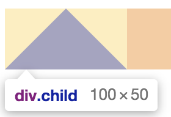

### [CSS]【布局题】利用margin/padding实现宽高自适应
如图：实现一个**宽度、高度、间隙**随屏幕大小**自适应**的布局：

 

```html
<div id="app">
    <div class="top-wrapper">
        <div class="user-wrapper" v-for="item in arr" :key="item.id"></div>
    </div>
    <div class="bottom-wrapper">
        <div class="btn">底部按钮</div>
    </div>
</div>
```
```scss
.top-wrapper {
    display: flex;
    flex-wrap: wrap;
    justify-content: space-between;
    padding: 10px;

    .user-wrapper {
        display: inline-block;
        width: 23%; // 相对于父容器（即top-wrapper）宽度
        margin-top: 2.67%; // 相对于父容器（即top-wrapper）宽度
        background: green;
        overflow: hidden; // 触发BFC条件，撑开该容器

        &::after{
            content: '';
            display: block;
            margin-top: 100%; // 相对父容器（即user-wrapper）宽度
        }

        &:nth-child(1),
        &:nth-child(2),
        &:nth-child(3),
        &:nth-child(4) {
            margin-top: 0;
        }

        .user-text {
            position: absolute; // 文字需额外放到一个脱离标准流的容器中
        }
    }
}
```
大致思路：把`参照物`都设置成`父容器的宽度`
 - 对于小方块的宽度自适应：
    - 每行4个小方块，它们各自的宽度百分比`（相对于父容器top-wrapper宽度）`，单个为`23%`，所以父容器（top-wrapper）还剩余`8%`的宽度。

 - 对于小方块的高度自适应：
    - 因为每个小方块的高度参考物不是父容器宽度，不能直接设置百分比（因为画正方形，可`将高度的百分比参考物`设置为`也相对于父容器top-wrapper的宽度`，可用`margin/padding百分比`）。
    - 又因为每个小方块里面没有内容，所以需要用一个`伪类after`把父容器高度撑开（`此时每个小方块就是伪类的父容器`），将伪类设为`margin-top: 100%`，这时伪类相对父容器（即小方块）宽度`100%`，自动撑开高度，数值和宽度一样。
    - 有个要注意的点是，要触发小方块的BFC特性，才能把高度撑开。

 - 对于小方块的水平间距：
    - 可以通过`justify-content: space-between`来实现块与块之间的水平间距。

 - 对于小方块的垂直间距：
    - 因为每一行有3条间隙，平分上面算的剩余`8%`的宽度，算得约每条`2.67%`
    - 因为`高度不能直接设置百分比`。把参考物换成`父容器top-wrapper`可以通过`margin-top`实现，即每个小方块`margin-top: 2.67%`（也是相对于父容器top-wrapper宽度），实现垂直间距

### [CSS]多列布局、伸缩布局、网格布局


### [CSS]CSS选择器
#### >（子选择器）
 - 注意：不包括 **孙元素**
 ```html
 <div id="a">
    <p>11111111111111</p>
    <p>22222222222222</p>
    <div>
　　　　<p>333333333</p><!--该<p>在<div>中-->
　　</div>
</div>

<style>
    #a>p
    {
        background-color: red; 
    }
</style>
 ```
 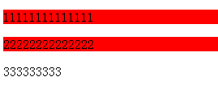

#### +（相邻选择器）
 - 注意：`紧密`、`且后跟着的`那`一个`元素
 ```html
 <div id="a">
    <h1>11111111111111</h1>
    <p>22222222222222</p>
    <p>33333333333333</p><!--只会选择第一个相邻的匹配元素-->
    <div>
      <p>44444444444</p>
    </div>
</div>

<style>
    h1+p {
        background-color: red;
    }
</style>
 ```
 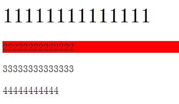

#### ~（匹配选择器）
 - 注意：**后面的**、且**同级的**元素
 ```html
 <div id="a">
    <p>1111</p>
    <h1>2222</h1>
    <p>3333</p>
    <p>4444</p>
    <div>
      <p>5555</p>
    </div>
</div>

<style>
    h1~p {
        background-color: red;
    }
</style>
 ```
 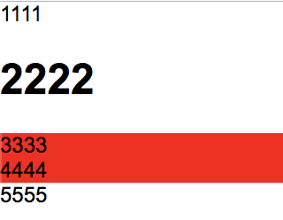

### [CSS]三列布局的实现
三列布局：三个元素：左、中、右、，其中左、右固定宽度为200px，中间宽度自适应。
 ```html
    <div class="left"></div>
    <div class="center"></div>
    <div class="right"></div>
 ```
 - 1、flexBox（有父容器）
 ```css
    .contain {
        display: flex;
    }
    .left,
    .right {
        width: 200px;
    }
    .center {
        flex: 1;
    }
 ```
 - 2、浮动定位
 ```css
    .left,.right {
        width: 200px;
        height: 200px;
    }
    .left {
        float: left;
    }
    .right {
        float: right;
    }
    .center {
        height: 200px;
    }
 ```
 - 3、绝对定位
 ```css
    .left,
    .right {
        position: absolute;
        width: 200px;
        height: 200px;
    }
    .left {
        left: 0;
    }
    .right {
        right: 0;
    }
    .center {
        position: absolute;
        left: 300px;
        right: 300px;
        height: 200px;
    }
 ```
 - 4、表格布局（有父容器）
 ```css
    .contain {
        display: table;
        width: 100%; /* 注意，这里因为是table，所以width是100% */
        height: 200px;
    }
    .left,
    .right {
        display: table-cell;
        width: 200px;
    }
    .center {
        display: table-cell;
    }
 ```
 - 5、网格布局（有父容器）
 ```css
    .contain {
        display: grid;
        grid-template-rows: 200px;
        grid-template-columns: 300px auto 300px;
    }
 ```


### [JS]闭包
`闭包`就是一个函数，这个函数能够访问 **其他函数的作用域** 中的变量。

当函数可以记住并访问所在的词法作用域时，就产生了闭包。

原理：内部函数的作用域链包含这个函数的作用域

特点：
 - 可以读取另外一个函数作用域里的变量
 - 可以将这些变量保存在内存中
 - 可能会导致内存泄露（因为闭包会携带：包含它的函数作用域）
 - 创建一些特权方法

#### 为什么闭包可以访问其他函数的作用域链？
当调用一个函数时，
 - 创建该函数的执行环境
 - 在环境中创建它的作用域链
 - 通过arguments和命名参数来初始化一个活动对象，push到作用域链顶端
 - 再往作用域链后面push其他活动对象

```js
function outer() {
    var a = 'heshiyu'
    var inner = function() {
        console.log(a)
    }
    return inner // 注意这里只是返回对这个方法的引用
}
var inner = outer() // 获得：闭包函数inner
inner() // 'heshiyu'
```
当程序执行完`var inner = outer()`，其实`outer`的执行环境并没有销毁。因为它里面的**变量a仍然被inner函数的作用域链所引用**，当程序执行完`inner()`，`inner`和`outer`的执行环境才被销毁。

### [JS]事件委托
事件委托（也称事件代理），指的是：指定一个事件处理程序，来管理某一类型的所有事件。

好处：
 - 性能的角度，减少DOM的交互次数
 - 动态新增子元素时，无需额外绑定事件

坏处：
 - 要对“不需要代理的节点”进行过滤
```js
window.onload = function(){
　　var oUl = document.getElementById("ul1")
　　oUl.onclick = function(ev){
        //兼容IE
        var ev = ev || window.event
        var target = ev.target || ev.srcElement
        if(target.nodeName.toLowerCase() == 'li'){
            alert(123)
            alert(target.innerHTML)
　　　　}
　　}
}
```

#### video里的子标签的track
在不同的手机系统、不同的浏览器都不兼容

### [JS]回调地狱
`回调地狱`：
 - 嵌套了很多层回调函数，使得代码**不易阅读与维护**。
 - 多个异步操作形成**强耦合**
    - 只要有一个操作需要修改，它的上层回调、下层回调就要跟着改
```js
asyncFunc1(opt, (...args1) => {
    asyncFunc2(opt, (...args2) => {
        asyncFunc3(opt, (...args3) => {
            asyncFunc4(opt, (...args4) => {
                // some operation
            })
        })
    })
})
```
可以看到左侧明显出现了一个**三角形缩进**。

（可见：[JS]异步解决方案的发展历程）

### [JS]设计模式
#### 观察者模式
观察者模式，是一个对象，维护一个依赖列表。当任何状态发生改变时，去通知每一个观察者。

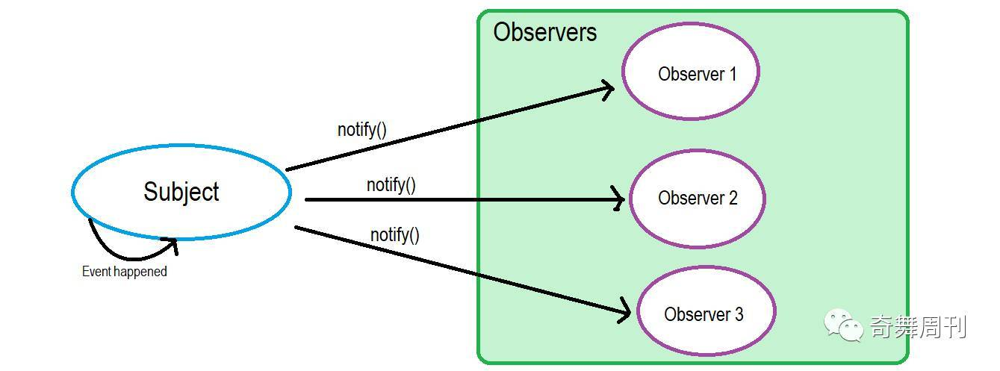

#### 发布-订阅模式
和观察者模式非常相似，但是最大的区别在于：
> 在发布-订阅模式，发布者（publishers）不会直接将消息发送给特定的订阅者

`发布者和订阅者`之间不知道对方的存在，需要通过`消息代理`来通信

|观察者模式|发布订阅模式|
|--|--|
|观察者、被观察者可以直接联系|无直接依赖关系，要通过消息代理（例微信公众号平台）|
|紧耦合|松耦合|
|同步|异步|
|当组件之间依赖关系简单时|当组件之间依赖关系复杂时|


#### 中介者模式
现实中的中介者：博彩公司
 - 如果没有博彩公司，上千万的人一起计算赔率、输赢是非常困难
 - 有了博彩公司作为中介者对象，每个人只需跟博彩公司发生关联，由博彩公司来根据每个人的投注情况计算好赔率（彩民赢了，找博彩公司拿；输了就把钱交给博彩公司）

 #### 一个购买商品的例子：
 
 
 如图，如果没有使用任何设计模式，这里应该是在`select`、`input`的各自onchange事件里，去获取`当前用户所选的条件下`的库存情况。

 如果使用了中介者模式，只需增加一个`中介者对象`
 ```js
 var goods = {
     'red': 3
 }

 var mediator = (function() {
    var colorSelect = document.getElementById('colorSelect'),
        numberInput = document.getElementById('numberInput')
        nextBtn = document.getElementById('nextBtn')
    
    return {
        changed (obj) {
            var color = colorSelect.value,
                number = numberInput.value,
                stock = good[color]
                
                if (obj === colorSelect) { // 如果选择的是颜色下拉框
                    // ...
                } else if (obj === numberInput) { // 如果选择的是数量输入框
                    // ...
                }

                nextBtn.innerHTML = '购买'
        }
    }
 })()
 ```
 可见，所有的对象会和`中介者对象`通信。当这些对象发生改变时，通知`中介者对象`，同时告诉`中介者对象`自己的身份，以便中介者辨别是谁发生了改变，剩下的事情就交给了中介者来完成。

 **好处**：降低各个对象之间的耦合度

 **缺点**：中介者对象自身往往难以维护

### [JS]原型、构造函数、对象和原型链
 - `原型`（prototype）包含着：`某一种特定类型`（如Person类型）中**所有实例共享的属性**和**方法**。每个`原型`都有一个`.constructor`属性，它指向的是构造函数本身（constructor）

 - `构造函数`都有一个`.prototype`属性，它指向的是该构造函数的原型（prototype）

 - `对象`是通过`构造函数`实例化new出来的，每个对象都有`__proto__`属性，指向它的原型（prototype）

 - `原型链`是作为 **实现继承** 的主要方法，它基本思想是：`利用原型，让一个引用类型继承另一个引用类型的属性和方法`。**（实际上是`__proto__连起来的链条`）**

 > 当实例化一个对象的时候，我们不仅可以获得这个`对象的实例属性（和方法）`，还可以获得`原型对象上的原型属性（和方法）`


### [JS]callback、Async/Await和Promise
 #### 回调函数
 如果是以前，可以用`回调函数`实现：
 ```js
 function runAsync(callback){
     if(/* 异步操作成功 */) {
         callback(value)
     }
 }

// 传入一个匿名函数作为回调函数
 runAsync(funtion(data) {
     console.log(data)
 })
 ```
 缺点：
  - 容易造成 **回调地狱**
  - 影响阅读体验

 #### Promise
 Promise是一个容器，而且代表的是一个异步操作，有3种状态：
  - `Pending（进行中）`
  - `Fulfilled（已成功）`
  - `Rejected（已失败）`
  
  只有 **异步操作的结果** 可以决定当前是哪一种状态，任何其他操作都无法改变这个状态（也就是“承诺”的意思）。
  
  并且，**它的状态可以影响后续的then行为**
 ```js
 // Promise的构造函数接收一个函数作为参数，这个函数又可以传入两个参数：resolve、reject；
 // 它们分别表示：异步操作执行后，Promise的状态变为Fulfilled/Rejected的回调函数。
 var promise = new Promise(function (resolve, reject) {
     // ...
     if(/* 异步操作成功 */) {
         resolve(value) // 这个value表示的是异步操作后获得的数据
     } else {
         reject(error) // 这个error表示的是异步操作后报出的错误
     }
 })
 ```
 优点：
  - 解决了 **回调地狱**
  - 方便阅读

 缺点：
  - 返回值传递
    - 仍然需要创建`then`调用链，需要创建匿名函数，把返回值一层层传递给下一个`then`
  - 异常不会向上抛出
    - `then`里函数有异常，`then调用链`外面写`try-catch`没有效果
  - 不方便调试
    - 在某个`.then`设置断点，不能直接进到下一个`.then`方法

对于Promise的异常捕获：

`Promise.prototype.catch()`是`.then(null, function(err) { ... })`的别名
```js
p.then(data => console.log(data))
.catch(err => console.log(err))

// 等价于
p.then(data => console.log()})
.then(null, err => console.log(err))
```
可知，`catch()`和`then()第二个参数的区别`：
 - catch()可以捕获前面所有的异常（`包括Promise里的reject、then里的`）
 - 第二个参数只能捕获`Promise里的reject、前一个then`的错误

 #### Async、Await
`async`是一个函数修饰符，表示函数里有异步操作
 > `async`函数会返回一个`Promise`对象，可以使用`then`添加回调函数；

`await`表示紧跟在后面的表达式需要等待结果；
 > 后面跟也是`Promise`，

 好处：
  - 简洁。易于阅读和理解
  - 错误处理。
    - 可以被`try-catch`捕捉到
  - 方便调试。


### [JS]函数防抖、函数节流
 `函数防抖`（debounce），指的是在上次触发之后、再过N毫秒，才能执行该动作
 
 原理：在N毫秒内重复触发，会重新计时

 简单实现：
 ```js
 function debounce(fn, delay = 500) {
     let timer
     return function() {
         let args = arguments
         if (timer) {
             clearTimeout(timer)
         }
         timer = setTimeout(() => {
             fn.apply(this, args)
         }, delay)
     }
 }

var func1 = function(y) {
    console.log(y)
}

var myFunc1 = debounce(func1, -2)
myFunc1('caozuoxiao')
 ```

 `函数节流`（throttle），指的是函数按照一个周期N毫秒执行
 
 原理：判断上次操作、这次操作的时间间距

 简单实现：
 ```js
 function throttle(fn, delay = 500) {
     let startTime = Date.now()
     return function() {
         let args = arguments
         let currentTime = Date.now()
         if (currentTime - startTime > delay) {
             fn.apply(this, args)
             startTime = currentTime // 刷新旧的startTime
         }
     }
 }

var func = function(x) {
    console.log(x)
}

var myFunc = throttle(func, -1) // 为了test，delay设为-1
myFunc('heshiyu') // 'hehsiyu'
 ```


### [JS]call、apply、bind
 3个方法的作用：
   - 改变`this`的指向；
   - 支持`传入参数`；
   - `call`、`apply`返回函数结果；`bind`返回新函数
 
 特点：
   - `call`：只能一个参数一个参数传
   - `apply`：只支持传一个数组（`arguments`）

```js
// 他们的用法

```

 #### 实现call
 ```js
 Function.prototype.myCall = function(obj, ...arg) {
     let result
     // 0、传参检测
     if (obj === null || obj === undefined) {
         obj = window
     } else {
         obj = Object(obj)
     }
     // 1、改变`this`指向
     // 要让传入的obj成为：函数调用时的this值
     obj._fn_ = this
     result = obj._fn_(...arg) // 2、支持`传入参数`
     delete obj._fn_
     return result // 3、利用变量保存函数的返回值
 }
 ```
 #### 实现apply
 ```js
 // 注意，第二个参数是一个数组
 Function.prototype.myApply = function(obj, arr) {
     return this.myCall(obj, ...arr)
 }
 ```
 #### 实现bind
 ```js
 Function.prototype.myBind = function(obj, ...arg) {
     return (...arg2) => {
         let args = arg.concat(arg2)
         // 以下和实现call的一样
         let result
         // 0、传参检测
         if (obj === null || obj === undefined) {
             obj = window
         } else {
             obj = Object(obj)
         }
     // 1、改变`this`指向
     // 要让传入的obj成为：函数调用时的this值
         obj._fn_ = this
         result = obj._fn_(...args) // 2、支持`传入参数`
         delete obj._fn_
         return result // 3、利用变量保存函数的返回值
     }
 }
 ```

### [JS]new操作符经历了哪些步骤
 - 创建了一个`新的对象`
 - 将`构造函数的作用域`赋值给`新的对象`（此时this指向新的对象）
 - 执行`构造函数`里的代码（为这个新对象添加属性）
 - 返回一个`新的对象`

 对于JS函数，有两个作用：
  - 普通函数
  - “构造器”
    - 通过new操作符，会返回一个新的对象，并且

    原型可以让我们预定义属性、方法，然后它们会自动应用到新对象实例上。

### [JS]window对象和document对象的区别
 `window`对象表示：浏览器中打开的窗口；

 `document`对象表示：当前页面；它是`window`的一个对象属性


### [JS]let、var
（待补）
`setTimeout`与`var/let`：
```js
for (var i = 0; i < 10; i++) {
    setTimeout(function() {
        console.log(i) // 10 10 10 10 10
    }, 100 * i)
}
```

```js
for (let i = 0; i < 10; i++) {
    setTimeout(function() {
        console.log(i) // 0 1 2 3 4 ...
    }, 100 * i)
}
```

原因：
 - `setTimeout`是在`下一轮事件循环开始时`触发
 - `let`在循环里`每次迭代`都会创建一个新的作用域

### [JS]Promise.all()的用法、异常处理
#### `Promise.all([])`接收一个数组，数组中每个元素都是`Promise的实例`。
例如：
```js
var p1 = new Promise((resolve, reject) => {
    setTimeout(resolve, 3000, 'first')
})
var p2 = new Promise((resolve, reject) => {
    setTimeout(resolve, 0, 'second')
})
var p3 = new Promise((resolve, reject) => {
    setTimeout(resolve, 1000, 'third')
})

var p = Promise.all([p1, p2, p3])
p.then(data => console.log(data)) // ['first', 'second', 'third']
```

 - 当`p1、p2、p3`都为fulFilled，按`参数的顺序`传给p的回调函数（then）
 - 当`p1、p2、p3`其中一个为rejected，会把`第一个变rejected`的值传给p的回调函数（catch）
> 注意：如果

#### 异常处理
因为`Promise.all()`方法是**一旦抛出其中一个异常**，那其他正常返回的数据也无法使用了

 

解决办法：
 - 方法一：改为串行调用（失去了并发优势）
 - 方法二：将p1、p2、p3这些promise`自身定义一个catch方法`。
    - 那它被rejected时，也`不会触发Promise.all()的catch`。而是会`触发自身定义的catch`。因为他们自身定义的catch方法`返回的是一个新Promise实例`，`作为参数的这个promise`实际上指的是这个新实例，这个`新实例会变成resolved`。
 - 方法三：在Promise内，先用try-catch吃掉这个异常。在其catch内再调用resolve(err)，让外面的Promise“感觉”像是调用成功（和方法二的区别是，方法二是个新实例）
 ```js
 // 方法二：
 var p2 = new Promise((resolve, reject) => {
     setTimeout(resolve, 0, xxx)
 })
 .then(result => result)
 .catch(err => err)
 ```
 ```js
 // 方法三：
 var p2 = new Promise((resolve, reject) => {
     setTimeout(() => {
         try {
             console.log(xxx) // xxx未声明，会抛出异常给下面的catch块
         } catch(err) {
             resolve(err) // 在内部的catch里调用resolve(err)
         }
     })
 })
 ```
 


### [JS]ES5、ES6、ES7的区别
#### ES7
 - Async、Await
 - 求幂运算符（`**`）
 - Array.prototype.includes()

### [JS]DOM节点的操作
[DOM节点](./../Basics/JS/DOM.md)

### [JS]JS交换两个节点的方法
```html
<div id="a">啊</div>
<div id="b">波</div>
```
```js
 var obj = document.createElement('a')
 var div1 = document.getElementById('a')
 var div2 = document.getElementById('b')

 div2.parentNode.appendChild(obj)
 div2.parentNode.replaceChild(div1, obj) // (newElement, oldElement)，newElement在替换后会从原位置中被删除
```

### [JS]正则表达式
 #### 创建正则表达式（两种方式）
  - 正则表达字面量
  ```js
  var reg = /ab+c/
  // 优点：可以让js解析器提高性能
  ```
  
  - 构造函数
  ```js
  var reg = new RegExp('ab+c')
  // 优点：在runtime时动态确定正则表达式，更灵活（即可引入变量）
  ```

 #### 修饰符
  - `i`：对大小写不敏感
  - `g`：执行全局匹配
  - `m`：执行多行匹配

 #### 常用的特殊字符
 ```js
 匹配任意字符：`.`
 匹配数量：`*`、`+`、`?`、`{n}`、`{n,}`、`{n,m}`
 匹配位置：`^`、`$`
 匹配条件：`|`
 匹配集合：`[]`
 匹配非集合：`[^]`

 `\d`：0-9之间的任意一个数字
 `\D`：除了\d

 `\w`：数字、字母、下划线（即0-9 a-z A-Z _）
 `\W`：除了`\w`

 `\s`：空白
 `\S`：除了空白
 ```
 - 
 #### js中和正则有关的所有方法
 - `RegExp`
    - exec
    - test
 - `String`（注意，以下是字符串的方法）
    - match
    - replace
    - search
    - split

 ##### [RegExp]exec
 对string进行正则匹配，并返回匹配结果
 
 若正则表达式是 **全局匹配**：
 - 参数：string
 - 返回：[ '匹配结果' , '由括号括起来的小分组匹配值' , index , input]
 - （若需所有，执行white，结束标志为null）

```js
var regex = /h(s+)y/g; 
regex.exec('ahahsyhsssy')
// ["hsy", "s", index: 3, input: "ahahsyhsssy"] 

regex.exec('ahahsyhsssy')
// ["hsssy", "sss", index: 6, input: "ahahsyhsssy"] 

regex.exec('ahahsyhsssy')
// null 
```
 
 若正则表达式是 **非全局匹配**：
 - 参数：string
 - 返回：[ '匹配结果' , '由括号括起来的小分组匹配值' , index , input]
 - 无论如何，`永远只匹配到第一条`

```js
var regex = /h(s+)y/g; 
regex.exec('ahahsyhsssy')
// ["hsy", "s", index: 3, input: "ahahsyhsssy"] 

regex.exec('ahahsyhsssy')
// ["hsy", "s", index: 3, input: "ahahsyhsssy"] 

regex.exec('ahahsyhsssy')
// ["hsy", "s", index: 3, input: "ahahsyhsssy"] 
```


 ##### [RegExp]test
测试string是否包含匹配结果，若包含返回true；否则返回false
 - 参数：string
 - 返回：true | false
```js
var regex = /he/
regex.test('heshiyu')
// true
```

##### [String]match
根据pattern进行正则匹配，如果匹配到，返回匹配结果；否则返回null

若正则表达式是 **全局匹配**：
 - 参数：regex
 - 返回：[匹配到的内容1, 匹配到的内容2, ...]
```js
var str = 'hi, heshiyu'
var regex = /i/g
str.match(regex)
// ['i', 'i']
```
若正则表达式是 **非全局匹配**：（和`exec`有点点像，但不完全像）
 - 参数：regex
 - 返回：[匹配到的内容1, 匹配到的内容2, ...]
```js
var str = 'hi, heshiyu'
var regex = /i/

str.match(regex)
// ['i', groups: undefined, index: 1, input, heshiyu]

str.match(regex)
// ['i', groups: undefined, index: 1, input, heshiyu]

str.match(regex)
// ['i', groups: undefined, index: 1, input, heshiyu]
```

##### [String]search
根据pattern进行正则匹配，如果匹配到一个结果，则返回他的索引；否则返回-1
 - 参数：regex | string
 - 返回：number
```js
var str = 'hi, heshiyu'
var regex = /i/
str.search(regex)

// 1
```

##### [String]replace
根据pattern进行正则匹配，把匹配结果替换为replacement
 - 参数1：regex | string
 - 参数2：string
 - 返回：替换结果
 ```js
var str = "i love china!"
var pattern = /i/g
var ret = str.replace(pattern, "I")

console.log(ret)
//I love chIna!
 ```

##### [String]split
根据pattern进行正则分割，返回一个分割数组
 - 参数1：regex | string
 - 返回：分割结果
```js
var  str = 'http://www.baidu.com/'
var  reg = /\W/
var  ret = str.split(reg)

console.log(ret)
//["http", "", "", "www", "baidu", "com", ""] 
```
#### 例子：正则匹配邮箱
 `/^([A-Za-z0-9_\-\.])+\@([A-Za-z0-9_\-\.])+\.([A-Za-z]{2,4})$/`

### [JS]js数组的方法
#### 变异方法
 - push()
 - pop()
 - shift()
 - unshift()
 - splice()
    - 参数1：要操作的下标
    - 参数2：要`删除`的项目数量
    - 参数3：要新加入的项目
    - 返回：被移除掉的项（array）
 - sort()
    - 参数：（可选）比较函数（function）
        - sort((a, b) => a - b) // 从小到大
    - 不传参数：按照`字符编码的顺序`进行排序
 - reverse()

#### 非变异方法
 - slice()
    - 参数1：截取的起始下标，闭区间
    - 参数2：截取的终止下标，开区间（不指定，就是后面所有）
    - 返回：被截走的数组（array）

 - concat()
    - 参数：要收录进数组的项（也可以是数组）
    - 返回：合并后的数组

 - filter()
    - 参数：当前值为true，则会被返回
    - 返回：符合条件的数组
    ```js
    var arr = [1, 3, 5]
    arr.filter(item => item === 5) // [5]
    ```

 - join()
    - 参数：分隔符
    - 返回：字符串

 - forEach()
    - 参数1：当前项
    - 参数2：当前项索引
    - 参数3：数组本身
    - 返回：undefined

 - map()
    - 参数1：当前项
    - 参数2：当前项索引
    - 参数3：数组本身
    - 返回：一个新数组，旧数组不变

### [JS]去重
```js
function func1(arr) {
    let map = {}
    for (let i = arr.length - 1; i >= 0; i--) {
        arr[i] in map ? arr.splice(i, 1) : (map[arr[i]] = true)
    }
    return arr
}
```

### [JS]for...in和for...of
 - for...in *（读取对象或数组的key值）*
    ```js
        var arr = [1, 9, 6, 7]
        var obj = {
            name: 'heshiyu'
        }

        for (var i in arr) {
            console.log(i)
        }
        // 依次输出：0 1 2 3

        for (var i in obj) {
            console.log(i)
        }
        // name
    ```
 - for...of *（读取数组的value值，且只能遍历部署了Iterator接口的数据）*
    ```js
        var arr = [1, 9, 6, 7]
        var obj = {
            name: 'heshiyu'
        }

        for (var i of arr) {
            console.log(i)
        }
        // 依次输出：1 9 6 7

        for (var i of obj) {
            console.log(i)
        }
        // error
    ```
因为`for...of`循环本质上是**调用Iterator接口产生的遍历器**，所以它只适用于`部署了Iterator接口`的数据（例如：数字、字符串、Map、Set、arguments、NodeList等），这是普通对象没有的
 
### [JS]Generator函数
看一个`Generator函数`：
```js
function* asyncJob(x) {
    console.log('aaa')
    var y = yield x + 2
    console.log('bbb')
    console.log('y', y)
    var y2 = yield y + 6
    return y2
}

var g = asyncJob(1) // Generator函数会返回一个遍历器g
console.log(g.next())
// ① 先输出'aaa'
// ② 再输出{ value: 3, done: false }
// value表示：yield语句后面跟的表达式的值，此时y的赋值还未完成！
// done表示：Generator函数是否执行完毕
// -----此时Generator函数执行到此处，执行权交给外面（第一个yield前的、且其后的表达式并返回）-----
console.log('ccc')
// ③ 输出'ccc'
console.log(g.next(660))
// next函数把执行权交回里面，继续执行
// 因为往next()传参（只能带一个），上一次“yield后跟的表达式返回值 = 参数（即666）”，给了y
// 完成y的赋值，因为next传参660，所以y = 660
// ④ 先输出'bbb'
// ⑤ 再输出'y, 660'
// 遇到第二个yield，执行yield后跟表达式
// ⑥ 返回对象{ value: 666, done: false }，此时y2的赋值还未完成
// -----此时Generator函数执行到此处，执行权交给外面（第二个yield前的、且其后的表达式并返回）-----
console.log(g.next(3))
// next函数把执行权交回里面，继续执行
// 因为往next()传参（只能带一个），上一次“yield后跟的表达式返回值 = 参数（即3）”，给了y
// 完成y的赋值，因为next传参3，所以y2 = 3
// ⑦ 最后输出{ value: 3, done: true }
```
```
aaa
{ value: 3, done: false }
ccc
bbb
y, 660
{ value: 666, done: false }
{ value: 3, done: true }
```
#### Generator函数能封装异步的原因？
根本原因：Generator函数可以**暂停执行**和**恢复执行**

两个特性：
 - 函数内外的数据交换
    - 内对外：next返回的value
    - 外对内：next传入的参数（只能传一个）
 - 错误处理


#### yield的特点
- 用来说明`next函数`返回的`value值`
- 每个`yield`调用后，后面的代码都会停止执行
- `yield`不能穿透函数（即`不能使用forEach`来遍历声明yield，`必须用for`！！）

迭代器对象可以任意具有.next方法的对象

#### Generator函数的自动执行
Generator是一个异步操作的容器，它的自动执行需要一种机制（当异步操作有了结果，这种机制就要自动交回执行权），有两种方法：
 - 回调函数。
    - 将异步操作包装成Thunk函数，在回调函数里交回执行权
 - Promise对象。
    - 将异步操作包装成Promise对象，在then方法里交回执行权

### [JS]Math.floor、parseInt
 相同：都能实现数字的向下取整

 不同：
 ```js
    // Math.floor 不能解析（非纯数字的）字符串
    Math.floor(0.89) // 0
    Math.floor("3") // 3
    Math.floor("760px") // NaN

    // parseInt不能解析（非数字开头的）字符串
    parseInt(0.89) // 0
    parseInt("3") // 3
    parseInt("760px") // 760
 ```

### [JS]this的指向
 `this`是运行时基于函数的执行环境所决定的。
  - 在全局函数中，this为window
  - 当函数被作为某个对象的方法调用时，this为那个对象

 #### 闭包里this的作用域

 ### [js]Ajax
 原理：
  - 实例化一个`XMLHttpRequest`对象
  - 设置回调函数`onreadystatechange`
  - 使用`open`、`setRequestHeader`、`send`结合发送请求

  其中`xhr.readyState`有如下5种状态：
   - 0：open未调用
   - 1：open已调用
   - 2：接收到头信息
   - 3：接收到响应主体
     - 根据响应的MIME类型，把数据转换成能通过responseBody、responseText或responseXML属性存取的格式
   - 4：响应完成

 ```js
    var url = 'http://www.api.com/checkLogin'
    var xhr = new XMLHttpRequest() // 或ActiveXObject

    xhr.open('GET', url, true) // true表明该请求是异步的
    xhr.setRequestHeader('x-from', 'pc')

    xhr.onreadystatechange = function(res) {
        if (xhr.readyState == 4 && xhr.status === 200) {
            var response = JSON.parse(xhr.response)
            if (response.success == false) {
                alert('您的账号暂无权限，请先注册~')
            } else if (response.success == true) {
                location.href = '/index/0'
            }
        }
    }

    xhr.withCredentials = true
    xhr.send()
 ```

### [JS]DOM绑定事件的三种方式
  - 【HTML 事件处理】在DOM元素上直接绑定
    ```html
    <div onclick="test()"></div>
    ```

  - 【DOM 0级事件处理】在JavaScript代码中绑定
    ```js
    document.getElementById('myID').onclick = function() {
        // ...
    }
    ```
  - 【DOM 2级事件处理】绑定事件监听函数
    ```js
    element.addEventListener(type, handle, useCapture)
    // 第一个参数：事件名称
    // 第二个参数：事件处理函数
    // 第三个参数：是否使用捕获（默认false，即事件冒泡）
    ```

### [JS]三种事件流模型
  - IE的事件冒泡
  - Netscape的事件捕获
  - DOM的事件流
    - DOM 2级事件规定，事件流包括三个阶段：`事件捕获`、`目标阶段`、`事件冒泡`

### [JS]target、currentTarget
  - event.target：返回的是`触发事件`的元素
  - event.currentTarget：返回的是`绑定事件`的元素
 
### [JS]检测变量类型
（待补）
- 方法一：
 `Object.prototype.toString.call(obj)`
 
 原因：`Array`、`function`是Object的实例，都重写了toString方法。根据原型链，调用的话，是对应的重写之后的toString方法，而不会去调用Object上原型的toString方法

 ```js
 Object.prototype.toString.call([]) // [object array]
 ```
- 方法二：
```js
let arr = []
arr.constructor === Array // true
```

### [JS]script标签的加载规则
 默认情况下，浏览器**同步加载JavaScript脚本**，（即**渲染引擎**遇到`<script>`标签就会把控制权交给**JS引擎**去执行脚本，执行完毕再把控制权交给**渲染引擎**，继续向下渲染）

 当然，浏览器也**允许脚本异步加载**，下面是两种 **异步加载** 的语法：
 ```js
 <script src="path/to/myModule.js" defer></script>
 <script src="path/to/myModule.js" async></script>
 ```
前者（`defer`）指的是：当页面渲染完成，再执行；

后者（`async`）指的是：一旦下载完成，渲染引擎就中断渲染，**执行这个脚本之后** 再继续渲染。

另外，`defer`会按照它在页面中出现的顺序加载，`async`不能保证按顺序。

### [JS]通过Object.defineProperty给对象添加属性
 对象里的属性并不只有`属性名`和`属性值`那么简单。

`Object.defineProperty(obj, prop, descriptor)`

其中，第三个参数`descriptor`（描述符）可以分为：
  - 数据描述符
  - 访问器描述符

 | | configurable | enumerable | value | writable | get | set |
 | - | - | - | - | - | - | - |
 | 数据描述符 | √ | √ | √ | √ | × | × |
 | 存取描述符 | √ | √ | × | × | √ | √ |

  - 如果一个描述符不具有`value、writable、get、set`任何一个关键字，那就默认是`数据描述符`。
  - 当描述符省略了字段，若为布尔值（默认false）；value、get、set（默认为undefined）
  - 使用`直接赋值`的方式创建对象的属性，enumerable为true

#### writable
writable属性若为fasle，则不能修改对象的这个属性。（不会报错，但值也不会变）
```js
var o = {} // Creates a new object

Object.defineProperty(o, 'a', {
  value: 37,
  writable: false
})

o.a = 25 // 不会报错，但值也不会变
```

#### enumerable
enumerable属性若为false,则不能再`for...in`或`Object.keys()`中被枚举。
```js
var o = {}
Object.defineProperty(o, "a", { value : 1, enumerable:true })
Object.defineProperty(o, "b", { value : 2, enumerable:false })
Object.defineProperty(o, "c", { value : 3 }) // 省略了指enumerable，默认false
o.d = 4 // 如果使用直接赋值的方式创建对象的属性，则这个属性的enumerable为true

for (var i in o) {
    console.log(i)
}
// 'a' 'b'
```

#### configurable
configurable属性若为false，则表示：1、该对象的这个属性不能被删除；2、除了`value`、`wratable`以外的其他特性能否被修改。
```js
var o = {}
Object.defineProperty(o, 'a', {
    get() {
        return 1
    },
    configurable: false
})
delete o.a // 返回false,删除不成功
```

 `数据描述符`具有4个描述其行为的特征：

 [configurable、enumerable和writable](http://www.softwhy.com/article-9359-1.html)

### [JS]扩展运算符（...）、Object.assign()
 `扩展运算符（...）`和`Object.assign()`可以对一个对象A进行`深拷贝`，但如果对象A里面还包含子对象/子数组，那么这部分就只是`浅拷贝`！！
 
 **(...)和Object.assign()这两个方法是等价的**

 > 深拷贝：拷贝的是`值的副本`
 > 
 > 浅拷贝：拷贝的是`值的引用`

```js
let o1 = { 
    name: 'I am o1',
    address: {
        province: 'gd',
        city: 'qy'
    }
}
let o4 = { ...o1 }

o4.name = 'I am o4'
console.log(o4)
console.log(o1)

o1.name = 'I am new o1'
o1.address.province = 'hz'
console.log(o4)
console.log(o1)

// { name: 'I am o4', address: { province: 'gd', city: 'qy' } }
// { name: 'I am o1', address: { province: 'gd', city: 'qy' } }
// { name: 'I am o4', address: { province: 'hz', city: 'qy' } }
// { name: 'I am new o1', address: { province: 'hz', city: 'qy' } }
```
#### 项目中的实例
利用`扩展运算符（...）`拷贝的对象里的`子对象/子数组`是`浅拷贝`。
```js
// 有这么一个对象defaultStart
let defaultStart = {
    name: '',
    children: []
}

// 第一次对newData进行拷贝
let newData = { ...defaultStart }
newData.children.push(cInfo)

// 第二次对newData进行拷贝
let newData = { ...defaultStart }
newData.children.push(cInfo) // 这时的children还是上次的children

// 解决办法：
// ① newData.children = []
// ② newData.children.length = 0
```

### [JS]深拷贝
`若没有function`，可以使用：
```js
JSON.parse(JSON.stringify(obj))

// 缺点：会忽略函数function
```

`若有function`，可以使用：
```js
export const deepClone = source => {
    if (!souce || typeof source !== 'object') {
        // 不是对象
        throw new Error('error arguments', 'shallowClone')
    }
    var targetObj = source.constructor === Array ? [] : {}
    for (var keys in source) {
        if(source.hasOwnProperty(keys)) {
            if(!source[keys] || typeof source[keys] !== 'object') {
                targetObj[keys] = source[keys]
            } else {
                targetObj[keys] = source[keys].constructor === Array ? [] : {}
                targetObj[keys] = deepClone(source[keys])
            }
        }
    }
    return targetObj
}
```


### [JS]模块规范一：AMD和CMD
[模块规范一：AMD和CMD（2019-03-25）](/src/Basics/JS/AMDCMD.md)

### [JS]模块规范二：ES6模块和CommonJS模块
[模块规范二：ES6模块和CommonJS模块（2019-03-25）](/src/Basics/JS/Module.md)

### [JS]暂时性死区
[暂时性死区](/src/Basics/JS/TDZ.md)

### [JS]EventLoop
[EventLoop](/src/Basics/JS/EventLoop.md)

### [JS]reduce()
```js
array.reduce(function(total, curVal, curIndex, arr) {
    // 用于执行每个数组元素的函数
}, initVal)
```
例子：
```js
let arr = [1, 2, 3]
arr.reduce((total, curVal) => (total + curVal), 10) // 16
```

### [JS]函数的内部属性
#### 函数内部属性一：arguments
`arguments`是一个类数组对象，包含着：**传入函数中的所有参数**、**callee属性**、**length属性**。

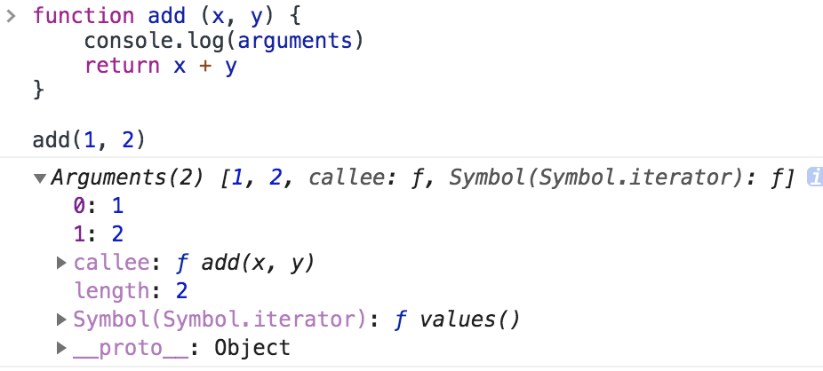
 - `传入的参数`：
    - `argument[0]`、`argument[1]`...去获取对应位置传入的参数
    - 若在函数体里利用`argument[x]`修改 **对应位置x传入的参数** 的值，会同步在后续中对应位置x传入参数
    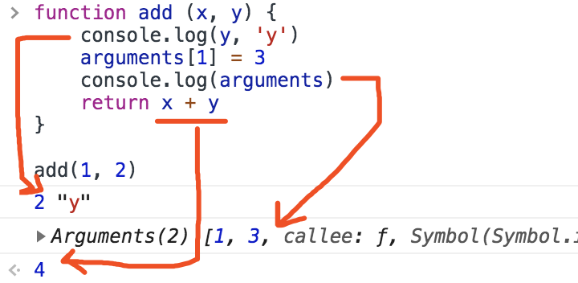
 - `length属性`：返回 **实际传入参数的个数**
 - `callee属性`：是一个引用，指向 **当前所执行的函数**
    - 在`'use strict'`下，该callee属性会被禁用
```js
// 不足：函数的执行 与 函数名 紧密耦合。因为函数名最好别改，改了就会连同下面return的factorial也要改
function factorial(num) {
    if (num < 1) {
        return 1
    } else {
        return num * factorial(num - 1)
        // return num * arguments.callee(num - 1)
    }
}
// arguments.callee优势，可以消除上面提到的紧密耦合
```
注意：通过 **函数声明** 来定义函数的效果 和 直接通过 **函数表达式** 来定义函数的效果，是`一样`的，（`函数名` 实际上也是一个 `指向函数对象的指针`）。
```js
var factorial = function(num) { ... }
```

```js
// 改用arguments.callee后
var trueFactorial = factorial

factorial = function() { // 切断了 变量factorial 和 函数对象的联系
    return 0
}

trueFactorial(5) // 120
factorial(5) // 0
```
#### 函数内部属性二：特殊对象this
`this`指向的是：函数执行的环境对象（若在全局中，this的值是`window`）
```js
var color = 'red'
var o = {
    color: 'blue'
}

function sayColor() {
    console.log(this.color) // 调用函数前，this的值并不确定。在执行过程中确定。
}

sayColor() // 'red'，因为在全局作用域


o.sayColor = sayColor
o.sayColor() // 'blue'，因为是在对象o的作用域
```
> `函数名` 实际上是一个 `指向函数对象的指针`，所以这里`o.sayColor = sayColor`之后，即使在不同环境执行，全局的`sayColor`函数与`o.sayColor`函数指向的仍然是同一个函数。

#### 函数内部属性三：caller
`caller`指向的是 **调用当前函数的父函数引用**（若在全局中调用当前函数，caller的值是`null`）

也可以通过`arguments.callee.caller`，是一样的效果

```js
function outer() {
    inner()
}

function inner() {
    console.log(inner.caller) // 显示outer的源码
}
outer()
```
### [JS]事件处理函数和默认行为的执行顺序
大多数情况下，是先执行**事件处理函数**，再执行**默认行为**。

也有例外：
 - checkbox的**事件默认行为会先执行**。如果一旦阻止了默认行为，就会**恢复到执行默认行为之前的状态**（用户无感知）

### [JS]for...in、Object.keys()、Object.getOwnPropertyNames()
for...in是遍历对象中的`所有可枚举属性`（包括自有属性和继承属性）

Object.keys()：返回一个数组，数组里是对象中`可枚举的自有属性`的名称

Object.getOwnPropertyNames()：返回一个数组，数组里是对象中`所有的自有属性`（不管是否可枚举）


### [JS]async/await
async是Generator函数的语法糖。它会返回一个promise对象（并且会等到内部所有await后面的Promise对象执行完才会发生状态改变）
```js
async function f() {
    return 'Hello world'
}
f().then(v => console.log(v)) // 'Hello world'
```
可见，函数f内部return返回的值，会被then方法回调函数接收到。

#### async的使用形式
```js
// 函数声明
async function func1 () { ... }

// 函数表达式
var func1 = async function () { ... }

// 对象的方法
var obj = {
    async func1() { ... }
}

// 类的方法
class Storage {
    async func1() { ... }
}

// 箭头函数
var func1 = async () => { ... }
```

#### async函数的实现原理
async函数实际上是`Generator函数`和`自动执行器`的一个包装
```js
async function func1(args) {
    // ...
}

// 等价于
function func1(args) {
    return spawn(function* () {
        // ...
    })
}
```
其中spawn函数
```js
function spawn(genF) {
    return new Promise((resolve, reject) => {
        var gen = genF()
        function step(nextF) {
            try {
                var next = nextF()
            } catch(e) {
                return reject(e)
            }
            if (next.done) {
                return resolve(next.value)
            }

            Promise.resolve(next.value).then(v => {
                step(function() { return gen.next(v) })
            }, e => {
                step(function() { return gen.throw(e) })
            })
        }

        step(function() { return gen.next(undefined) })
    })
}
```
因为立即resolved的Promise是在`本轮事件循环的末尾执行`，所以最好前面加个`return`

#### async的错误处理机制
由`async函数的实现原理`可知，函数内部await 后面跟的Promise只要有一个reject了，那就会使得async函数所返回的Promise对象也被reject。

如果不想整个async函数中断，有两个方法
```js
async function f () {
    // 方法一：用try-catch捕获可能会抛出异常的await
    try {
        await Promise.reject('error')
    } catch(e) {
        console.log(e)
    }

    // 方法二：对可能会抛出异常的await声明catch
    await Promise.reject('error').catch(e => console.log(e))

    return await Promise.resolve('Hello world')
}
```

#### 多个await并发执行
若两个异步操作是互不依赖的，那可以并发执行
```js
let [foo, bar] = await Promise.all([getFoo(), getBar()])
```

注意：
```js
// forEach、map也可以使这些await是并发执行
// 原因：每次迭代会生成新的async。只能保证同一个async内部的await是继发
// 可使用场景：一组异步操作的按顺序输出
arr.forEach(async (doc) => {
    await fetchUrl(doc)
})

// 使用for循环可以保证是继发执行
for (let doc of arr) {
    await fetchUrl(doc)
}

```

#### await
await后面跟的是一个Promise对象（如果不是，他会被转成一个立即resolve的Promise对象）


### [JS]计算随机数0-5、95-99
```js
Math.random() // [0, 1)之间的浮点数
Math.random() * 10 // [0, 10)之间的浮点数

// 0-5
Math.floor(Math.random() * 6) // [0, 6)之间的整数，向下取整

// 95-99
Math.floor(Math.random() * 5 + 95) // [95, 100)之间的整数，向下取整
```

### [JS]柯里化
柯里化是一种采用了**高阶函数**的**函数式编程技巧**。

 - 先传递一部分参数给指定函数
 - 这个函数会返回另外一个函数
 - 由被返回的函数去处理剩下的参数

 ```js
 add(1)(2)(3).valueOf() // 6

 function add() {
    // 定义一个数组专门存储所有参数
    // var _args = Array.prototype.slice.call(arguments)
    var _args = [...arguments]

    // 在内部声明一个函数，利用闭包的特性来保存
    var _adder = function() {
        _args.push(...arguments)
        return _adder
    }

    // 利用toString隐式转换的特性，当最后执行时隐式转换，并计算最终的值返回
    _adder.valueOf = function() {
        return _args.reduce(function(a, b) {
            return a + b
        })
    }

    return _adder
 }
 ```

 好处：
 - 参数复用
 - 提前返回
    ```js
    // before
    var addEvent = function(el, type, fn, capture) {
        if (window.addEventListener) {
            el.addEventListener(type, function(e) {
                fn.call(el, e)
            }, capture)
        } else if(window.attachEvent) {
            el.attachEvent('on' + type, function(e) {
                fn.call(el, e)
            })
        }
    }

    // after
    var addEvent = (function() {
        if (window.addEventListener) {
            return function(el, sType, fn, capture) {
                el.addEventListener(sType, function(e) {
                    fn.call(el, e)
                }, capture)
            }
        } else if (window.attachEvent) {
            return function(el, sType, fn, capture) {
                el.attachEvent('on' + sType, function(e) {
                    fn.call(el, e)
                })
            }
        }
    })()
    ```
 - 延迟运行

### [JS]this的各种情况
 - 作为函数调用，this指向window（非严格模式）；this指向undefined（严格模式）
 - 作为某对象方向调用，this指向该对象。
 - 使用call、apply、bind可以改变this指向
 - 在构造函数里调用，this指向新创建的对象
 - 箭头函数没有自己的this，都是最外层函数的this，它指向箭头函数定义时外层函数所在的对象

### [JS]异步解决方案的发展历程
 - 回调函数
    - 缺点：回调地狱、不能捕获错误

 - 事件监听
    - 缺点：整个流程变成事件驱动，思路不太清晰

 - 发布订阅
    - 优点：多了一个“消息中心”

 - Promise
    - 优点：解决了回调地狱
    - 缺点：1、无法取消Promise；2、错误需要通过回调函数来捕获

 - Generator
    - 优点：控制函数的执行
    - 缺点：要编写自动执行器
 - Async/Await
    - 优点：1、Generator+自动执行器；2、更像同步写法
 - WebWorker
    - 优点：开启了一个“新线程”

### [JS]ES6新数据结构Set、Map
#### Set
Set类似于**数组**，特点是里面的`值是唯一`的（即不会出现重复）、且`遍历顺序就是插入顺序`。
```js
// 新建一个Set结构
var set = new Set(['贺世宇', '作者'])
```

它有两个实例属性：
 - constructor
 - size

它有4个操作方法、4个遍历方法
 - 操作：
    - add(value)
    - delete(value)
    - has(value)
    - clear()

 - 遍历：
    - keys() //由于Set没有键值，那么键名===键值
    - values()
    - entries()
    - forEach() // 接受第二个参数，用于绑定this

用处：`去除数组中重复成员`：
```js
var arr = [1, 3, 3, 5]

// 方法一：
var s = new Set()
arr.forEach(x => s.add(x))
var brr = Array.from(s)

// 方法二：
var crr = [...new Set(arr)]

```
#### Map
Map类似于**对象**，也是键值对集合。特点是里面的`键（key）不仅限于字符串`、且`遍历顺序就是插入顺序`。**（可保证键值唯一）**

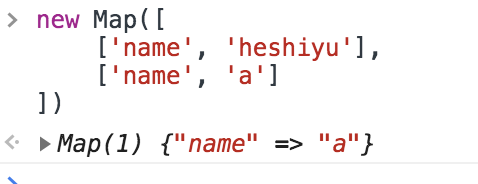

```js
// 新建一个Map结构
var map = new Map([
    ['name', '贺世宇'],
    ['title', '作者']
])

// 
```

它有实例属性：
 - size

它有5个操作方法、4个遍历方法：
 - 操作
    - set(key, value) // 返回最新Map，所以可以链式调用
    - get(key)
    - has(key)
    - delete(key)
    - clear()

 - 遍历
    - keys() // 注意，无参数
    - values() // 注意，无参数
    - entries() // 注意，无参数
    - forEach() // 第一个参数是迭代函数（val, key, map），接受第二个参数，用于绑定this

和**普通对象**的区别：
 - key的类型：
    - 
| | Map | 普通对象 |
|--|--|--|
| key的类型 | 任意类型 | 只能是字符串 |
| keys() | 变量.keys() | Object.keys(obj) |
| 遍历顺序 | 插入顺序 | 对象散列结构，无顺序

### [JS]==和===的区别
`==`（相等）和`===`（恒等）的区别，前者`会进行类型转换（1）`再对`值进行比较（2）`，后者`不会进行类型转换（1）`，同时也对`值进行比较（2）`。

### [JS]JS的继承
 - 原型链
    - 原理：1、先创建子类的实例对象this；2、再将父类的方法添加到this上
 - Class的extends
    - 原理：1、先创建父类的实例对象（调用super）；2、通过子类的构造函数修改this

#### 组合继承：

组合`原型继承、借用构造函数`，使得实例化的对象具有各自的实例属性（方法），也有公用的原型属性（方法）。

```js
function Person() {
    this.skin = true
}
function Student(name) {
    this.name = name
    Person.call(this)
}

Student.prototype = new Person() // 此时Student.prototype被重写了，变成Student.prototype === Person
Student.prototype.constructor = Student // 将原型对象上的constructor重新指向Student构造函数

var stu = new Student('heshiyu')
```

### [JS]垃圾回收机制
JS垃圾回收机制：
 - 标记清除
    -  垃圾收集器在运行时会给存储在内存中的所有变量加上标记。然后，会去掉环境中的变量、被环境中变量引用的标记。此后，如果还有标记的，就视为准备删除的变量。最后，垃圾收集器会销毁这些准备删除的值，并回收他们的内存。
 - 引用计算
    -  引用计数会跟踪每个值被引用的次数。当声明一个变量，并将一个引用类型赋值给变量时，这个值的引用次数为1。相反，如果取消引用换成别的值了，这个值就-1。垃圾收集器下次运行时，会释放那些引用次数为0的值所占的内存。

### [JS]toString()、valueOf()
所有对象（**undefined、null除外**）都继承了这两个转换方法：
 - toString()：返回对象的字符串表示
 - valueOf()：返回对象的字符串、数值或布尔值表示

```js
var a = 3,
    b = '3',
    c = true,
    d = { test: '123', example: 123 },
    e = function(){ console.log('example') },
    f = ['test', 'example']

a.toString() // '3'
b.toString() // '3'
c.toString() // 'true'
d.toString() // '[object Object]'
e.toString() // function(){ console.log('example') }
f.toString() // 'text,example'。相当于arr.join(',')

a.valueOf() // 3
b.valueOf() // '3'
c.valueOf() // true
d.valueOf() // {test: "123", example: 123}
e.valueOf() // function(){ console.log('example') }
f.valueOf() // ['test', 'example']
```

### [JS]类数组对象、可遍历对象
`类数组对象`：具有length属性的对象
 - Array.from()

`可遍历对象`：具有Iterator接口的对象（**Array、Map、Set、String、函数的arguments对象、NodeList对象**）
 - Array.from()
 - 扩展运算符（...)

下面这个`类数组对象`，但它`没有部署Iterator接口`：
```js
let arrayLike = {
    '0': 'a',
    '1': 'b',
    '2': 'c',
    length: 3
}

// （1）使用扩展运算符
let arr = [...arrayLike]
// Error: Cannot spread non-iterable object.

// （2）使用Array.from()
Array.from(arrayLike)
// ["a", "b", "c"]

// Array.from()等价于
Array.prototype.slice.call(arrayLike)
// 也等价于
[].slice.call(arrayLieke)
```
### [JS][ ].find()、[ ].findIndex()和[ ].filter()
```js
[1, 3, 5, 8].find(x => x > 3)
// 5

[1, 3, 5, 8].findIndex(x => x > 3)
// 2

[1, 3, 5, 8].filter(x => x > 3)
// [5, 8]
```
