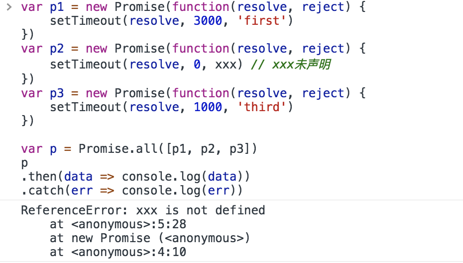
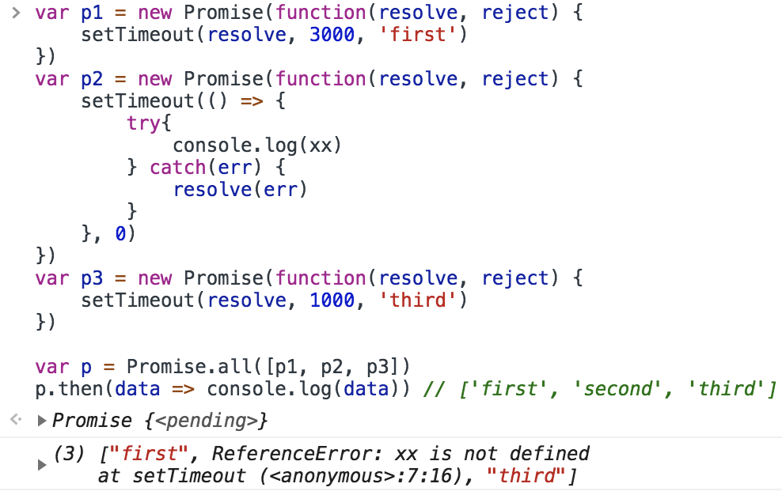
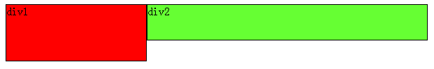
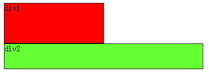
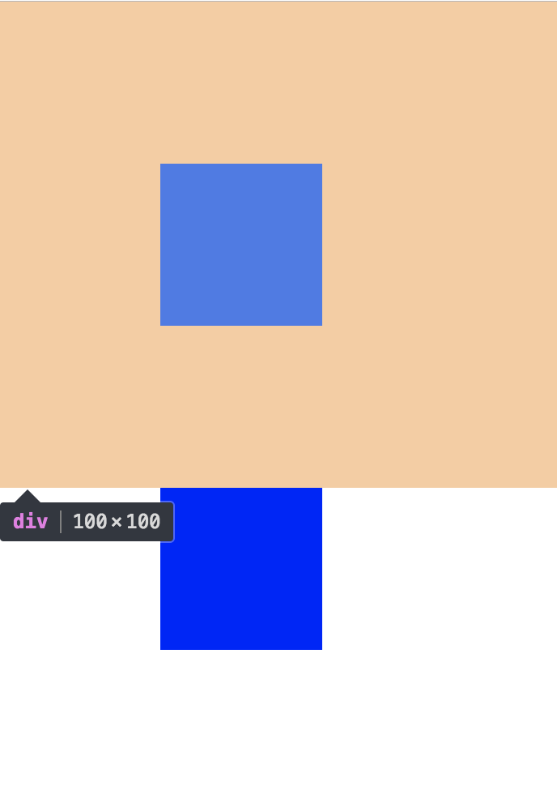
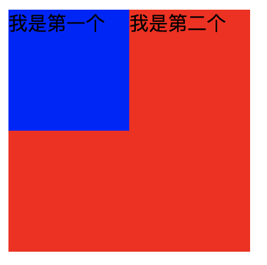
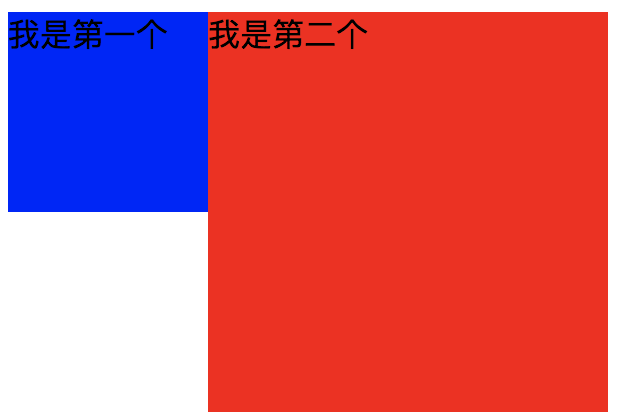
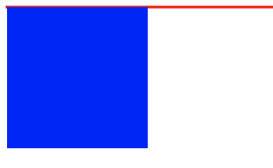
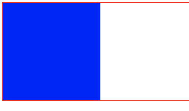

# 基础（一面）
### [HTML 5]Web worker
Web Worker是HTML5的新功能。Web Worker标准包含两部分：**Worker对象**（该对象暴露给创建该线程 的线程用的）、**WorkerGlobalScope**（这是一个用来表示新创建的Worker的全局对象，也是Worker线程内部使用的对象）

外界：
 - 实例化一个worker对象
 ```js
 var worker = new Worker('./my/path/to/async.js')
 ```
 - 发送消息给worker内部
 ```js
 worker.postMessage('Hello')
 ```
 - 注册事件处理程序
 ```js
 worker.onmessage = function(e) {
     // ...
     worker.terminate() // 关闭 Worker线程
 }
 ```
worker内部
 - 注册事件处理程序
 ```js
 // WorkerGlobalScope是一个供Worker使用的全局对象
 // 因此postMessage、onmessage看起来像全局函数和全局变量
 onmessage = function(e) {
     postMessage(123)
 }
 ```
### WebWorker 会用在哪些场景？
 - 完成轮询，以便第一时间得知状态改变

### [HTML5]HTML5的新语法
#### 语法优化
 - DOCTYPE html 简化
    - 字符编码更简洁
    - 不区分大小写

#### 新增标签（语义化）
 - 结构标签
    - header（头部信息、标题）
    - nav（导航条）
    - section（内容区块）
    - article（核心内容）
    - footer（底部信息）

 - 表单标签（input的type属性）
    - email
    - url
    - number
    - range
    - Date
    - search
    - color

 - 媒体标签
    - video
    - audio
    - embed（嵌入内容，包括各种媒体：PDF、MP3等）

### [CSS3]CSS3的新增属性
CSS3样式提纲：
 - 圆角（border-radius）、阴影（box-shadow、text-shadow）、渐变（gradient）、滤镜（filter）、文字省略（text-overflow: ellipsis）
 - 动画（animation）
 - 过渡（transition）、变换（transform）
 - 新增盒模型——弹性盒模型（Flexbox）
 - 新增box-sizing：content-box（即标准盒模型）、border-box（即IE盒模型）

### 盒模型
 - 标准盒模型
 width、height、padding、border、margin 五个独立，所设及所得

 - IE盒模型
 width（height）包括了padding、border，（`margin依旧独立`），故最终width会小一些

### 弹性盒模型
采用Flex布局的元素，成为`Flex容器`，它的子元素自动成为`Flex项目`

容器存在两根轴：`主轴（水平）`、`交叉轴（垂直）`。`项目`默认沿主轴排列
 - 容器的属性
    - **justify-content** // 主轴上项目的对齐方式 { flex-start | flex-end | center | space-between }
    - **align-items** // 交叉轴上项目的对齐方式 { flex-start | flex-end | center }
    - flex-direction // 主轴的方向
    - flex-wrap // 主轴是否换行
    - flex-flow // 上两个缩写

 - 项目的属性
    - order // 项目各自的排列顺序
    - flex-grow // 放大比例
    - flex-shrink // 缩小比例
    - flex-basis
    - **flex** // 上三个的缩写

### 完美居中的方案
 详见[2019-03-10](./2019-03-10.md)里的居中
### [CSS]CSS定位
 - 绝对定位
    - position: absolute | fixed（前者相对非static的父元素、后者相对浏览器的左上角）
 - 相对定位
    - position: relative（相对本身所在位置）

### 闭包
`闭包`就是一个函数，这个函数能够访问 **其他函数的作用域** 中的变量。

当函数可以记住并访问所在的词法作用域时，就产生了闭包。

原理：内部函数的作用域链包含这个函数的作用域

特点：
 - 可以读取另外一个函数作用域里的变量
 - 可以将这些变量保存在内存中
 - 可能会导致内存泄露（因为闭包会携带：包含它的函数作用域）
 - 创建一些特权方法

#### 为什么闭包可以访问其他函数的作用域链？
当调用一个函数时，
 - 创建该函数的执行环境
 - 在环境中创建它的作用域链
 - 通过arguments和命名参数来初始化一个活动对象，push到作用域链顶端
 - 再往作用域链后面push其他活动对象

```js
function outer() {
    var a = 'heshiyu'
    var inner = function() {
        console.log(a)
    }
    return inner // 注意这里只是返回对这个方法的引用
}
var inner = outer() // 获得：闭包函数inner
inner() // 'heshiyu'
```
当程序执行完`var inner = outer()`，其实`outer`的执行环境并没有销毁。因为它里面的**变量a仍然被inner函数的作用域链所引用**，当程序执行完`inner()`，`inner`和`outer`的执行环境才被销毁。

### 事件委托

### 移动端H5适配
#### video里的子标签的track
在不同的手机系统、不同的浏览器都不兼容

### [JS]回调函数
把函数作为参数传递，等待请求完成之后执行callback函数

需求：创建100个div节点，然后把这些div节点都**设置为隐藏**。
```js
var appendDiv = function() {
    for ( let i=0; i< 100; i++) {
        var div = document.createElement('div')
        div.innerHTML = i
        document.body.appendChild(div)
        div.style.display = 'none' // 这句不合理，影响复用
    }
}
appendDiv()
```
可以看出`div.style.display = 'none'`的硬编码放在`appendDiv`中显然是不合理的。因为并不是每个人创建了节点都希望他们立刻被隐藏。

做法：把`div.style.display = 'none'`抽离出来，用**回调函数**的形式传入appendDiv：
```js
var appendDiv = function(callback) {
    for( let i=0; i< 100; i++ ) {
        var div = document.createElement('div')
        div.innerHTML = i
        document.body.appendChild(div)
        // 节点创建好了，还有其他需求吗？
        if (typeof callback === 'function') {
            callback(div)
        }
    }
}

appendDiv(function(node) {
    node.style.display = 'none' // vip客户说：我还要增加一个功能，隐藏掉div
})
```
把`“隐藏节点”`的逻辑放在回调函数中，委托给appendDiv方法，在指定时刻执行这个“客户定义的”回调函数。


### 设计模式
#### 发布-订阅模式
发布-订阅模式（也称：观察者模式），它定义了**对象间的一对多依赖**关系（即，当一个对象的状态发生改变时，所有依赖于它的对象都将得到通知）

优点：
 - 时间上（广泛应用于异步编程，是一种代替传递回调函数的方案）
 - 对象间（不需强耦合再一起。虽然不清楚彼此细节，但不影响它们之间通信）

 ### [浏览器]内核
 - Trident （IE内核）
 - Gecko （Firefox内核）
 - Presto（Opera，已废弃）
 - Webkit（Safari、Chrome28前）
 - Blink（Chrome28后）

 ### [浏览器]强缓存和协商缓存
 第一次请求成功后，再次请求同一个网页：
  - 获取第一次请求成功后缓存下来的`Header`，里面包括：`Expires`、`Cache-control`、`Last-Modified`和`ETag`。前两者属于强缓存，后两者属于协商缓存
  - 先看`Expires`和`Cache-control`，检查是否命中 `强缓存`
    - 若是，直接从本地磁盘获取资源（200）
    - 若不是，再看`Last-Modified`、`ETag`检查是否命中 `协商缓存`
        - 若是，浏览器会响应新的Header信息给客户端（但不会返回资源内容），没有新修改的地方（304）
        - 若不是，响应全新的资源内容给客户端

### [HTML]HTML5 本地存储
  * [sessionStorage、localStorage、cookies的区别（2019-01-13）](/src/Browser/webStorage.md)

### [WEB]XSS、CSRF、SQL注入
针对Web服务器的攻击，常见的有：`XSS（跨站脚本攻击）`、`CSRF（跨站请求伪造）`、`SQL注入`

#### XSS（跨站脚本攻击）
依赖JS。

攻击者向某个web页面插入恶意的js脚本。当普通用户访问时，恶意脚本会自动执行，然后盗取用户cookie

解决方法：
 - 对于`输入点`，前端将`特殊字符进行编码`（例如Html标记的<>）
 - 对于`输出点`，后端将`关键字符进行过滤`
 - 对于`cookie`设置为`httpOnly`（防止客户端通过document.cookie读取cookie）

#### CSRF（跨站请求伪造）
攻击者盗用你的身份，以你的名义发送恶意请求。

解决方法：
 - 验证`HTTP Referer`字段
 - 在请求地址中`添加token并验证`
 - 在HTTP头中`添加自定义属性并验证`

#### SQL注入
攻击者把SQL命令插入到web表单的输入框，欺骗服务器执行恶意的SQL命令。

解决方法：对用户的输入进行检查

### [浏览器]输入URL，会发生什么？
1、浏览器输入url

2、浏览器检查`强缓存`（Expires、Cache-control）

3、解析url、获取主机ip

4、组装Http报文

5、打开socket与目标ip，端口建立TCP连接

6、TCP连接建立后，发送HTTP请求

7、服务器接收并解析，检查`协商缓存`（ETag、Last-Modified）

8、通过TCP返回响应报文

9、浏览器缓存响应

10、浏览器进行`解析HTML（构造DOM树）`、`下载资源`、`构造CSSOM树`、`执行JS脚本`

### [Web]性能优化
 - content方面
    - 减少DOM元素数量
    - 减少DNS查询
    - 减少HTTP请求
 
 - Server方面
    - 使用CDN
    - 使用Expires、Cache-Control响应头，配置ETag

 - Cookie方面
    - 减小cookie大小

 - css方面
    - 将样式表放到页面顶部
    - 不使用CSS表达式

 - js方面
    - 将脚本放到页面底部
    - 减少DOM访问

 - 图片方面
    - css精灵

### [Web]渐进增强、优雅降级
渐进增强是指，针对`低版本浏览器`进行构建（先保证最基本的功能），然后再针对`高级浏览器`进行改进。

优雅降级是指，一开始就构建`完整的功能`，然后再针对`低版本浏览器`进行兼容。


### [js]原型对象、原型指针与原型链
`prototype`是指原型对象。
 - 作用：
    存放着所有实例对象的公用属性和方法（即原型属性和方法）
 - 原理：
     - 因为每个构造函数都有`prototype`属性，它指向的是该构造函数的原型对象；
     - 再者，原型对象也有一个`constructor`属性，它指向的是该构造函数本身
     - 也就是说，当实例化一个对象的时候，我们不仅可以获得这个`对象的实例属性（和方法）`，还可以获得`原型对象上的原型属性（和方法）`

`原型链`是作为 **实现继承** 的主要方法，其基本思想是：`利用原型，让一个引用类型继承另一个引用类型的属性和方法`。

`__proto__`是原型指针，指向原型。（每个对象有都有的属性）

 > 原型链实际上是`__proto__连起来的链条`

 ### 单例模式


### [Node.js]
Node.js 采用了`单线程`、`异步式I/O`、`事件驱动`的程序设计模型，实现了：`包和模块`、`文件系统`、`网络通信`、`操作系统API`等功能

#### 异步式I/O
 - `线程1` 将 **I/O操作** 发送给 `操作系统`，继续执行后面的语句；
 - 执行完后，会马上进入 **事件循环**（不断地检查 **事件队列** 有没有未处理的事件）
 - 当操作系统完成 **I/O操作** 时，以 **事件** 的形式发送到 **事件队列**
 - `线程1` 在 **事件循环** 中，检查到 **事件队列** 存在未处理的事件；**事件循环** 会 **主动调用回调函数** 来完成后续工作

#### 事件驱动events
 > `events`模块提供了唯一的接口，它几乎被所有的模块依赖。
`events`模块只提供一个对象：`events.EventEmitter`，其核心就是 **事件发射** 和 **事件监听** 功能的封装。
```js
var events = require('events')
var emitter = new events.EventEmitter()

emitter.on('someEvent', name => console.log(name))
emitter.emit('someEvent', 'name')
```

#### [浏览器]WebSocket
`WebSocket`是一种浏览器的API，它可以在一个单独的持久连接上建立双向通信

优点：
 - 支持服务端及时的消息推送；
 - 复用长连接；
 - 同一条`WebSocket`上能同时并发多个请求

缺点：
 - 需要维护`WebSocket`连接
 - 消息推送比较复杂


### [HTTP]状态码
 - 200：ok，正常返回
----
 - 301：永久性重定向
 - 302：临时性重定向
    - 相同点：以上两个都会跳转，搜索引擎会抓取最新内容
    - 不同点：搜索引擎会保存 `新地址（301）` / `旧地址（302）`
 - 304：Not Modified，响应内容没有改变（在协商缓存 - 有效后触发）
----
 - 400：Bad Request，服务器无法理解请求格式
 - 401：Unauthorized，请求未授权
 - 403：Forbidden，禁止访问
 - 404：Not Found，找不到匹配资源
----
 - 500：常见服务端错误
 - 503：服务端暂时无法处理请求

### 正向代理 和 反向代理
#### 正向代理
一般说的 **代理** 指的是**正向代理**（如：VPN）

正向代理的对象是 `客户端`

```js
// 在vue里的config/index.js中dev对象的proxyTable上设置，来解决开发时跨域问题
dev: {
    proxyTable: {
        '/api': {
            target: 'http://192.168.5.2',
            changeOrigin: true
        }
    }
}
```

#### 反向代理
反向代理的对象是 `服务端`

 - 在“反向代理”中，客户端做域名解析时，实际上得到的是 `反向代理服务器的IP`，而不是`服务器IP`
 - `Nginx`接收客户端请求，根据`server_name`去匹配对应的`server节点`；再找到里面的`proxy_pass`转发过去

 ```js
 // 客户端 部分
 192.168.72.49 8081.max.com
 192.168.72.49 8082.max.com
 --------------------------

 // 服务端 部分
 server {
     listen 80;
     server_name 8081.max.com // 根据这个字段进行匹配

     location / {
         proxy_pass http://192.168.72.49:8081 //再根据这个字段进行转发
     }
 }

 server {
     listen 80;
     server_name 8082.max.com

     location / {
         proxy_pass http://192.168.72.49:8082
     }
 }
 ```

 ### [HTTP]请求头


 ### TypeScript接口用途


 ### [ES8] callback、Async/Await和Promise
 #### 回调函数
 如果是以前，可以用`回调函数`实现：
 ```js
 function runAsync(callback){
     if(/* 异步操作成功 */) {
         callback(value)
     }
 }

// 传入一个匿名函数作为回调函数
 runAsync(funtion(data) {
     console.log(data)
 })
 ```
 缺点：
  - 容易造成 **回调地狱**
  - 影响阅读体验

 #### Promise
 Promise是一个容器，而且代表的是一个异步操作，有3种状态：
  - `Pending（进行中）`
  - `Fulfilled（已成功）`
  - `Rejected（已失败）`
  
  只有 **异步操作的结果** 可以决定当前是哪一种状态，任何其他操作都无法改变这个状态（也就是“承诺”的意思）。
  
  并且，**它的状态可以影响后续的then行为**
 ```js
 // Promise的构造函数接收一个函数作为参数，这个函数又可以传入两个参数：resolve、reject；
 // 它们分别表示：异步操作执行后，Promise的状态变为Fulfilled/Rejected的回调函数。
 var promise = new Promise(function (resolve, reject) {
     // ...
     if(/* 异步操作成功 */) {
         resolve(value) // 这个value表示的是异步操作后获得的数据
     } else {
         reject(error) // 这个error表示的是异步操作后报出的错误
     }
 })
 ```
 优点：
  - 解决了 **回调地狱**
  - 方便阅读

 缺点：
  - 返回值传递
    - 仍然需要创建`then`调用链，需要创建匿名函数，把返回值一层层传递给下一个`then`
  - 异常不会向上抛出
    - `then`里函数有异常，`then调用链`外面写`try-catch`没有效果
  - 不方便调试
    - 在某个`.then`设置断点，不能直接进到下一个`.then`方法

 #### Async、Await
`async`是一个函数修饰符。如果是`async`关键词声明的函数会**隐式**返回一个`Promise`；

`await`后面跟也是`Promise`，它的语义是：必须等到`await`后面跟的`Promise`有了返回值，才能继续执行`await`下一行代码；

 好处：
  - 简洁。易于阅读和理解
  - 错误处理。
    - 可以被`try-catch`捕捉到
  - 方便调试。


### [css]rem
`rem`是相对于（相对于`html`的字体大小）

默认：1rem = 16px

要设置成：1rem = 10px，则需要：

```css
html {
    font-size: 62.5% /* 10 / 16 * 100% */
}
```

### [css]css hack
`css hack`，指的是当不同浏览器对某些css属性做解析的时候，出现差异；然后去弥补这些差异的过程。

分为：
 - 条件hack
 ```html
 <!--[if le IE 8]>
 <style>
    .test2 {
        width: 100px;
    }
 </style>
 <![endif]--

 /* 上面是表示当浏览器是小于ie8以下的 */
 ```
 - 属性hack
 ```css
 #test {
     color: #c30; /* For Firefox */
     color: red\0; /* For Opera */
     color: yellow\9; /* For IE8 */
     *color: blut; /* For IE7 */
     _color: #ccc; /* For IE6 */
 }
 ```
 - 选择符hack
 ```css
 * html .test {
     color: red; /* For IE6 and earlier */
 }
 * + html .test {
     color: yellow; /* For IE7 */
 }
 .test:lang(zh-cn) {
     color: white; /* For IE8+ and not IE */
 }
 .test:nth-child(1) {
     color: black; /* For IE9+ and not IE */
 }
 ```


 ### [js] 函数防抖与函数节流
 `函数防抖`（debounce），指的是在上次触发之后、再过N毫秒，才能执行该动作
 
 原理：在N毫秒内重复触发，会重新计时

 简单实现：
 ```js
 function debounce(fn, delay = 500) {
     let timer
     return function() {
         let args = arguments
         if (timer) {
             clearTimeout(timer)
         }
         timer = setTimeout(() => {
             fn.apply(this, args)
         }, delay)
     }
 }

var func1 = function(y) {
    console.log(y)
}

var myFunc1 = debounce(func1, -2)
myFunc1('caozuoxiao')
 ```

 `函数节流`（throttle），指的是函数按照一个周期N毫秒执行
 
 原理：判断上次操作、这次操作的时间间距

 简单实现：
 ```js
 function throttle(fn, delay = 500) {
     let startTime = Date.now()
     return function() {
         let args = arguments
         let currentTime = Date.now()
         if (currentTime - startTime > delay) {
             fn.apply(this, args)
             startTime = currentTime // 刷新旧的startTime
         }
     }
 }

var func = function(x) {
    console.log(x)
}

var myFunc = throttle(func, -1) // 为了test，delay设为-1
myFunc('heshiyu') // 'hehsiyu'
 ```


 ### [js] call、apply、bind
 3个方法的作用：
   - 改变`this`的指向；
   - 支持`传入参数`；
   - `call`、`apply`返回函数结果；`bind`返回新函数
 
 特点：
   - `call`：只能一个参数一个参数传
   - `apply`：只支持传一个数组（`arguments`）

 #### 实现call
 ```js
 Function.prototype.myCall = function(obj, ...arg) {
     let result
     // 0、传参检测
     if (obj === null || obj === undefined) {
         obj = window
     } else {
         obj = Object(obj)
     }
     // 1、改变`this`指向
     // 要让传入的obj成为：函数调用时的this值
     obj._fn_ = this
     result = obj._fn_(...arg) // 2、支持`传入参数`
     delete obj._fn_
     return result // 3、利用变量保存函数的返回值
 }
 ```
 #### 实现apply
 ```js
 // 注意，第二个参数是一个数组
 Function.prototype.myApply = function(obj, arr) {
     return this.myCall(obj, ...arr)
 }
 ```
 #### 实现bind
 ```js
 Function.prototype.myBind = function(obj, ...arg) {
     return (...arg2) => {
         let args = arg.concat(arg2)
         // 以下和实现call的一样
         let result
         // 0、传参检测
         if (obj === null || obj === undefined) {
             obj = window
         } else {
             obj = Object(obj)
         }
     // 1、改变`this`指向
     // 要让传入的obj成为：函数调用时的this值
         obj._fn_ = this
         result = obj._fn_(...args) // 2、支持`传入参数`
         delete obj._fn_
         return result // 3、利用变量保存函数的返回值
     }
 }
 ```

 ### [http]HTTP和HTTPS的区别
 `http`是无状态的超文本传输协议，是明文传输；
  - 标准端口：80
  - 不需要ca证书

 `https`是由SSL + http协议构建的加密传输协议
  - 标准端口：443
  - 需要ca证书
  - 增加cpu、带宽消耗
  - 首次连接比较慢

 ### [TCP]三次握手、四次挥手
 三次握手：
  - `客户端`发送syn给`服务端`
  - `服务端`收到syn后，会给`客户端`发送syn + ack
  - `客户端`收到syn + ack后，会给`服务端`发送ack表示已收到

 四次挥手：
  - `主动方`会发送FIN给`被动方`
  - `被动方`收到FIN后，会发送ack给`主动方`
  - `被动方`再发送FIN给`主动方`
  - `主动方`收到FIN，发送ack给`被动方`

### [js]new操作符经历了哪些步骤？
 - 创建了一个`新的对象`
 - 将`构造函数的作用域`赋值给`新的对象`（此时this指向新的对象）
 - 执行`构造函数`里的代码（为这个新对象添加属性）
 - 返回一个`新的对象`

 ### [js]window对象和document对象的区别
 `window`对象表示：浏览器中打开的窗口；

 `document`对象表示：当前页面；它是`window`的一个对象属性


 ### [算法] 八大算法
 不稳定：
 - 简单选择排序
 - 希尔排序
 - 快速排序
 - 堆排序

 稳定：
 - 冒泡排序
 - 归并排序
 - 插入排序
 - 基数排序

 #### 稳定性的意义
 目的：`保证两次排序的结果相同`
  - 比如先按ID（从小到大排序），已经排好了；
  - 再按体重排序（轻的在前面、重的在后面），遇到体重相等时，就按ID排
  - 如果是稳定性的算法，结果是相同的（体重相同者，ID小的在前面）
  - 如果是不稳定的算法，结果可能是（体重相同者，ID小的在后面）
 
 ### [js] let/var

 ### [浏览器]CORS跨域资源共享
 `CORS`是W3C标准，叫“跨域资源共享”。它允许`浏览器`向`跨源服务器`发出`XMLHttpRequest`请求，从而克服AJAX只能`同源使用`的限制。

 需要`浏览器`+`服务端`同时支持（IE10+）

 一共2类CORS请求：`简单请求`、`非简单请求`

 #### 简单请求
 同时满足以下两种条件：

 条件一：请求方法：`HEAD`、`GET`、`POST`

 条件二：HTTP头部信息（不能多于以下字段）
 - `Accept`
 - `Accept-Language`
 - `Content-Language`
 - `Last-Event-ID`
 - `Content-Type`
    - application/x-www-form-urlencoded
    - multipart/form-data
    - text/plain

**简单请求的HTTP头部**会自动添加一个`Origin`字段（表明请求来自哪个源）。

若`Origin`指定的源：
 - 在许可范围
    - 响应头信息**会有**`Access-Control-Allow-Origin`（其值要么是`Origin`的值，要么是`*`）
 - 不在许可范围
    - 响应头信息**没有**`Access-Control-Allow-Origin`（能被`XMLHttpRequest`的`onerror`捕获）

> 有关Cookie**（前提：源在许可范围内）**
>    - 响应头信息会有`Access-Control-Allow-Credentials`（`true`：请求可以带Cookie；`false`：相反）
>    - 响应头信息的`Access-Control-Allow-Origin`不能设为`*`，必须指定明确
>    - 浏览器要设置`xhr.withCredentials = true`才可以发Cookie，且只有用`服务器域名`设置的Cookie才会上传（其他域名的Cookie不会上传）

#### 非简单请求
`非简单请求`是指请求方法：`PUT`、`DELETE` 或者 Content-Type：`application/json`的请求，它会先发送一个`预检请求`（`OPTIONS`）。

`预检请求`的HTTP头部会自动添加一个`Origin`字段（表明请求来自哪个源），以及以下两个特殊字段：
 - `Access-Control-Request-Method`
    - 列出**接下来的CORS请求**会用到哪些方法
 - `Access-Control-Request-Headers`
    - 指定**接下来的CORS请求**会额外发送哪些自定义头部

 服务器收到`预检请求`后，
 - 允许跨域
    - `Access-Control-Allow-Origin`
        - 表示允许访问的源（其值要么是`Origin`的值，要么是`*`）
    - `Access-Control-Allow-Methods`: GET, POST, PUT
        - 表示允许的方法
    - `Access-Control-Allow-Headers`
        - 表示允许访问的头部属性
 - 不允许跨域
    - 响应头信息没有任何CORS相关头信息字段(能被`XMLHttpRequest`的`onerror`捕获)

 只要通过了“预检请求”，以后每次正常的CORS请求，都会跟`简单请求`一样了：
  - 对于请求头部，会有一个`Origin`字段
  - 对于响应头部，也会有`Access-Control-Allow-Origin`
  

### CSS面试题
一个页面中，有Header、Content、Footer三部分。其中，Footer高度固定，但Content内容的高度不定。当Content内容小于多于一屏，Footer紧跟在Content的实际位置下方；当Content内容多于一屏，Footer固定在浏览器下方

 ### [css]sticky
 `sticky`是position的粘性属性。它是在`relative`和`fixed`中切换，具体看是否要移出`viewPort`。
 ```css
 div.sticky {
     position: sticky;
     top: 10px;
 }
 ```
 也就是说：当滚动时，这个元素有移出的倾向，则切换为`fixed`（通过阈值来进行一些buff的作用）
 - 阈值是：`top`、`bottom`、`left`、`right`，必须设置四者之一
 - 若设定了阈值为`top: 10px`，则表示：当距离`viewPort的顶部`提前到`10px`的位置就切换`fixed`
 - 该元素并不脱离文档流，仍然保留元素原本在文档流中的位置


### Promise.all()的用法，以及它的异常处理
#### `Promise.all([])`接收一个数组，数组中每个元素都是`Promise的实例`。
例如：
```js
var p1 = new Promise(function(resolve, reject) {
    setTimeout(resolve, 3000, 'first')
})
var p2 = new Promise(function(resolve, reject) {
    setTimeout('second')
})
var p3 = new Promise(function(resolve, reject) {
    setTimeout(resolve, 1000, 'third')
})

var p = Promise.all([p1, p2, p3])
p.then(data => console.log(data)) // ['first', 'second', 'third']
```

 - 当`p1、p2、p3`都为fulFilled，按`参数的顺序`传给p的回调函数（then）
 - 当`p1、p2、p3`其中一个为rejected，会把`第一个变rejected`的值传给p的回调函数（catch）

#### 异常处理
因为`Promise.all()`方法是**一旦抛出其中一个异常**，那其他正常返回的数据也无法使用了

 

解决办法：
 - 方法一：改为串行调用（失去了并发优势）
 - 方法二：在Promise内，先用try-catch吃掉这个异常。在其catch内再调用resolve(err)，让外面的Promise“感觉”像是调用成功
 ```js
 // 方法二：
 var p2 = new Promise(function(resolve, reject) {
     setTimeout(() => {
         try {
             console.log(xxx) // xxx未声明，会抛出异常给下面的catch块
         } catch(err) {
             resolve(err) // 在内部的catch里调用resolve(err)
         }
     })
 })
 ```
 


### 对于行内元素、块级元素的水平/垂直居中如何实现？
#### `行内元素`：
 - 水平居中：
```css
/* A1 */
.parent {
    text-align: center;
}
```
 - 垂直居中：
```css
/* B1 */
.parent {
    height: 100px;
    line-height: 100px;
}

/* B2 */
.parent {
    display: table-cell;
    vertical-align: middle;
}
```
 - 水平垂直居中：
 ```css
 /* 不兼容flexbox */
    /* `A1` 与 `B1/B2`混合搭配  */
 
 /* 兼容flexbox */
    .parent {
        display: flex;
        justify-content: center;
        align-items: center;
    }
 ```

#### 块级元素：
 - 水平居中：
 ```css
 /* C1 */
 .child {
     margin: 0 auto;
 }
 /* C2 */
 .child {
     position: relative;
     margin: auto;
     left: 0;
     right: 0;
 }
 /* C3 */
 .parent {
     display: flex;
     justify-content: center;
 }
 ```
 - 垂直居中：
 ```css
 /* D1 */
 .parent {
     display: table-cell;
     vertical-align: middle;
 }
 ```
 - 水平垂直居中：
 ```css
 /* 不兼容flexbox */
    /* `C1/C2/C3` 与 `D1`混合搭配  */
 
 /* 兼容flexbox */
    .parent {
        display: flex;
        justify-content: center;
        align-items: center;
    }
 ```

### 行内元素有哪些？为什么img不是？
行内替换元素。height/width/padding/margin均可用。效果等于块元素。


### Flexbox的兼容性
IE10 及以上


### ES6、ES7和ES8有哪些不同的地方吗？
#### ES7
 - 求幂运算符（`**`）
 - Array.prototype.includes()

#### ES8
 - async/await
 - Object.entries()和Object.values()
    - 将对象按照key/value返回一个二维数组
 - padEnd和padStart
    - 填充目标字符串到目标长度
 - Object.getOwnPropertyDescriptors
    - 返回目标对象中所有属性的属性描述符
 - 共享内存和原子


### 有哪些可以和后台保持不断的通信？
 - 不断轮询
 - 长时间连接
 - WebSocket

 ### [css]设置元素不可见的方法
```css
/* 1 */
.child {
   display: none;
}

/* 2 */
.child {
   visibility: hidden;
}

/* 3 */
.child {
   position: absolute;
   top: -999999px;
}

/* 4 */
.child {
   opacity: 0;
}
```

### [css]网页中的布局格式
 - 标准流
   - 行内元素在同一行，块级元素上下显示
 - 浮动流
   - 脱离标准流的第一种方式，但 **会影响** 标准流的排列
 - 定位流
   - 脱离标准流的第二种方式，**不会影响** 标准流的排列

### [css]浮动是什么？
浮动的目的：**一行显示多个div元素**

 规则：若元素A是浮动的：
 - 若他前一个元素也是浮动的，那会跟随前一个元素的**后边**
 - 若他前一个元素是在标准流的，那会和前一个元素的**底部对齐**

 牢记：`clear`规则只能影响`使用清除的元素本身`（**可以使xx元素的左/右边不允许出现浮动元素**）
 
 例子：
 `div1`、`div2`都是浮动的，希望做到`div2`紧跟`div1`底部对齐
 

 解决方法：
 ```css
 .div2 {
    clear: left; /* 指定 div2元素左边 不允许出现浮动元素 */
 }
 ```
 
 
 #### 浮动会带来什么问题？
  - 多个浮动元素可能导致父元素高度无法撑开
  - 浮动元素后面的非浮动元素（内联元素），会跟随其后
  - 浮动元素前面的非浮动元素，会影响页面的结构

 #### 清除浮动
  - 在父元素最后一个子元素后，再加一个子元素，属性为`clear: both;`
  - 在父元素新增伪类：
  ```css
  .parent:after {
     display: block;
     content: ' ';
     clear: both;
  }
  ```
  - 给父元素设为`overflow: hidden;`（利用BFC的原理）
  - 给父容器设为`float: left;`（利用BFC的原理）

### [css] BFC是什么？
`BFC`指的是`块级格式化上下文`，可以把BFC理解为一个封闭的大箱子，箱子内部的元素无论如何都不会影响到外部。

#### 触发BFC的条件
 - 根元素（body）
 - 浮动元素
 - 绝对定位元素（absolute、fixed）
 - display为`inline-block`、`table-cell`、`flex`
 - overflow为`hidden`、`scroll`、`auto`

 触发某元素的BFC特性 = 将某元素放到BFC容器中

#### BFC的特性及应用
 - `在同一个BFC里`的元素的`外边距`会发生重叠
 ```html
 <style>
    div {
       width: 100px;
       height: 100px;
       background: blue;
       margin: 100px;
    }
 </style>
 <body>
    <div></div>
    <div></div>
 </body>
 ```
 由下图可知，两个div元素都`处于同一个BFC容器下`（指body元素）。
 
 上一个div的`margin-bottom: 100px;`，下一个div的`margin-top: 100px;`，可看出margin是重叠过的（即两个100px只算一个）

 

 > 解决方法：为了 避免外边距（margin）重叠，可以将它们放到 `不同的BFC容器`中（每个div外包一个`overflow: hidden;`的父容器）

- `BFC`可以阻止元素`被浮动元素覆盖`
```html
 <style>
    .first {
       float: left;
       width: 100px;
       height: 100px;
       background: blue;
    }
    .second {
       width: 200px; /* 不设定宽度可以实现 两列自适应布局 */
       height: 200px;
       background: red;

       overflow: hidden; /* 该元素放在一个新的BFC容器 */
    }
 </style>
 <body>
    <div class="first">我是第一个</div>
    <div class="second">我是第二个</div>
 </body>
```
由下图可知，第一个div元素有自己的BFC容器，但是对于第二个div元素处于标准流会被覆盖。

> 解决办法：为了 阻止浮动元素（float）的覆盖，可以触发该元素的BFC特性。

 - before

 
 
 - after

 

 - `BFC`可以包含浮动的元素（即通常说的`清除浮动`）
```html
<style>
   .parent {
      border: 1px solid gray;
   }
   .child {
      float: left;
      width: 100px;
      height: 100px;
      background: orange;
   }
</style>
<body>
    <div class="parent">
        <div class="child"></div>
    </div>
</body>
```
 由下图可知，BFC容器内的浮动元素脱离标准流后，容器只剩下2px的边距高度。

 > 解决办法：为了 包含浮动元素（float），可以触发父元素的BFC特性（overflow: hidden;）

 - before

 

 - after

 
 
### setTimeout与var/let

```js
for (var i = 0; i < 10; i++) {
    setTimeout(function() {
        console.log(i) // 10 10 10 10 10
    }, 100 * i)
}
```

```js
for (let i = 0; i < 10; i++) {
    setTimeout(function() {
        console.log(i) // 0 1 2 3 4 ...
    }, 100 * i)
}
```

原因：
 - `setTimeout`是在`下一轮事件循环开始时`触发
 - `let`在循环里`每次迭代`都会创建一个新的作用域

### [css]margin重叠问题
在css中，`同一个BFC`下相邻的两个盒子的外边距（margin）可以结合成一个单独的外边距，这种合并的方式叫`折叠`
 - 若两个相邻的外边距`都是正数（+）`，结果是`最大值`
 - 若两个相邻的外边距`都是负数（-）`，结果是`两者绝对值较大的那个数`
 - 若两个相邻的外边距`一正（+）一负（-）`，结果是`两者之和`

### [js]DOM操作：获取、增、删、查、改等操作
[DOM节点](./../Basics/JS/DOM.md)

### [js]JS交换两个节点如何实现？
```html
<div id="a">啊</div>
<div id="b">波</div>
```
```js
 var obj = document.createElement('a')
 var div1 = document.getElementById('a')
 var div2 = document.getElementById('b')

 div2.parentNode.appendChild(obj)
 div2.parentNode.replaceChild(div1, obj) // (newElement, oldElement)，newElement在替换后会从原位置中被删除
```

### [css]z-index和position的关系
`z-index`用于设置元素的堆叠顺序，堆叠顺序高的会处于堆叠顺序底的前面

它只在`position`为`absolute`、`relative`或`fixed`的元素上有效

### [js]cookie和session的区别
`cookie`
 - `保存在客户端`的小文本
 - 可保存sessionID
 - 不安全
 
`session`
 - `保存在服务端`的有关浏览器会话的信息
 - 运行依赖sessionID
    - 创建前，服务端会先检查请求头里是否包含session id。若有，且未过期，则直接用旧的）
 - 有失效时间
 - 安全

 一句话：`session`的实现一般需要借助`cookie`来发送`sessionID`

 ### [js]jquery实现ajax的源码

 ### HTTP协议相关：请求头、响应头、状态码（5大类）、报文格式，一次http完整的过程，详细说一下Accept - Encoding的作用，和性能有关系？http有哪些请求方式？Get和post的区别？

 