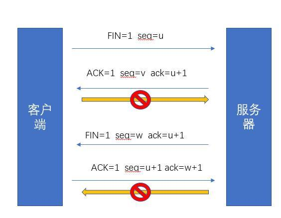

# 基础知识2
转载请注明出处: [https://github.com/Heshiyu1996/blogs](https://github.com/Heshiyu1996/blogs)

- 浏览器部分
    - [浏览器内核](#浏览器浏览器内核)
    - [浏览器缓存](#浏览器浏览器缓存)
    - [输入URL，会发生什么？（完整的http过程）](#浏览器输入URL，会发生什么？（完整的http过程）)
    
- Web部分
    - [XSS、CSRF、SQL注入](#WEBXSS、CSRF、SQL注入)
    - [Web性能优化](#WEBWeb性能优化)
    - [CDN](#WEBCDN)
    - [渐进增强、优雅降级](#WEB渐进增强、优雅降级)
    - [正向代理、反向代理](#WEB正向代理、反向代理)
    - [跨域资源共享（CORS）](#WEB跨域资源共享（CORS）)
    - [解决跨域的问题](#WEB解决跨域的问题)
    - [与后台保持不断的通信的方法](#WEB与后台保持不断的通信的方法)
    - [cookie和session的区别](#WEBcookie和session的区别)
    - [HTTP](#WEBHTTP)
    - [移动端H5适配](#WEB移动端H5适配)
    - [webpack](#WEBwebpack)
    - [gulp与webpack的区别](#WEBgulp与webpack的区别)
    - [为什么form表单可以跨域](#WEB为什么form表单可以跨域)
    - [HTTP和HTTPS的区别](#WEBHTTP和HTTPS的区别)
    - [三次握手、四次挥手](#WEB三次握手、四次挥手)
    - [HTTP2.0](#WEBHTTP2.0)
    -
- Node.js部分
    - [异步式I/O和事件驱动](#Node.js异步式I/O和事件驱动)
    - [require的过程](#Node.jsrequire的过程)
    - [回调函数](#Node.js回调函数)
    - [EventEmitter](#Node.jsEventEmitter)
- 算法
    - [八大排序](#算法八大排序)
    - [二分查找](#算法二分查找)


### [浏览器]浏览器内核
 - Trident （IE内核）
 - Gecko （Firefox内核）
 - Presto（Opera，已废弃）
 - Webkit（Safari、Chrome28前）
 - Blink（Chrome28后）

### [浏览器]浏览器缓存
 第一次请求成功后，再次请求同一个网页：
  - 获取第一次请求成功后缓存下来的`Header`，里面包括：`Expires`、`Cache-control`、`Last-Modified`和`ETag`。前两者属于强缓存，后两者属于协商缓存
  - 先看`Expires`和`Cache-control`，检查是否命中 `强缓存`
    - 若是，直接从本地磁盘获取资源（200）
    - 若不是，再看`Last-Modified`、`ETag`检查是否命中 `协商缓存`
        - 若是，浏览器会响应新的Header信息给客户端（但不会返回资源内容），没有新修改的地方（304）
        - 若不是，响应全新的资源内容给客户端

 ### [浏览器]输入URL，会发生什么？（完整的http过程）
 1、浏览器输入url

 2、浏览器检查`强缓存`（Expires、Cache-control）

 3、DNS解析url，获取主机ip

 4、组装HTTP报文

 5、发起TCP的3次握手

 6、TCP连接建立后，发送HTTP请求

 7、服务器接收并解析，检查`协商缓存`（ETag、Last-Modified）

 8、通过TCP返回响应报文

 9、浏览器缓存响应

 10、浏览器进行`解析HTML（构造DOM树）`、`下载资源`、`构造CSSOM树`、`执行JS脚本`
 
 > HTML解析器会根据HTML文档，从上往下进行解析
 > 
 > DOM的渲染，是在加载完`<head>`里的css、js后开始执行的
 > 
 > 所以，最好不要把js放在`<head>`(特别是操作DOM的js)
 > 
 > 对于没有声明defer、async的`<script>`就会按顺序直接加载、执行。`JS引擎`会抢夺HTML解析器的控制权。直到加载、执行完才会把控制权交给`渲染引擎`

### [WEB]XSS、CSRF、SQL注入
针对Web服务器的攻击，常见的有：`XSS（跨站脚本攻击）`、`CSRF（跨站请求伪造）`、`SQL注入`

#### XSS（跨站脚本攻击）
**含义**：攻击者向某个页面插入恶意的js脚本。当普通用户访问时，恶意脚本会自动执行，然后盗取用户cookie。

XSS攻击分为两种：反射性攻击、存储型攻击

- 反射性攻击
    - 1、引诱用户去点击链接
    - 2、正规网站的服务端将恶意代码`从URL的参数`里取出
    - 3、`拼接在HTML中`返回给浏览器
    - 4、被拼接的恶意代码就是：`1、获取该用户cookie；2、把cookie发送给黑客`

- 存储型攻击
    - 恶意代码被保存到目标网站服务器，其他用户加载时执行（**例如：博客、论坛、私信**）

**防御**：
 - `参数过滤`。在**表单提交**或**url参数**传递前，对需要的参数进行`过滤`
 - `转义`，对显示的内容进行`转义`
 - `httpOnly`。对于`cookie`设置为`httpOnly`（防止客户端通过document.cookie读取cookie）

#### CSRF（跨站请求伪造）
**含义**：攻击者通过`CSRF攻击`来`欺骗用户的浏览器`，使得浏览器`以用户的名义`去运行操作。

**原因**：因为浏览器的机制，当发送请求给某个域名，就会把关联的cookie（如果未过期的话）一起带过去。

> Cookie是`存在本地磁盘`的、并且是`跟着域名`来发送的

**例子**：
 - 1、用户登录并认证了网站A；
 - 2、当用户是登入状态时，攻击者诱导用户进入网站B；
 - 3、在网站B中，“悄悄地”向网站A发送请求；
 - 4、网站A认为是用户本人发出，接受请求。

**防御**：
 - 检查`Referer`字段
    - 缺点：要正确判断`是否为合法请求源`不容易
 - 设置`Token`并验证
    - 方法一：【cookie + 请求体参数】
    - 服务端在响应头设置`Set-Cookie`，值是服务端**随机生成**的`Token`
    - 浏览器收到响应头，会把cookie种到浏览器。
    - 浏览器解析cookie，并把`Token`放到请求体参数中，提交请求。
    - 服务端验证：`请求头中cookie中的Token`与`请求体参数中的Token`是否一致
    - 【方法二：通过cookie发送sessionId，变成“寻找Session”的问题】
 - 图片验证码

#### SQL注入
攻击者把SQL命令插入到web表单的输入框，欺骗服务器执行恶意的SQL命令。

防止：对用户的输入进行检查、过滤

### [WEB]Web性能优化
 - content方面
    - 减少DOM元素数量
    - 减少DNS查询
    - 减少HTTP请求
        - 原因
        ```js
        影响页面呈现有3个因素：
            1、服务端连接数据库，并返回数据
            2、http请求以及数据在网络中的传输（消耗80%）
            3、文件在浏览器中渲染呈现
        
        具体实践（减少HTTP请求）：
            1、充分利用浏览器缓存（使用Expires、Cache-Control响应头，配置ETag）
            2、CSS Sprites：把多张图片整合到一张图片中，再利用CSS的background属性进行定位
            3、合并CSS和JS文件：把多个js（css）合并为一个js（css）
            4、图片地图：允许在一张图片上关联多个URL，目标URL取决于点击的坐标
            5、对HTTP传输内容进行压缩（配置`Accept-Encoding`）
            6、
        ```
        另外还可以通过[图片转成base64](/src/Performance/base64.md)达到减少HTTP请求效果
 
 - Server方面
    - 使用CDN
    - 使用Expires、Cache-Control响应头，配置ETag

 - Cookie方面
    - 减小cookie大小

 - css方面
    - 将样式表放到页面顶部
    - 不使用CSS表达式

 - js方面
    - 将脚本放到页面底部
    - 减少DOM访问

### [WEB]CDN
`CDN`指的是内容分发网络。

当用户获取数据时，不需要直接从`源站`获取，而是通过`CDN`的内容分发，使得用户可以以`最短的路径`、`最快的速度`对网站进行访问，并减少`源站`的**负载压力**。
 
 - 未使用CDN
    - 1、用户输入域名
    - 2、DNS服务器解析该域名
    - 3、DNS服务器返回域名的IP地址
    - 4、浏览器向该IP发送请求
    - 5、服务器响应用户请求

    
 
 - 使用CDN
    - 1、用户输入域名
    - 2、DNS服务器`将解析权`交给`CDN专用DNS服务器`
    - 3、`CDN专用DNS服务器`将会返回`CDN负载均衡设备`的IP地址
    - 4、浏览器向该IP发送请求
    - 5、`CDN负载均衡设备`会为用户选择一台合适的`缓存服务器`（根据距离、需求、负载情况），并返回`缓存服务器`的IP
    - 6、浏览器向`缓存服务器`发出请求
    - 7、缓存服务器响应用户请求

    


### [WEB]渐进增强、优雅降级
渐进增强是指，针对`低版本浏览器`进行构建（先保证最基本的功能），然后再针对`高级浏览器`进行改进。

优雅降级是指，一开始就构建`完整的功能`，然后再针对`低版本浏览器`进行兼容。


### [WEB]正向代理、反向代理
#### 正向代理
一般说的 **代理** 指的是**正向代理**（如：VPN）

正向代理的对象是 `客户端`

```js
// 在vue里的config/index.js中dev对象的proxyTable上设置，来解决开发时跨域问题
dev: {
    proxyTable: {
        '/api': {
            target: 'http://192.168.5.2',
            changeOrigin: true
        }
    }
}
```

#### 反向代理
反向代理的对象是 `服务端`

 - 在“反向代理”中，客户端做域名解析时，实际上得到的是 `反向代理服务器的IP`，而不是`服务器IP`。然后`Nginx`再把http请求转发到另一个服务器上。
 - 跨域原理：通过把`本地的一个url前缀`映射到`要跨域访问的web服务器`上。对于浏览器来说，访问的是同源服务器上的一个url；对于Nginx来说，通过检测URL前缀，把HTTP请求转发到后面真实的物理服务器上

 ```js
 // 客户端 部分
 192.168.72.49 8081.max.com
 192.168.72.49 8082.max.com
 --------------------------

 // 服务端 部分
 server {
     listen 80;
     server_name 8081.max.com // 根据这个字段进行匹配

     location / {
         proxy_pass http://192.168.72.49:8081 //再根据这个字段进行转发
     }
 }

 server {
     listen 80;
     server_name 8082.max.com

     location / {
         proxy_pass http://192.168.72.49:8082
     }
 }
 ```


### [WEB]跨域资源共享（CORS）
 `CORS`是W3C标准，叫“跨域资源共享”。

 需要`浏览器`+`服务端`同时支持（IE10+），主要是在服务端增加一个 **过滤拦截器**。

 一共2类CORS请求：`简单请求`、`非简单请求`

 #### 简单请求
 同时满足以下两种条件：

 条件一：请求方法：`HEAD`、`GET`、`POST`

 条件二：HTTP头部信息（不能多于以下字段）
 - `Accept`
 - `Accept-Language`
 - `Content-Language`
 - `Last-Event-ID`
 - `Content-Type`
    - application/x-www-form-urlencoded
    - multipart/form-data
    - text/plain

**简单请求的HTTP头部**会自动添加一个`Origin`字段（表明请求来自哪个源）。

若`Origin`指定的源：
 - 在许可范围
    - 响应头信息**会有**`Access-Control-Allow-Origin`（其值要么是`Origin`的值，要么是`*`）
 - 不在许可范围
    - 响应头信息**没有**`Access-Control-Allow-Origin`（能被`XMLHttpRequest`的`onerror`捕获）

> 有关Cookie（前提：源在许可范围内）
>    - 响应头信息会有`Access-Control-Allow-Credentials`（`true`：请求可以带Cookie；`false`：相反）
>    - 响应头信息的`Access-Control-Allow-Origin`不能设为`*`，必须指定明确
>    - 浏览器也要设置`xhr.withCredentials = true`才可以发Cookie，且只有用`服务器域名`设置的Cookie才会上传（其他域名的Cookie不会上传）

#### 非简单请求
`非简单请求`是指请求方法：`PUT`、`DELETE` 或者 Content-Type：`application/json`的请求，它会先发送一个`预检请求`（`OPTIONS`）。

`预检请求`的HTTP头部会自动添加一个`Origin`字段（表明请求来自哪个源），以及以下两个特殊字段：
 - `Access-Control-Request-Method`
    - 列出**接下来的CORS请求**会用到哪些方法
 - `Access-Control-Request-Headers`
    - 指定**接下来的CORS请求**会额外发送哪些自定义头部

 服务器收到`预检请求`后，
 - 允许跨域
    - `Access-Control-Allow-Origin`
        - 表示允许访问的源（其值要么是`Origin`的值，要么是`*`）
    - `Access-Control-Allow-Methods`: GET, POST, PUT
        - 表示允许的方法
    - `Access-Control-Allow-Headers`
        - 表示允许访问的头部属性
 - 不允许跨域
    - 响应头信息没有任何CORS相关头信息字段(能被`XMLHttpRequest`的`onerror`捕获)

 注意：只要通过了“预检请求”，以后每次正常的CORS请求，都会跟`简单请求`一样了：
  - 对于请求头部，会有一个`Origin`字段
  - 对于响应头部，也会有`Access-Control-Allow-Origin`
  
### [WEB]解决跨域的问题
解决跨域：
 - JSONP
 - CORS
 - window.postMessage
 - window.name
 - Nginx

#### JSONP
 `JSONP`的特点：
  - 只支持`GET`，不支持`POST`（相当于下载一个js文件，相当于浏览器输入一个url一样）
  - 服务端返回的数据不能是标准的json格式，而是通过callback包裹（需要客户端和服务端定制开发）
  - 安全问题
  - 要确定jsonp请求是否失败并不容易

`JSONP`使用步骤：

1、注册一个callback：

```html
<script>
    var myHandler = function(data) {
        alert('获得从服务端的数据：', data)
    }
</script>
```

2、发送请求给服务器

客户端（js）写法一，利用script标签的src属性跨域：
```html
  <script src="http://flightQuery.com/jsonp/flightResult.aspx?code=CA1998&callback=flightHandler"></script>
```

客户端（jquery）写法二，利用jquery的ajax：
  ```html
  <script>
  $.ajax({
      url: 'http://www.baidu.com',
      async: false,
      type: 'get',
      data: {
          'id': 1
      },

      dataType: 'jsonp', // 1、指定服务器返回的数据类型
      jsonpCallback: 'myHandler', // 2、指定回调函数名称，要与服务器响应包含的callback名称相同

      success: function(data) {
          alert(data)
      },
      error: function(err) {
          alert(err)
      }
  })
  </script>
  
  ```
3、服务端（flightResult.aspx）返回以下代码：
```js
myHandler({
    "code": "200",
    "desc": 'hello',
    "detail": "hehe"
})
```
以上代码会用于调用`myHandler`这个回调函数。

 
 `CORS`的特点：
  - 支持所有请求类型
  - 服务端只需将处理后的数据直接返回，不需特殊处理

#### CORS
见上面一个知识点

#### window.postMessage
```js
// 子iframe
window.parent.postMessage('fullScreen', *)

// 父窗口
window.onmessage('fullScreen', () => { ... })

```

#### window.name（搭配iframe）
因为在一个窗口的生命周期内，载入的所有页面共享一个window.name。
```html
<body>
    <iframe id="iframe" src="http://www.baidu.com/data.html" onload="getData()" />
</body>

<script>
    function getData() {
        var iframe = document.getElementById('iframe')
        iframe.onload = function() {
            var data = iframe.contentWindow.name
            // 获取data.html里的数据
        }
        iframe.src = "b.html" // 转为和a同源的b.html
    }
</script>
```

#### Nginx
利用Nginx通过反向代理来转发请求，来满足浏览器的同源策略，实现跨域。

例如：

前端`http://localhost:8094`，想请求`http://localhost:1894/api/basic/login`这个接口

1、配置Nginx.conf，里面的定位规则：
```js
server {
    listen      8094;  #监听端口
    server_name localhost;

    location / {
        root html; #文件根目录
        index index.html index.htm; #默认起始页
    }

    #新增以下location定位规则
    location /rest {
        rewrite ^.+rest/?(.*)$ /$1 break; #只取标志位$1，作为重定向地址
        proxy_pass http://localhost:1894; #表明该请求要代理到的主机
    }
}

 # server：代表启动的一个服务
 # location：代表定位规则
    # rewrite：结合正则表达式、标志位，对url进行重写、重定向（语法：`rewrite regex replacement [flag]`）
        # 例如：`rewrite ^.+rest/?(.*)$ /$1 break`，
```

2、前端访问时，url填写`/rest/api/basic/login`即可。


### [WEB]与后台保持不断的通信的方法
 - 不断轮询
 - 长时间连接
 - WebSocket

#### WebSocket
WebSocket是一种协议，和HTTP协议一样位于应用层，都是TCP/IP协议的子集。
 - HTTP是单向通信协议（只有客户端发起HTTP请求，服务端才会返回数据）
 - WebSocket是双向通信协议（建立连接后，客户端、服务器都可以主动向对方发送或接受数据）
它建立前需要借助HTTP协议，建立连接后，持久连接的双向通信就和HTTP协议无关了。


### [WEB]cookie和session的区别
`cookie`
 - `保存在客户端`的小文本
 - 可保存sessionID
 - 不安全
 
`session`
 - `保存在服务端`的有关浏览器会话的信息
 - 运行依赖sessionID
    - 创建前，服务端会先检查请求头里是否包含session id。若有，且未过期，则直接用旧的）
 - 有失效时间
 - 安全

 一句话：`session`的实现一般需要借助`cookie`来发送`sessionID`


### [WEB]HTTP
 [HTTP](./../Browser/HTTP.md)

### [WEB]移动端H5适配

 #### [css]媒体查询
 ```css
 /* 分辨率大于960px且小于1280px */
 @media screen and (min-width: 960px) and (max-width: 1280px) {

 }
 ```
 #### [css] rem

### [WEB]webpack
`webpack`是模块打包的机制，它是通过`loader`、`plugins`对资源进行处理，最后打包成浏览器成识别的js等文件。

原理：
 - 识别入口文件
 - 分析模块依赖
 - 解析模块（通过不同`Loader`）
 - 编译模块，生成抽象语法树`AST`
 - 循环遍历`AST`
 - 打包成`bundle.js`

#### bundle.js
`bundle.js`实际上是一个`立即执行的匿名函数`。
 - 函数的参数是一个数组，数组中的每一项都是一个`function`
 - 每个`function`就对应每个`模块`的内容，会按照`require`的顺序排列，
 - 每个模块都有一个唯一的id（从0递增）

[查看bundle.js](./../../example/webpack/bundle.js)

#### Loader
`Loader`是对加载的文件进行处理。

本质上是一个函数，输入参数是一个`字符串`，输出参数也是一个`字符串`。（但是输出参数会被当成是JS代码，随后会解析成`抽象语法树AST`）

#### Plugins
`Plugins`是用来扩展webpack功能的，会在整个构建过程中生效，执行相关的任务。

和`Loader`的区别：
 - `Loader`是在打包构建过程中，用来处理源文件的（JSX、SCSS...），一次处理一个；
 - `Plugins`并不是直接操作单个文件，而是会`对整个构建过程都起作用`

#### 使用方法
 - ./node_modules/.bin/webpack `input.js` `output.js`
    - 不同环境下全局安装的webpack版本可能不符合这个项目，所以还是用局部依赖
 - 从入口文件`input.js`开始，找出`所有依赖`的文件，然后用对应的`loaders`去处理它们
 - 最后打包成为一个浏览器可识别的js文件`output.js`

### [WEB]gulp与webpack的区别
`gulp`强调的是前端开发流程。

用法：通过定义一系列的task，再定义task处理的事物、顺序，最后让gulp执行task，从而构建前端项目。

4个常用的方法：
 - src（）：获取流
 - dest（）：写文件
 - task（）：定义任务
 - watch（）：用来监听事件

 IE8下最好用`gulp`，IE9用`webpack`

### [WEB]为什么form表单可以跨域
因为原页面用 form 提交到另一个域名之后，原页面的脚本无法获取新页面中的内容。

所以浏览器认为这是安全的。

而 AJAX 是可以读取响应内容的，因此浏览器不能允许你这样做。

 ### [WEB]HTTP和HTTPS的区别
 `http`是无状态的超文本传输协议，是明文传输的；**它是基于TCP/IP的**。
  - 标准端口：80
  - 不需要ca证书

 `https`是由SSL + http协议构建的加密传输协议
  - 标准端口：443
  - 需要ca证书
  - 增加cpu、带宽消耗
  - 首次连接比较慢

 ### [WEB]三次握手、四次挥手
 三次握手：
  - `客户端`发送`SYN=1`给`服务端`
  - `服务端`收到`SYN=1`后，会给`客户端`发送`SYN=1、ACK=1`
  - `客户端`收到`SYN=1、ACK=1`后，会给`服务端`发送`ACK=1`


 四次挥手：
  - `客户端`会发送`FIN=1`给`服务端`
  - `服务端`收到`FIN=1`后，会发送`ACK=1`给`客户端`
  - `服务端`再发送`FIN=1`给`客户端`
  - `客户端`收到`FIN=1`，发送`ACK=1`给`服务端`



 ### [WEB]HTTP2.0
 HTTP2.0大幅度提高了web性能。

 `HTTP2.0`和`HTTP1.1`的区别：
  - 多路复用
  - 二进制分帧
  - 报文头压缩
  - 服务器推送

 ### [WEB]HTTP1.0如何复用TCP连接
 HTTP1.1默认连接是`持久连接`，客户端会在持久连接上连续发起请求。

 HTTP1.1以前的版本默认都是`非持久连接`，需要在HTTP请求头指定`connection: Keep-Alive`

 ### [WEB]长连接
 - 短轮询：客户端周期性地向服务器发起HTTP请求（一个request对应一个response）
 - 长轮询：客户端发起HTTP请求，服务器并不是每次都立即响应（等待数据更新后才响应，否则保持该连接直到超时）（一个request对应一个response）
 - WebSocket

 ### [WEB]DNS
 顺序：
  - 1、本地host文件
  - 2、本地DNS解析器
  - 3、本地DNS服务器
  - 4、根域名服务器
  - 5、顶级域名服务器
  - 6、权威域名服务器

### [Node.js]异步式I/O和事件驱动
Node.js 采用了`单线程`、`异步式I/O`、`事件驱动`的程序设计模型，实现了：`包和模块`、`文件系统`、`网络通信`、`操作系统API`等功能

#### 异步式I/O
 - `线程1` 将 **I/O操作** 发送给 `操作系统`，继续执行后面的语句；
 - 执行完后，会马上进入 **事件循环**（不断地检查 **事件队列** 有没有未处理的事件）
 - 当操作系统完成 **I/O操作** 时，以 **事件** 的形式发送到 **事件队列**
 - `线程1` 在 **事件循环** 中，检查到 **事件队列** 存在未处理的事件；**事件循环** 会 **主动调用回调函数** 来完成后续工作

#### 事件驱动events
 > `events`模块提供了唯一的接口，它几乎被所有的模块依赖。
`events`模块只提供一个对象：`events.EventEmitter`，其核心就是 **事件发射** 和 **事件监听** 功能的封装。
```js
var events = require('events')
var emitter = new events.EventEmitter()

emitter.on('someEvent', name => console.log(name))
emitter.emit('someEvent', 'name')
```

#### [浏览器]WebSocket
`WebSocket`是一种浏览器的API，它可以在一个单独的持久连接上建立双向通信

优点：
 - 支持服务端及时的消息推送；
 - 复用长连接；
 - 同一条`WebSocket`上能同时并发多个请求

缺点：
 - 需要维护`WebSocket`连接
 - 消息推送比较复杂

属性：
```js
Socket.readyState // 0未建立；1已建立；2正在关闭；3已关闭
Socket.bufferedAmount
```

方法：
```js
Socket.send() // 向服务端发送数据
Socket.close() // 关闭连接
```

事件：
```js
Socket.onopen // 连接建立时触发
Socket.onmessage //接收到服务消息时触发
Socket.onerror // 连接错误时触发
Socket.onclose // 连接关闭时触发
```

### [Node.js]require的过程
`require`命令的基本功能是，读取并执行一个指定的文件，然后返回 **该模块** 的`exports`对象。

他的加载规则：
 - 加载目录
    - 找到目录下`package.json`的`main`字段
    ```json
    {
        "name": "some-dir",
        "main": "./lib/some-lib.js"
    }
    ```
    - 找不到`package.json`，会找`index.js`、`index.node`
 
 - 加载文件（最初是以`.js`为后缀）
    - 以`/`开头，则按绝对路径去加载该模块
    - 以`./`开头，则按相对该脚本的路径去加载该模块
    - 没有开头
        - 按加载`核心模块`的方式去加载该模块
        - 找不到，再按`第三方模块`的方式去加载该模块
            - 例如`require('foo.js')`
            ```js
            // 按`核心模块`的方式去加载
            /usr/local/lib/node/foo.js

            // 按`第三方模块`的方式去加载(最近一个node_modules)
            /home/user/projects/node_modules/foo.js
            // 按`第三方模块`的方式去加载(最近第二个node_modules)
            /home/user/node_modules/foo.js
            // 按`第三方模块`的方式去加载(最近第三个node_modules)
            /home/node_modules/foo.js
            // 按`第三方模块`的方式去加载(最近第四个node_modules)
            /node_modules/foo.js
            ```

### [Node.js]回调函数
[回调函数](/src/NodeJS/Callback.md)

### [Node.js]EventEmitter
[EventEmitter（2019-01-24）](/src/NodeJS/EventEmitter.md)

### [算法]八大排序
 [八大排序](./../Algorithm/Sort.md)

### [算法]二分查找
 思想：在一个`有序序列`当中，把要`查找的值`，与`中间值`比较：
 
 若大于中间值，则在右边进行`相同查找`；否则在左边进行查找。找到后返回索引值，否则返回`-1`

  - 利用递归（数据量较少时）
  ```js
  function binary_search(arr, key) {
      var low = 0 // 最左端
      var high = arr.length - 1 // 最右端
      
      while(low < high) {
          var mid = Math.floor((low + high) / 2)
          if (key === arr[mid]) {
              return mid
          } else if (key > arr[mid]) {
              low = mid + 1
          } else if (key < arr[mid]) {
              high = mid - 1
          } else {
              return - 1
          }
      }
  }

  var arr = [1, 9, 7, 6]
  binary_search(arr, 7)
  ```
 #### 时间复杂度的计算
 `时间复杂度 = while的循环次数`
 
 - 算法的基本操作执行次数是问题规模n的某一个函数，记作T(n)；
 - 存在一个辅助函数f(n)，使得T(n)/f(n)当n趋向于无穷大时，他们的值是个不为零的常数，那f(n)就是T(n)的同数量级函数
 - 这个算法的时间复杂度是O(f(n))

 > 同数量级函数有：1、log2n、n、nlog2n、n平方、n三次方、2的n次方、n的阶乘

 #### 例子：
 假设共n个数，那下一轮是n/2，再下一轮是n/4（即n/2²）...最后是n/(2的k次方)。其中`k`是`循环的次数`
 故，要计算：n/(2的k次方) >= 1
 
 解，得：n = (2的k次方)

 **k = logn**