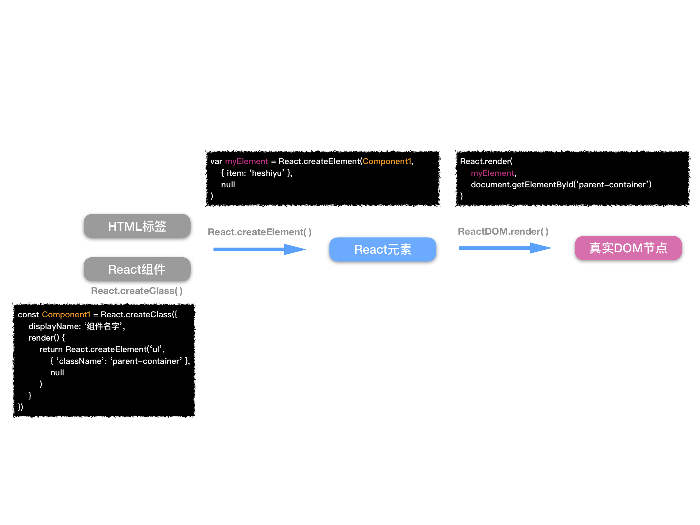

# React-基础知识

### 建立页面
在浏览器中使用React，需要引用两种类库：React、ReactDOM。
 - 前者用来创建视图；
 - ReactDOM包含在浏览器中渲染React元素必需的工具。

### 虚拟DOM
整个WEB应用程序可以只使用一个页面，并且依靠JavaScript更新用户界面。

在一个单页应用中，浏览器初始化时会载入一个HTML文档。虽然用户也可以进行网站页面导航访问，但是他们实际上仍然停留在相同的页面上。JavaScript会根据用户的交互操作销毁或者创建一个新的用户界面，使得用户感觉自己从一个页面上跳转到另一个页面，实际上用户仍然在相同的HTML页面。

虚拟DOM是由React元素组成的，实际上是一个JavaScript对象。React通过DOM API为用户尽可能高效地渲染这些变更。

### React元素
React元素是表示：应该如何创建浏览器DOM的一组指令。

通过`React.createElement`创建React元素。
```js
React.createElement(类型, 特性, 子节点)
// 参数一：元素类型：{ String | React组件 }
// 参数二：元素特性：{ Object }，（1、被当做属性添加到标签中；2、可以通过this.props读取）
// 参数三：元素的子节点：{ React元素 [, React元素...] | Array }（会被插入到 开闭标签 之间）

// 若子节点不止一个，可以有第4、第5...个参数；又或者是第3个参数是[]
```
```js
React.createElement("h1", 
    { id: "myH1", title: "myTitle" },
    "myChildren"
)
```
会渲染成实际的DOM元素：
```html
<h1 id="myH1" title="myTitle">myChildren</h1>
<!-- 注意：根元素会有data-reactroot这个属性 -->
```

`React元素的实际内容`：
```js
{
    $$typeof: Symbol(React.element),
    "type": "h1",
    "key": null,
    "ref": null,
    "props": { "id": "myH1", "title": "myTitle", "children": "myChildren" }, // 这props包含特性、子元素
    "_owner": null,
    "_store": {}
}
```

### ReactDOM
通过`ReactDOM.render`渲染一个React元素：
```js
ReactDOM.render(React元素, 挂载点)
```
```js
var dish = React.createElement("h1", 
    { id: "myH1", title: "myTitle" },
    "myChildren"
)
ReactDOM.render(dish, document.getElementById('react-container'))
```
总结：
 
 React.createElement()
 
 -> React元素

 -> ReactDOM.render

 > React中所有和DOM渲染有关的功能都移动到了ReactDOM中，因为也可以使用React来构造原生的移动应用，而浏览器只是React其中一个运行环境。

### React组件
通过`React.createClass`创建一个组件：
```js
const Component1 = React.createClass({
    displayName: '组件名字',
    render() {
        return React.createElement('ul', { 'className': 'parent-container' },
            React.createElement('li', null, "No 1"),
            React.createElement('li', null, "No 2"),
            React.createElement('li', null, "No 3")
        )
    }
})
```
随后，`组件Component1`可作`元素类型`使用：
```js
const list = React.createElement(Component1, null, null) // 此处list是一个React元素

ReactDOM.render(
    list，
    document.getElementById('react-container')
)
```

可以通过`this`关键字来访问组件实例：
```js
const Component1 = React.createClass({
    displayName: '组件名字',
    render() {
        return React.createElement('ul', { 'className': 'parent-container' }, 
            this.props.items.map((item, i) => 
                React.createElement('li', { key: i }, item))
        )
        // this.props表示 这个组件实例 的props属性（即React.createElement的第2个参数props特性）
    }
})
const list = React.createElement(Component1, { items: ['No 1', 'No 2'] }, null)

ReactDOM.render(
    list,
    document.getElementById('react-container')
)
```



### React.Component
除了`React.createClass`外，`React.Component`也可以创建新的React组件。

优点：
 - 兼容ES6
 - 支持继承

使用`React.Component`：
```js
class Component1 extends React.Component {
    // 里面的写法和React.createClass的一样（移除displayName）
    render() {
        return React.createElement('ul', { 'className': 'parent-container' }, null)
    }
}
```

### 无状态函数式组件
`无状态函数式组件`是个函数，而不是对象。

用法：
```js
// 属性参数结构（将 属性作用域 直接限定在 函数内部）
const Component1 = ({ items }) =>
    React.createElement('ul', { className: 'parent-container' },
        items.map((item, i) =>
            React.createElement('li', { key: i }, item)
        )
    )
```

### 有关渲染
`ReactDOM.render`可以保留当前DOM，适时更新需要更新的DOM元素，来达到更新UI的目的。

每次修改State后，都必须依赖`ReactDOM.render`高效地完成UI重绘的工作。

### 工厂类
#### 使用工厂类创建React元素
```js
React.DOM.h1(null, "myChild")

React.DOM.ul(
    { "className": "parent-container" }, // props特性
    React.DOM.li(null, "No 1"), // 子元素1
    React.DOM.li(null, "No 2"), // 子元素2
    React.DOM.li(null, "No 3") // 子元素3
)
```

#### 使用工厂类创建React组件
```js
const { render } = ReactDOM

// 无状态函数式组件
const Component1 = ({ items }) =>
    React.createElement('ul', { className: 'parent-container' },
        items.map((item, i) =>
            React.createElement('li', { key: i }, item)
        )
    )

const Func1 = React.createFactory(Component1)

const items = ['No 1', 'No 2']

render(
    Func1({ items }),
    document.getElementById('react-container')
)
```