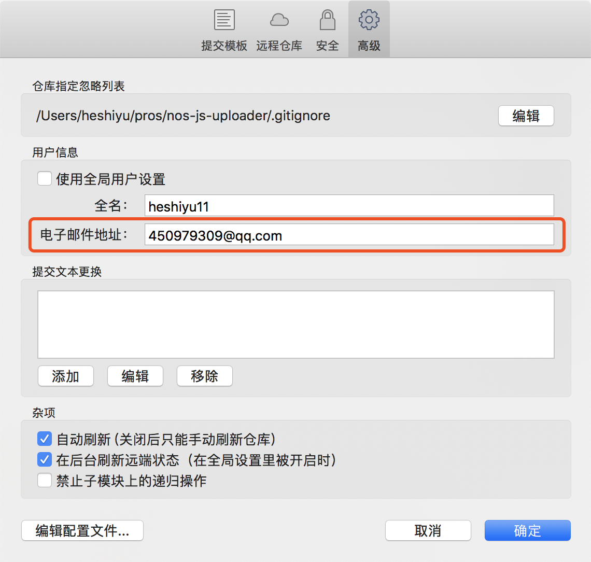

# Git
> 平时开发经常用到Git，但是有些常用的命令不太熟，列举一下吧
> 
> 更新时间： 2019-03-22

## 在github的三种信息
在github里有三种信息：`name`（昵称）、`username`（用户名）、`email`（邮箱）。
 - name：仅作github内展示用
 - username：可用来登录
 - email：可用来登录

## 在sourcetree里的配置
在sourcetree里有两种信息：`全名`、`电子邮件地址`（。
 - `全名`：仅作sourcetree内展示用
 - `电子邮件地址`：要和`github`里的email对应（否则commit log里没有头像）

## 在.gitignore里重新声明
如果一个你要忽略的文件`已经纳入到了git`，也就是说你已经提交过这个文件了。这时再在`.gitignore`文件中添加上对它的忽略是不起作用的。

解决办法：
 - 1、`git rm -r --cache .`命令来清空本地的git缓存；
 - 2、再使用：`git add .`命令来重新提交代码。

这样你要忽略的文件就不会再被提交了。