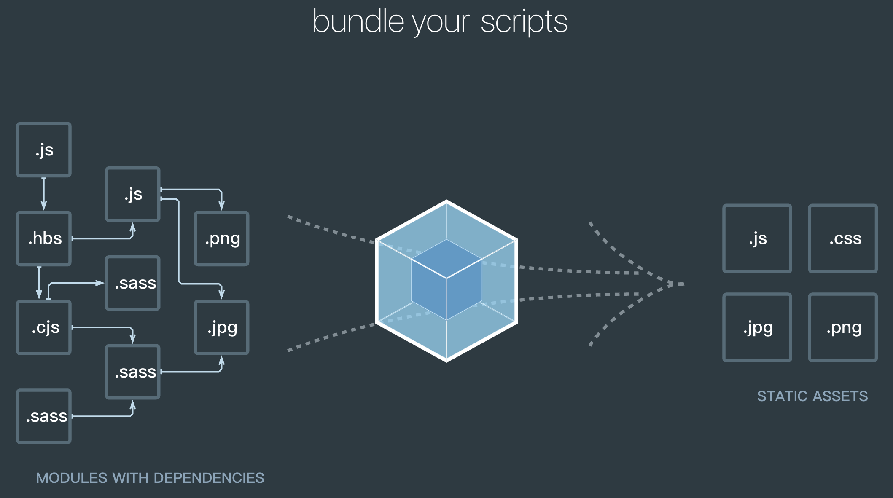

# Git
> 平时开发经常用到Git，但是有些常用的命令不太熟，列举一下吧
> 
> 更新时间： 2019-01-29

## 定义
Webpack是一个模块打包器。它通过一个给定的入口文件，然后开始找到项目中的所有依赖文件，并且借助 **loaders、plugins** 来 改变、压缩、优化它们，最后打包成一个或者多个浏览器可识别的js文件。

如果一个你要忽略的文件已经纳入到了git ，也就是说你已经提交过这个文件了。这时再在 .gitignore 文件中添加上对它的忽略是不起作用的。

你可用：git rm -r --cache .  命令来清空本地的git缓存。

再使用：git add .  命令来重新提交代码。

这样你要忽略的文件就不会在被提交了。

