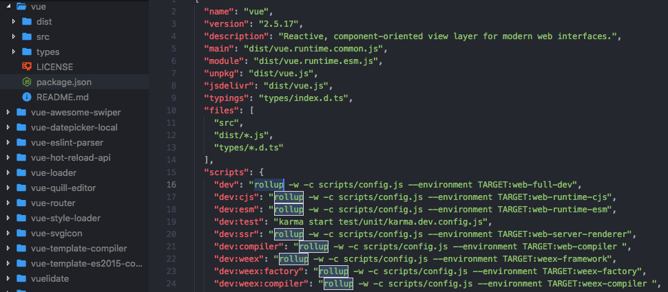

# Rollup
> Rollup和Webpack一样，也是一款打包工具。Vue、React、Three.js以及很多知名的库也在使用Rollup。那它和Webpack有什么区别啊？
> 
> 更新时间： 2019-03-24

## Webpack和Rollup的区别
### Webpack
`Webpack`是在2012年发布的，最初的目的是：`构建复杂的单页应用程序（SPA）`，所以它有两个特性：
 - **代码分离**
    - 把代码分离到不同bundle中，然后可以`按需加载`或`并行加载`这些文件。
 - **静态资源**
    - 将所有静态资源导入到应用程序中，进行处理。

[详见《Webpack》一文](./Webpack.md)

 > 打包原理：将每个模块封装在一个函数中，并将他们放在一个包中。通过浏览器的`require`实现导入，并逐一执行。

 优点：能处理所有事情。

### Rollup
`Rollup`是利用了`ES6`的模块设计，尽可能高效地构建出能够`直接`被其他js库引用的模块。

 > 打包原理：把所有代码放在同一个地方，然后一次性执行，从而生成`更简洁`、`更简单`的代码，启动更快。

 痛点：能处理大多数CommonJS文件（通过插件），但有些语法**根本不能转义为ES6**

### 选择原则：
`Webpack`一般使用与大型应用
 - 需要代码拆分
 - 需要处理很多静态资源
 - 需要引入很多CommonJS模块的依赖

`Rollup`一般使用于工具类库
 - 基于ES6模块
 - 希望他人直接能使用

## 有哪些代码库使用Rollup
Vue：

