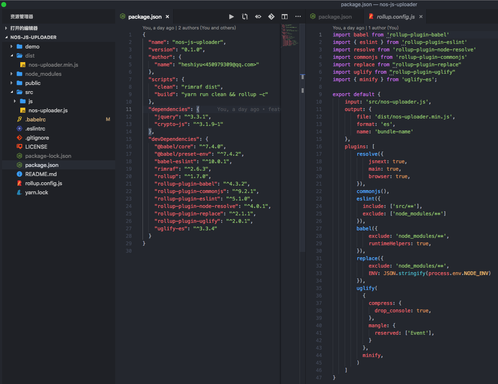

# Rollup
> Rollup和Webpack一样，也是一款打包工具。经过一番研究，在最近的一个小项目[nos-js-uploader](https://github.com/Heshiyu1996/nos-js-uploader)选用了Rollup作为打包工具。
> 
> 同时也发现Vue、React、Three.js以及很多知名的库也在使用Rollup。
> 
> 为什么要用它？怎么使用它的？有哪些库使用它？
> 
> 更新时间： 2019-03-25

我是导航条：
 - [Webpack和Rollup的区别](#Webpack和Rollup的区别)
      - [Webpack](#Webpack)
      - [Rollup](#Rollup)
      - [两者的选择原则](#两者的选择原则)
 - [开始使用Rollup](#开始使用Rollup)
   - [安装](#安装)
   - [编写配置文件rollup.config.js](#编写配置文件rollup.config.js)
   - [启动rollup](#启动rollup)
   - [常用的Rollup插件](#常用的Rollup插件)
      - [兼容CommonJS](#兼容CommonJS)
      - [使用Babel](#使用Babel)
      - [使用ESLint](#使用ESLint)
      - [用replace替换环境变量](#用replace替换环境变量)
      - [用uglify压缩](#用uglify压缩)
 - [有哪些代码库使用了Rollup](#有哪些代码库使用了Rollup)


## Webpack和Rollup的区别
### Webpack
`Webpack`是在2012年发布的，最初的目的是：`构建复杂的单页应用程序（SPA）`。

它最大的两个特性：
 - **代码分离**
    - 把代码分离到不同bundle中，然后可以`按需加载`或`并行加载`这些文件。
 - **静态资源**
    - 将所有静态资源导入到应用程序中，进行处理。

[详见《Webpack》一文](./Webpack.md)

 > 打包原理：将每个模块封装成一个函数，并将他们放在一个包中。通过浏览器的`require`实现导入，逐一执行。

 优点：能处理很多事情（包括静态资源、HTML、CSS）。

### Rollup
`Rollup`可以让开发者，将项目 **按功能** 拆分成一个个子目录。通过模块化的方式，让这些模块相互引用，通过Rollup打包成一个单独JS（即bundle）。
 > 打包原理：把所有代码放在同一个地方，然后一次性执行，从而生成`更简洁`、`更简单`的代码，启动更快。
 
 优点：
  - 只处理JS，打包速度快
  - 自动Tree-shaking（清除项目中没使用到的代码）
  - 配置简单
 
 缺点：能处理大多数CommonJS文件（通过插件），但有些语法**根本不能转义为ES6**

### 两者的选择原则：
`Webpack`一般适用于大型应用
 - 支持：代码拆分
 - 支持：处理很多静态资源
 - 支持：引入很多CommonJS模块的依赖

`Rollup`一般适用于JavaScript库
 - 基于ES6模块
 - 希望他人直接能使用

## 开始使用Rollup
### 安装
npm install -save-dev rollup

### 编写配置文件rollup.config.js
```js
// rollup.config.js
export default {
   input: 'src/main.js',
   output: {
      file: 'dist/js/main.min.js',
      format: 'umd',
      name: 'bundle-name'
   }
}
```
参数说明：
 - input：要打包的文件
 - output
   - file：输出的文件
   - format：输出的文件类型（amd | cjs | es | life | umd）
      - amd：异步模块定义（用于像RequireJS这样的模块加载器）
      - cjs：CommonJS，（适用于Node和Browserify/Webpack）
      - es：将软件包保存为ES模块文件
      - life：一个自动执行的功能，适合作为`<script>`标签
      - umd：通用模块定义，以amd、cjs和life为一体
   - name：生成包名称

### 启动rollup
一般通过`package.json`进行打包命令，其中的 `-c` 表示直接按照配置文件（`rollup.config.js`）开始打包。
```json
"scripts": {
   "build": "rollup -c"
}
```

### 常用的Rollup插件
#### 兼容CommonJS
原因：`Rollup`不能识别`CommonJS模块`，并且在npm中的大多数包都是以`CommonJS规范`进行开发。需要兼容`CommonJS`，将`CommonJS模块`转换成`ES6模块`。

解决方法：

1、`rollup-plugin-commonjs`、`rollup-plugin-node-resolve`

（会和`rollup-plugin-node-resolve`搭配使用，后者是用来**解析依赖的模块路径**）
```
npm install --save-dev rollup-plugin-commonjs rollup-plugin-node-resolve
```
2、更新`rollup.config.js`
```js
// rollup.config.js
import commonjs from 'rollup-plugin-commonjs'
import resolve from 'rollup-plugin-node-resolve'

export default {
   input: 'src/main.js',
   output: {
      file: 'dist/js/main.min.js',
      format: 'umd',
      name: 'bundle-name'
   },
   plugins: [
      resolve({
         jsnext: true, // 表示将原来的node模块转化成ES6模块
         main: true, // 决定要将第三方模块内的哪些代码打包到最终文件中
         browser: true // 同上
      }),
      commonjs()
   ]
}
```

#### 使用Babel
原因：`Rollup`不会对ES6的语法（除了ES6模块）进行编译。如果需要使用ES6的语法进行开发，还需要使用`babel`来把`ES6的代码`编译成`ES5`。

解决方法：

1、`rollup-plugin-babel`
```
npm install --save-dev rollup-plugin-babel@latest
```

2、配置`.babelrc`
```json
{
   "presets": [
      [
         "@babel/preset-env",
         {
            "modules": false
         }
     ]
   ],
   "compact": false
}
```
上面的`modules`为`true`的话，`Babel`会在Rollup处理之前，将我们模块先转成`CommonJS`，导致`Rollup`处理失败

3、更新`rollup.config.js`
```js
// rollup.config.js
import commonjs from 'rollup-plugin-commonjs'
import resolve from 'rollup-plugin-node-resolve'
import babel from 'rollup-plugin-babel'

export default {
   input: 'src/main.js',
   output: {
      file: 'dist/js/main.min.js',
      format: 'umd',
      name: 'bundle-name'
   },
   plugins: [
      resolve({
         jsnext: true, // 表示将原来的node模块转化成ES6模块
         main: true, // 决定要将第三方模块内的哪些代码打包到最终文件中
         browser: true // 同上
      }),
      commonjs(),
      babel({
         exclude: 'node_modules/**'
      })
   ]
}
```

#### 使用ESLint
解决方法：

1、`rollup-plugin-eslint`
```
npm install --save-dev rollup-plugin-eslint
```

2、配置`.eslintrc`(也可以通过`./node_modules/.bin/eslint --init`生成大多数配置)

3、更新`rollup.config.js`

```js
// rollup.config.js
import commonjs from 'rollup-plugin-commonjs'
import resolve from 'rollup-plugin-node-resolve'
import babel from 'rollup-plugin-babel'
import { eslint } from 'rollup-plugin-eslint'

export default {
   input: 'src/main.js',
   output: {
      file: 'dist/js/main.min.js',
      format: 'umd',
      name: 'bundle-name'
   },
   plugins: [
      resolve({
         jsnext: true, // 表示将原来的node模块转化成ES6模块
         main: true, // 决定要将第三方模块内的哪些代码打包到最终文件中
         browser: true // 同上
      }),
      commonjs(),
      babel({
         exclude: 'node_modules/**'
      }),
      eslint({
         include: ['src/**'],
         exclude: ['node_modules/**']
      }),
   ]
}
```
#### 用replace替换环境变量
原因：在bundle里，出现的`ENV`变量，如何做到统一根据实际值来替换？

解决方法：

1、`rollup-plugin-replace`
```
npm install --save-dev rollup-plugin-replace
```

2、更新`rollup.config.js`

```js
// rollup.config.js
import commonjs from 'rollup-plugin-commonjs'
import resolve from 'rollup-plugin-node-resolve'
import babel from 'rollup-plugin-babel'
import { eslint } from 'rollup-plugin-eslint'
import replace from "rollup-plugin-replace"

export default {
   input: 'src/main.js',
   output: {
      file: 'dist/js/main.min.js',
      format: 'umd',
      name: 'bundle-name'
   },
   plugins: [
      resolve({
         jsnext: true, // 表示将原来的node模块转化成ES6模块
         main: true, // 决定要将第三方模块内的哪些代码打包到最终文件中
         browser: true // 同上
      }),
      commonjs(),
      babel({
         exclude: 'node_modules/**'
      }),
      eslint({
         include: ['src/**'],
         exclude: ['node_modules/**']
      }),
      replace({
            exclude: 'node_modules/**',
            ENV: JSON.stringify(process.env.NODE_ENV)
            // 找到每一个 ENV ，并用 process.env.NODE_ENV 去替换
            // JSON.stringify 用来确保值是双引号的
      }),
   ]
}
```
#### 用uglify压缩
原因：减少bundle体积（通过**移除注释、缩短变量名**等）

解决方法：

1、`rollup-plugin-uglify`
```
npm install --save-dev rollup-plugin-uglify
```

2、更新`rollup.config.js`

```js
// rollup.config.js
import commonjs from 'rollup-plugin-commonjs'
import resolve from 'rollup-plugin-node-resolve'
import babel from 'rollup-plugin-babel'
import { eslint } from 'rollup-plugin-eslint'
import replace from "rollup-plugin-replace"
import uglify from "rollup-plugin-uglify"
import { minify } from 'uglify-es';

export default {
   input: 'src/main.js',
   output: {
      file: 'dist/js/main.min.js',
      format: 'umd',
      name: 'bundle-name'
   },
   plugins: [
      resolve({
         jsnext: true, // 表示将原来的node模块转化成ES6模块
         main: true, // 决定要将第三方模块内的哪些代码打包到最终文件中
         browser: true // 同上
      }),
      commonjs(),
      babel({
         exclude: 'node_modules/**'
      }),
      eslint({
         include: ['src/**'],
         exclude: ['node_modules/**']
      }),
      replace({
            exclude: 'node_modules/**',
            ENV: JSON.stringify(process.env.NODE_ENV)
            // 找到每一个 ENV ，并用 process.env.NODE_ENV 去替换
            // JSON.stringify 用来确保值是双引号的
      }),
      uglify(
         {
            compress: {
               drop_console: true,
            },
            mangle: {
               reserved: ['Event'],
            }
         },
         minify,
      )
   ]
}
```

## 有哪些代码库使用了Rollup
### Vue的底层源码
Vue的底层源码是使用`Rollup`打包的：


上面我写错了，`promise`不会返回一个bundle文件，而是一个`bundle对象`。后续可以通过`bundle.generate()、bundle.write()`来生成最终的`bundle文件`。


### 我自己的小项目



## 参考链接
[rollup.js官网](https://rollupjs.org/guide/en)

[《使用rollup打包JS的方法步骤》](https://www.jb51.net/article/152103.htm)

[《使用Rollup打包JavaScript》](https://www.jianshu.com/p/6a7413481bd2)