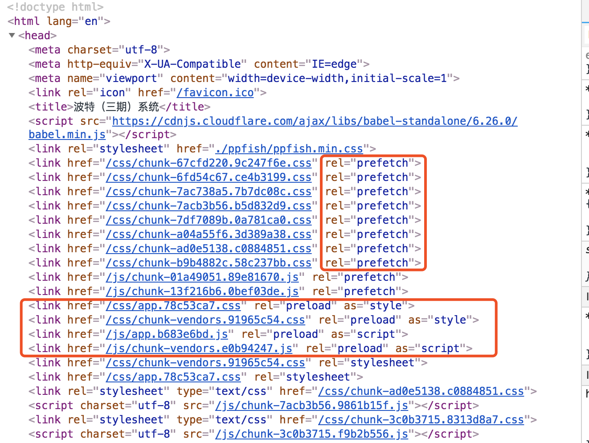

# Webpack
> Webpack

## 定义
Webpack是一个模块打包器。

给定的入口文件，然后开始找到项目中的所有依赖文件，并且借助 **loaders、plugins** 来 `改变`、`压缩`、`优化` 它们，最后打包成一个（或者多个）浏览器可识别的js文件。


## webpack的两大特性
`Webpack`是在2012年发布的，最初的目的是：`构建复杂的单页应用程序（SPA）`，所以它有两个特性：
 - **代码分离**：
    - 把代码分离到不同bundle中，然后可以`按需加载`或`并行加载`这些文件。
    - 三种常用的代码分离方法：
      - 入口起点：使用`entry`配置，进行代码分离
      - SplitChunksPlugin：可以将`公共的依赖模块`提取到已有的（或新生成的）`chunk`（webpack对于“包”叫做`chunk`）【原CommonsChunkPlugin，在webpack4已被移除】
      - 动态导入：通过模块的内联函数调用来分离
 - **静态资源**
    - 将所有静态资源导入到应用程序中，进行处理。

### [代码分离1]入口起点
```js
// webpack.config.js
const path = require('path')

module.exports = {
   entry: {
      index: './src/index.js',
      another: './src/another-module.js'
   },
   output: {
      filename: '[name].bundle.js',
      path: path.resolve(__dirname, 'dist')
   }
}
```
结果如下：会有`两个出口文件`：
```
Hash: 309402710a14167f42a8
Version: webpack 2.6.1
Time: 570ms
            Asset    Size  Chunks                    Chunk Names
  index.bundle.js  544 kB       0  [emitted]  [big]  index
another.bundle.js  544 kB       1  [emitted]  [big]  another
   [0] ./~/lodash/lodash.js 540 kB {0} {1} [built]
   [1] (webpack)/buildin/global.js 509 bytes {0} {1} [built]
   [2] (webpack)/buildin/module.js 517 bytes {0} {1} [built]
   [3] ./src/another-module.js 87 bytes {1} [built]
   [4] ./src/index.js 216 bytes {0} [built]
```

### [代码分离2]SplitChunksPlugin
```js
// webpack.config.js
const path = require('path')
const webpack = require('webpack')


module.exports = {
   entry: {
      index: './src/index.js',
      another: './src/another-module.js'
   },
   output: {
      filename: '[name].bundle.js',
      path: path.resolve(__dirname, 'dist')
   },
   optimization: {
      splitChunks: {
         chunks: 'all' // 'all'表示所有chunk都会被优化
      }
   }
}
```

`SplitChunkPlugin`知道，在`index.js`、`another.js`里有着重复的依赖模块：`lodash`，那么它的做法就是将`lodash`分离到 **单独的chunk** 中，减轻了它俩的大小。

`SplitChunkPlugin`的优势：
 - 缓存公共模块
   - 这些**公共模块**能在`最开始的时候`加载一次，随后`缓存起来`供后续使用，提升了速度。
 - 通过最小的损耗去请求资源
   - 因为文件改动时，生成的`编译文件hash值`会改变。若不将 **公共模块** 分离，则每次小改动（特别改的是**公共部分**），都会把所有内容`重新加载`一遍；如果分离，则只需重新请求这小部分的 **公共模块**，其余不变的js内容`不会重新请求`。
```
                          Asset      Size                 Chunks             Chunk Names
              another.bundle.js  5.95 KiB                another  [emitted]  another
                index.bundle.js  5.89 KiB                  index  [emitted]  index
vendors~another~index.bundle.js   547 KiB  vendors~another~index  [emitted]  vendors~another~index
Entrypoint index = vendors~another~index.bundle.js index.bundle.js
Entrypoint another = vendors~another~index.bundle.js another.bundle.js
```
### [代码分离3]动态导入
对于动态代码拆分，`webpack`提供了两种类似的技术：
 - `import()`
 - `require.ensure`（是webpack特有的，已被`import()`取代）

#### import( )

```js
const path = require('path');

module.exports = {
   mode: 'development',
   entry: {
      index: './src/index.js'
   },
   output: {
      filename: '[name].bundle.js',
      chunkFilename: '[name].bundle.js',
      path: path.resolve(__dirname, 'dist')
   }
};
```
`chunkFilename`这个属性，它决定`non-entry chunk`（非入口的chunk）的名称


```js
function getComponent() {
   return import(/* webpackChunkName: "lodash" */ 'lodash').then(({ default: _ }) => {
     var element = document.createElement('div');

     element.innerHTML = _.join(['Hello', 'webpack'], ' ');

     return element;

   }).catch(error => 'An error occurred while loading the component');
}

getComponent().then(component => {
   document.body.appendChild(component);
})
```
由于`import()`会返回一个promise，它表示的是动态地加载模块。
 - 调用`import()`的地方，会被作为`分离的模块起点`（即，**被请求的模块** 和 **它引用的所有子模块**，会分离到一个单独的chunk中）

通过注释，提供了`webpackChunkName`，这样会将拆分出来的bundle命名为：`lodash.bundle.js`

```
...
                   Asset      Size          Chunks             Chunk Names
         index.bundle.js  7.88 KiB           index  [emitted]  index
vendors~lodash.bundle.js   547 KiB  vendors~lodash  [emitted]  vendors~lodash
Entrypoint index = index.bundle.js
...
```


#### require.ensure
`require.ensure`可以实现js的`按需加载、分开打包`。
```js
require.ensure(
   dependencies: String[],
   callback: function(require),
   errorCallback: function(error),
   chunkName: String
)
```

 - `dependencies`：将其对应的文件拆分到一个单独的`bundle`中，此`bundle`会异步加载。
 - `callback`：只要加载好全部依赖，就会执行此函数。当程序运行需要依赖时，可以使用`require()`来加载依赖（require是callback的参数）
 - `errorCallback`：当webpack加载依赖失败时，会执行此函数
 - `chunkName`：通过将同一个`chunkName`传递给不用的`require.ensure()`调用，可以将这些“同名的小集体”合并到一个单独的`chunk`中，只产生一个`bundle`

```js
const home = (location, callback) => {
  require.ensure([], require => {
    callback(null, require('modules/home'))
  }, 'home')  
}
```

### 预取/预加载模块（prefetch/preload module）
> webpack v4.6.0+ 添加了预取和预加载的支持
 
 - 预取（prefetch）：`将来某些导航下`可能需要的资源
 - 预加载（preload）：`当前导航下`可能需要的资源

#### 预取（prefetch）
有一个`HomePage`组件，其内部会渲染一个`LoginButton`组件。点击`LoginButton`组件后按需加载`LoginModal`组件。

```js
// LoginButton.js

import(/* webpackPrefetch: true */ 'LoginModal');
```

 - 效果：页面头部会追加`<link rel="prefetch" href="login-modal-chunk.js">`，告诉浏览器：在空闲时，要预取`login-modal-chunk.js`文件。
 - 会在`父 chunk`加载结束后，才开始加载


#### 预加载（preload）
有一个`ChartComponent`图表组件，它需要依赖体积巨大的`ChartingLibrary`库。（为了体验性更好，它会在渲染时显示一个`LoadingIndicator（进度条）`组件，然后立即按需导入`ChartingLibrary`）

```js
// ChartComponent.js

import(/* webpackPreload: true */ 'ChartingLibrary')
```
 - 效果：页面头部会追加`<link rel="preload">`请求`chart-library-chunk`。因为`ChartComponents`体积很小，很快被加载好，页面就会显示`LoadingIndicator（进度条）`。一直等到`charting-library-chunk`请求完成，进度条才消失。

#### 预取（prefetch）和预加载（preload）的区别
|   | 加载时机 | 下载时机 | 使用时机 |
| ------ | ------ | ------ | ------ |
| `预取（prefetch）` | 父chunk加载结束后 | 在浏览器空闲时 | 会用于未来某时刻 |
| `预加载（preload）` | 父chunk加载时（并行加载） | 立即下载 | 立即请求 |

及他们的使用：

