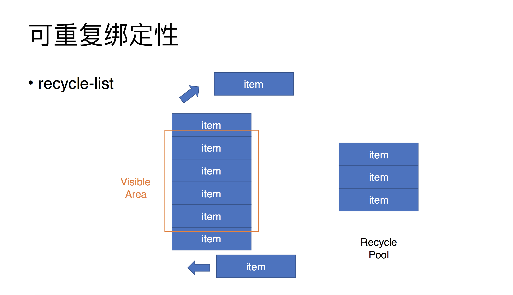

# VueConf
> 今年的Vue.js开发者大会（第二届）在杭州举办，能够把第一次留给Vue.js，完全有一种偶像就在眼前的感觉啊！所以打算随便写下一些总结分享，由于大神讲得比较快，我可能记得不太全，我尽量吧hhhhhhhh（不断更新...）
## 会议日程
* [主题演讲（演讲者：尤雨溪）](#主题演讲（演讲者：尤雨溪）)
* [挖掘Vue的声明式交互能力（演讲者：Winter）](#挖掘Vue的声明式交互能力（演讲者：Winter）)
* [我在维护Vue-cli时学到什么？（演讲者：蒋豪群）](#我在维护Vue-cli时学到什么？（演讲者：蒋豪群）)
* [<闪电>燃烧你的vue-cli（演讲者：韦元悦）](#<闪电>燃烧你的vue-cli（演讲者：韦元悦）)
* [让你的Vue应用变得易接入(演讲者：勾三股四)](#让你的Vue应用变得易接入(演讲者：勾三股四))
* [探索Vue的高级应用(AntDesignVue里的那些黑科技)(演讲者：唐金州)](#探索Vue的高级应用(AntDesignVue里的那些黑科技)(演讲者：唐金州))
* [基于Electron-Vue的桌面应用开发实践(演讲者：赵帅)](#基于Electron-Vue的桌面应用开发实践(演讲者：赵帅))
* [多端统一方案：Hippy-Vue是如何设计实现的((演讲者：旷旭卿))](#多端统一方案：Hippy-Vue是如何设计实现的((演讲者：旷旭卿)))
* [应用多端统一的实践((演讲者：卓凌))](#应用多端统一的实践((演讲者：卓凌)))


## 主题演讲（演讲者：尤雨溪）
    第一场是尤大大的远程演讲，微信视频那边的尤大大一开始听不到会场的声音有点尬，不过很幽默风趣，尤其是那一句“那我现在是不是应该说点什么？”全场哈哈哈哈~~~
先放两张图：


Vue.js 3.0的新特性：
 * 更**快**
 * 更**小**
 * 更**易于维护**
 * 更好的**多端渲染支持**
 * 其它新功能

### 更快
 * Virtural Dom全部重写，初始渲染的速度翻倍
 * js加载速度提升一倍，且内存占用减半
 * 放弃Object.defineProperty，使用更快的proxy（每个Vue组件代理其data、computed等；this就是一个组件实例的proxy）
 * 利用基于 Proxy 的观察者机制来更新数据监听，从而提高组件实例初始化的速度
 * 尽可能地在编译时(compile-time)分析压榨性能，从而减少在运行时（run-time）的开销
 * 优化slot的生成、静态内容/属性的直接提取、更友好的hint提示、对对象属性的增删、数组index/length的


### 更小
 * Tree-shaking更友好（原理大概是：无用的代码都扔掉，做到按需引入，就像一棵树上的枯叶可以抖下来）
 * run-time只占不到70kb

### 更易维护
 * 全部改用Typescript重写（以前是Flow）
 > 不但对用户、社区支持好很多，同时也降低源代码的阅读难度（因为ts的类型信息可以增大阅读性）
 * 内部模块解耦
 > 像监听器观察者（observer）、compiler-core、runtime-core这些耦合度较低的，单独存放了一个文件夹；vue文件夹里放的就是现在的前端工程项目


 * Vue 3的编译器重构


### 更好的多端渲染支持
 * 自定义Renderer API
 > 可以从`@vue/runtime-core`这个库里导出createRenderer这一API来执行类似于render(h)的操作


### 其它新功能
 * 轻松排查组件状态更新的触发原因
 > renderTriggered(event) { debugger}；
 > 其中event是具体的信息，包括oldKey、newKey、event类型等等
 * 更好的Typescript支持，包括原生classAPI和TSX
 * 更好的警告信息
 * Hooks API（作为一种逻辑复用XX，“完爆”Mixin）
 * 支持IE 11，可能不会兼容全部，但会采用降级方式或者友好的提示
 * 可以不用div作为root节点
 * 每一帧只做16~17ms的工作量，保证在大量计算下也能保证用户的操作

### 总结
总的来说，Vue3在性能方面还是改进了很多，同时也很好地支持TypeScript的语法了。当代码报错的时候不再是像目前各种debugger排查原因，而是大大提升了渲染速度、开发效率，也减小了占有内存。

Vue3.0发布时间：**19年下半年** （期待ing）

## 挖掘Vue的声明式交互能力（演讲者：Winter）
 > 主题介绍：声明式与命令式设计是Vue和React的核心区别之一，我的分享中将会从几个方面来探讨如何挖掘声明式编程的优势，分别包括：声明式与双向绑定，声明式与交互，声明式与递归

 ### “交互能力编程”包括什么
 * 图灵完备性
 * 与UI编程
 * 与UI架构
 * 与交互
 
 ### 声明式 VS 命令式
 “声明式”是指：直接想要达到某种效果，并不注重过程。`例如：HTML、CSS等`
 > 一个月后，我要看到你站在这里讲一份关于Vue的PPT

 “命令式”是指：为了达到某种效果，并且注重过程的。`例如：JS、JAVA、C++等`
 > 你先去学习Vue，上官网深入他的一些规则原理，然后做一份PPT给我

 ### 图灵完备性
 图灵完备性，表示在这个系统中写代码能够解决任何计算性的问题，也就是说**一切可计算的问题都能计算**
 `Vue.js是具有图灵完备性的`，这一点会上劭非大神分别“计算阶乘”、“计算斐波那契数列”来证明了。

 ### 可重复绑定性（recycle-list）
 类似于在可视区域滚动。当滚出可视区域后，从DOM树上摘下那些出了区域的DOM节点，放入池子中（如果池子已满则先销毁池子中的DOM节点再放入）。当下次再进来这部分的可视区域后，再从池子中把DOM节点挂到树上（实际上是再把数据绑上而已），以达到提高性能的效果。

 

 ### 与UI编程

  与UI编程的各个阶段：

  - 70年代，MVC的诞生，人们意识到**视图**是应该被**独立抽象**的

  - 80年代，标记语言大热，最开始更是与文本相关

  - 90年代，可视化编辑器出现“独立的UI代码文件”

  - 2000年，markup language + programming language

  - 2009年，“HTML5”

 ### 与UI架构
  MVC => MVP => MVVM，一脉相承的演化

  MVVM是为**声明式/多语言**量身定做的编程模型

 ### data的写法
 在演示demo时，留意到邵非大神的代码，发现他的data都是这样写的：
 ```js
 // new
 data: () => ({
     /* ... */
 })

 // old
 data() {
     return {
         /* ... */
     }
 }
 ```

 ### 总结
这一part还是属于比较干货的内容，劭非大神谦虚地说自己一个月前才学的Vue，然而像Vue一样类似的声明式语言的主要特点都是大同小异的，都是具有：“图灵完备性”、“UI编程”、“UI架构”等特点。

通过这节学到了Vue.js是具有图灵完备性的一门语言，任何可计算的问题都可以利用Vue.js本身的语法被计算出来。同时对“UI编程”的各个发展阶段，以及对“MVVM的架构”的来源有了一定的认识。

-----待更新-----


## 我在维护Vue-cli时学到什么？（演讲者：蒋豪群）
## <闪电>燃烧你的vue-cli（演讲者：韦元悦）
## 让你的Vue应用变得易接入(演讲者：勾三股四)
## 探索Vue的高级应用(AntDesignVue里的那些黑科技)(演讲者：唐金州)
## 基于Electron-Vue的桌面应用开发实践(演讲者：赵帅)
## 多端统一方案：Hippy-Vue是如何设计实现的(演讲者：旷旭卿)
## 应用多端统一的实践(演讲者：卓凌)