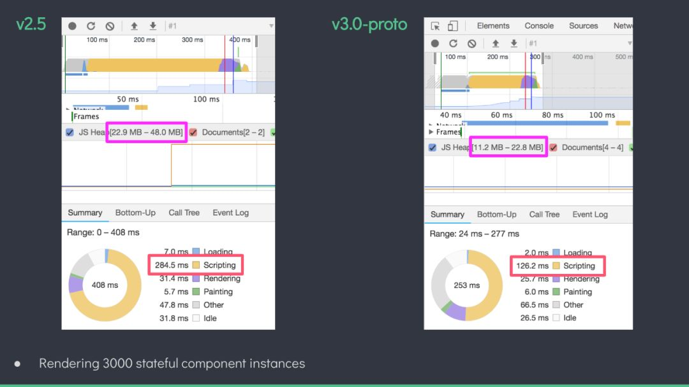

## 主题演讲（演讲者：尤雨溪）
    第一场是尤大大的远程演讲，微信视频那边的尤大大一开始听不到会场的声音有点尬，不过很幽默风趣，尤其是那一句“那我现在是不是应该说点什么？”全场哈哈哈哈~~~
先放两张图：

Vue.js 3.0的新特性：
 * 更**快**
 * 更**小**
 * 更**易于维护**
 * 更好的**多端渲染支持**
 * 其它新功能

### 更快
 * Virtural Dom全部重写，初始渲染的速度翻倍
 * js加载速度提升一倍，且内存占用减半
 * 放弃Object.defineProperty，使用更快的proxy（每个Vue组件代理其data、computed等；this就是一个组件实例的proxy）
 * 利用基于 Proxy 的观察者机制来更新数据监听，从而提高组件实例初始化的速度
 * 尽可能地在编译时(compile-time)分析压榨性能，从而减少在运行时（run-time）的开销
 * 优化slot的生成、静态内容/属性的直接提取、更友好的hint提示、对对象属性的增删、数组index/length的

### 更小
 * Tree-shaking更友好（原理大概是：无用的代码都扔掉，做到按需引入，就像一棵树上的枯叶可以抖下来）
 * run-time只占不到70kb

### 更易维护
 * 全部改用Typescript重写（以前是Flow）
 > 不但对用户、社区支持好很多，同时也降低源代码的阅读难度（因为ts的类型信息可以增大阅读性）
 * 内部模块解耦
 > 像监听器观察者（observer）、compiler-core、runtime-core这些耦合度较低的，单独存放了一个文件夹；vue文件夹里放的就是现在的前端工程项目

 * Vue 3的编译器重构

### 更好的多端渲染支持
 * 自定义Renderer API
 > 可以从`@vue/runtime-core`这个库里导出createRenderer这一API来执行类似于render(h)的操作

### 其它新功能
 * 轻松排查组件状态更新的触发原因
 > renderTriggered(event) { debugger}；
 > 其中event是具体的信息，包括oldKey、newKey、event类型等等
 * 更好的Typescript支持，包括原生classAPI和TSX
 * 更好的警告信息
 * Hooks API（作为一种逻辑复用XX，“完爆”Mixin）
 * 支持IE 11，可能不会兼容全部，但会采用降级方式或者友好的提示
 * 可以不用div作为root节点
 * 每一帧只做16~17ms的工作量，保证在大量计算下也能保证用户的操作

### 总结
总的来说，Vue3在性能方面还是改进了很多，同时也很好地支持TypeScript的语法了。当代码报错的时候不再是像目前各种debugger排查原因，而是大大提升了渲染速度、开发效率，也减小了占有内存。

Vue3.0发布时间：**19年下半年** （期待ing）
