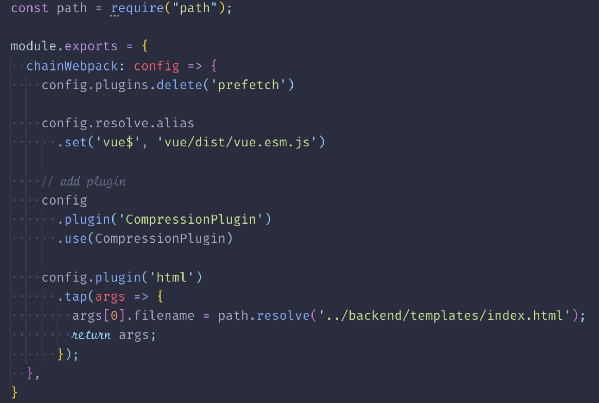

## What I Learned from Maintaining Vue CLI（演讲者：蒋豪群）
 > 主题介绍：本次演讲将给大家分享 Vue CLI 的一些设计思路、Vue 生态圈的 tooling 发展和如何更好地跟进这些新技术。

 ### The Good Old's vue init
 * Lots of incompatible templates
 * Scaffolding only
 * Eject only
 * Difficult upgrades
 
 ### Goals of CLI v3
 * Reduce configuration fatigue
 * Incorporate best practices
 * Configurable and extensible

 ### install
 ```
 yarn global remove vue-cli

 yarn global add @vue/cli
 
 // 可见：
 // 1、如果目前电脑上有老版本的vue-cli，需要先移除
 // 2、官方推荐使用yarn来安装
 ```

### start
```
vue create my-app
cd ./my-app
yarn serve
yarn build
```

### Built-in features
Webpack 4、TypeScript、Sass、Babel 7、Less、Stylus、Jest

### Zero Configuration
 * The Rise of Parcel
 * Zero Config = Better Default Configs = Best Practices

### Opinionated Choices
 * ESLint Config: Standard/ Prettier/ Airbnb
 * Test Frameworks: Mocha/ Jest/ ...

### Plugin-based Design
 * Tackle one problem at a time
 * Opt-in
 * Good for contributing

### Core Plugins
 * Transpiler: None/ Babel/ TypeScript/ TypeScript + Babel
 * PWA: workbox
 * ESLint: Airbnb/ Standard/ Prettier/ TSLint

### chainWebpack
当用户希望增加webpack的自定义配置时，可以使用**chainWebpack**


### Vue CLI 3的特点：
 * 适应vue的升级
 * 更好的错误提示
 * 更好的TypeScript支持