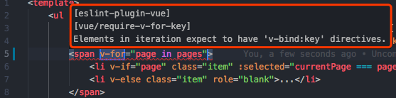
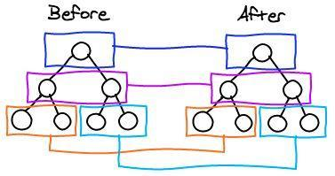
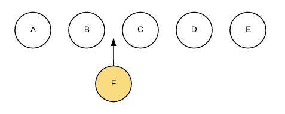
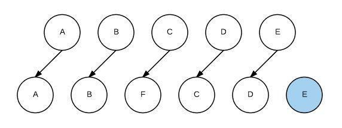
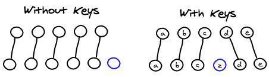

# 为什么v-for要添加唯一key？
> 记得以前刚开始学vue的时候不一定要加key，只是作为info来提示。现在越来越强调开发者需要加key，同时现在不加还会报错了。
> 
> 更新时间：2019-01-23

我是导航条：
[介绍](#介绍) -> [使用index作为key值](#使用index作为key值) -> [使用数组中不会变化的那一项作为key](#使用数组中不会变化的那一项作为key) -> [原理](#原理) -> [key的作用](#key的作用) -> [其他](#其他) -> [参考链接](#参考链接)

### 介绍
如果有一个列表已渲染了，还要往里面插入东西，那么v-for就会默认采用`就地复用`策略。也就是说，他会根据`key`值所对应的内容，来判断这个值是否修改。
 - 如果修改，则重新渲染这一项
 - 如果没修改，就复用之前的元素

#### 不加key会有什么提示？


同时会直接报错

### 使用index作为key值
```js
const list = [
    {
        id: 1,
        name: 'test1',
    },
    {
        id: 2,
        name: 'test2',
    },
    {
        id: 3,
        name: 'test3',
    }
]
```
```html
<div v-for="(item, index) in list" :key="index" >{{item.name}}</div>
```
这里是直接将 **index** 作为 key，如果对列表没有进行大改动，则没有多大影响。

#### 在最后一条数据后插入
```js
const list = [
    {
        id: 1,
        name: 'test1',
    },
    {
        id: 2,
        name: 'test2',
    },
    {
        id: 3,
        name: 'test3',
    },
    {
        id: 4,
        name: '我是在最后插入的新数据',
    }
]
```
```html
<div v-for="(item, index) in list" :key="index" >{{item.name}}</div>
```
此时还是将 **index** 作为 key，没有大问题。因为key值对应的内容没有改动

#### 在中间插入一条数据
```js
const list = [
    {
        id: 1,
        name: 'test1',
    },
    {
        id: 4,
        name: '我是在中间插入的新数据',
    },
    {
        id: 2,
        name: 'test2',
    },
    {
        id: 3,
        name: 'test3',
    }
]
```
这样就有问题了，比如：key为2、3、4对应的内容（即name）改动了，它们都要重新渲染

| before | after |
|--|--|
| key: 0, index: 0, name: test1 | key: 0, index: 0, name: test1 |
| key: 1, index: 1, name: test2 | key: 1, index: 1, name: 我是在中间插入的新数据 |
| key: 2, index: 2, name: test3 | key: 2, index: 2, name: test2 |
|   | key: 3, index: 3, name: test3 |

发现除了第一个数据可以复用以外，另外3条数据都系要 **重新渲染**

### 使用数组中不会变化的那一项作为key
```html
<div v-for="(item, index) in list" :key="item.id" >{{item.name}}</div>
```
| before | after |
|--|--|
| key: 1, index: 0, id: 1, name: test1 | key: 1, index: 0, id: 1, name: test1 |
| key: 2, index: 1, id: 2, name: test2 | key: 4, index: 1, id: 4, name: 我是在中间插入的新数据 |
| key: 3, index: 2, id: 3, name: test3 | key: 2, index: 2, id: 2, name: test2 |
|   | key: 3, index: 3, id: 3, name: test3 |

经过对比后，发现key值对应的内容，这些只有一条变化，因此 **只要渲染这一条数据就可以了**

### 原理
因为Virtual Dom使用了 **Diff算法**。
它核心是基于两个简单的假设：

1、两个相同的组件产生类似的DOM结构，不同的组件产生不同的DOM结构

2、同一层级的一组节点，他们可以通过 **唯一的id** 进行区分

基于以上两点假设，使得虚拟DOM的Diff算法的复杂度从 **O(n^3)降到了O(n)**。



当使用了`v-for`进行渲染列表节点（即某一层有很多相同的节点时），Diff算法的更新过程默认情况下也是遵循以上原则：



如果在B和C之间插入一个F，Diff算法默认执行起来是这样的（生硬地插）：



大概思路就是，C更新成F、D更新成C、E更新成D、 **最后再插入E**（注意！！是最后插入E！）十分没有效率！

所以我们需要使用`key`来给每个节点（每个坑）做一个唯一标识，（这些标识会和他要显示的内容 **相匹配**）。这样Diff就可以正确地识别此节点，从而给其他插入的新节点找到正确的位置。


### key的作用
可以高效地更新虚拟DOM

### 其他
如果在vue里使用 **相同标签名元素的过渡切换** 时，也会使用到key属性，其目的也是为了让vue可以区分它们，否则vue只会替换其内部属性而不会触发过渡效果

### 参考链接
[为什么使用v-for时必须添加唯一的key](https://wangyaxing.cn/2018/03/18/2018-03-18-%E4%B8%BA%E4%BB%80%E4%B9%88%E4%BD%BF%E7%94%A8v-for%E6%97%B6%E5%BF%85%E9%A1%BB%E6%B7%BB%E5%8A%A0%E5%94%AF%E4%B8%80%E7%9A%84key/)