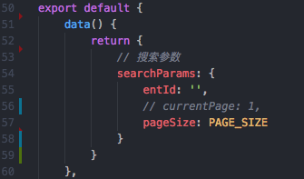

# 什么时候用Vue.set()?
> MVVM框架的特点，数据去驱动视图更新。那这个数据怎么才算数？
> 
> 更新时间：2019-02-26

### 什么时候使用？
 - 非响应式数据
 - 对数组进行改动时（利用索引修改某一项）

### 使用情况一：非响应式数据
#### 哪些数据算“响应式”？
在vue实例初始化时，在data里初始化的，这些变量都是响应式的。

如果是对象，那么他里面的属性，同样也是响应式的，他们可以`触发视图更新`，也可以`被watch到`。

如下图：



但是，`currentPage`属性就不是响应式的了，他在后面将 **不拥有触发视图更新的能力，也不能被watch监听到**。

#### 使用方法
Vue.set(target, key, value)

参数：
 - { Object | Array } target
 - { string | number } key
 - { any } value

返回值：**（没错，他也有返回值）**
 - 设置的值将会被返回

```js
Vue.set(this.searchParams, 'currentPage', 1)
```
这样做的效果是，向响应式对象`this.searchParams`添加了一个新的响应式属性`currentPage`。

但是要注意：如果添加它（`currentPage`）为响应式属性之前，就对它进行了watch，那都是不生效的。也就是说，绑定watch的这些操作要放在 **这个属性成为响应式属性 之后**

> 所以，如果一开始在data初始化时，就有标明currentPage，那后续就不用对它进行Vue.set()了


### 使用情况二：对数组进行改动时
#### 哪种改动不能被Vue检测？
 - 利用索引，修改某一项：`this.list[1] = heshiyu`

#### 使用方法
```js
Vue.set(this.list, 1, 'heshiyu') // 注意，第二个参数是Number
```


### Vue.set() 和 this.$set()
```js
import { set } from '../observer/index'
 
Vue.set = set
```
```js
import { set } from '../observer/index'
 
Vue.prototype.$set = set
```
可以看出，`Vue.set()`和`this.$set()`的实现原理是`一模一样`的。区别在于：`Vue.set()`是将set函数绑定在构造函数上，而`this.$set()`是将set函数绑定在Vue的原型上。