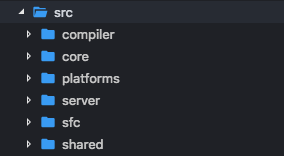
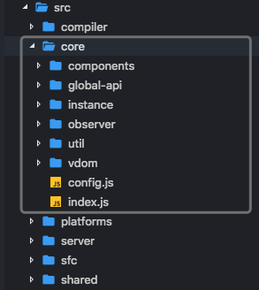
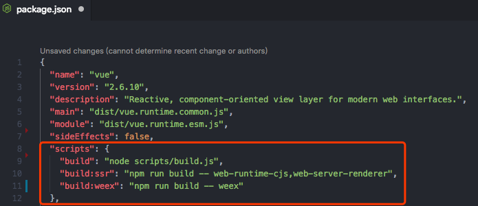
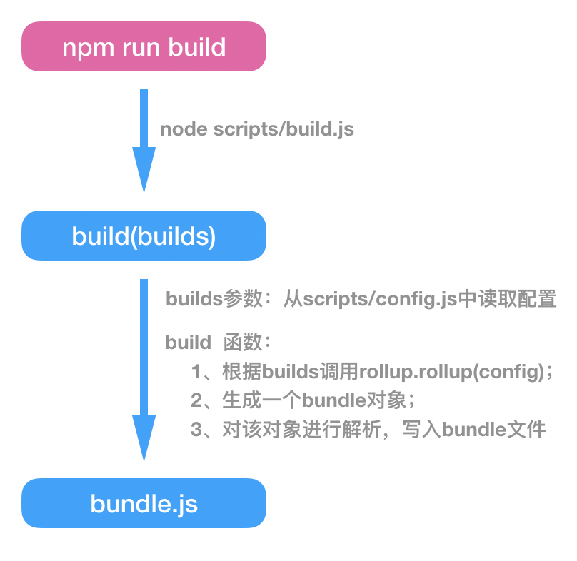
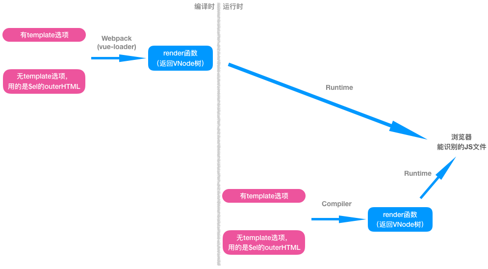
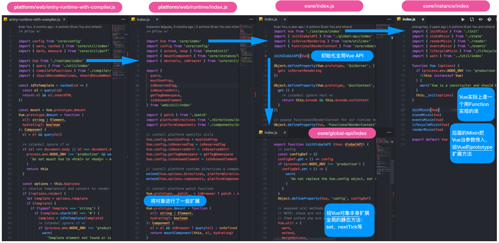

# Build
> Vue.js的源码目录设计、源码构建、两个版本的Vue.js
> 
> 更新时间： 2019-03-26

我是导航条：
 - [源码的目录结构](#源码的目录结构)
      - [compiler（编译）](#compiler（编译）)
      - [core（核心）](#core（核心）)
      - [platforms（跨平台）](#platforms（跨平台）)
      - [server（服务端渲染）](#server（服务端渲染）)
      - [sfc（解析.vue文件）](#sfc（解析.vue文件）)
      - [shared（共享的方法）](#shared（共享的方法）)
 - [源码的构建过程](#源码的构建过程)
      - [构建脚本](#构建脚本)
      - [构建过程](#构建过程)
 - [两种版本的Vue.js](#两种版本的Vue.js)
## 源码的目录结构

Vue.js的源码都在src目录下，
### compiler（编译）
主要功能：把`模板`解析成`AST语法树`、`AST语法树优化`、`代码生成`等。

编译的工作可以在 **两个时间点** 做：
 - `在构建时做`（借助**webpack、vue-loader**等）
 - `在运行时做`（使用**Runtime + Compiler版**的Vue.js）

### core（核心）
> **是Vue.js的灵魂**。

主要功能：`内置组件（components）`、`全局API封装（global-api）`、`Vue实例化（instance）`、`观察者（observer）`、`虚拟DOM（vdom）`、`工具函数（util）`等。

### platforms（跨平台）
> `Vue.js`支持跨平台：`web`、`native`（需搭配weex）

`platform`是`Vue.js`的入口，包含两个主要入口：`web`、`weex`，它们分别表示：打包成运行在 `web` 上或 `weex` 上的`Vue.js`。

### server（服务端渲染）
`server`存放着有关所有 **服务端渲染** 相关的逻辑。

`服务端渲染`的主要工作是：把`组件`渲染为`服务器端的HTML字符串`，将它们直接发送到**浏览器**。

### sfc（解析.vue文件）
`sfc`下的代码逻辑会把`.vue`文件解析成一个`JavaScript`对象

### shared（共享的方法）
`Vue.js`里定义的一些能被 `浏览器端`的Vue.js 和 `服务端`的Vue.js 所**共享**的工具方法。

## 源码的构建过程
`Vue.js`源码是基于[Rollup](./../../Tool/Rollup.md)构建的，它的构建配置都在`scripts`目录下。

### 构建脚本
由下图可知，`Vue.js`源码的构建脚本是运行`npm run build`（实际上会执行`node scripts/build.js`）。后面两条是在第一条的基础上，`添加了一些环境参数`。

### 构建过程
大致构建过程如下：

## 两种版本的Vue.js
利用`vue-cli`初始化Vue.js项目时，会询问用`Runtime Only`（运行时）版本还是`Runtime + Compiler`（运行时 + 编译器）版本：
 - `Runtime Only`（推荐）

    >只包含**运行时的Vue.js**代码
    >
    >需要**额外安装**`vue-loader`把`.vue`编译成`JavaScript`
    >
    >编译出来的vue.js**体积小**很多

 - `Runtime + Compiler`
    - Vue在`运行时`，会动态把`模板`编译成`render`函数（**耗性能**）

## Vue的构建思路总结
在web应用下，`Runtime + Compiler`版本构建出来的Vue.js的入口是在：

`src/platforms/web/entry-runtime-with-compiler.js`。
 - 也就是说，当执行`import Vue from 'vue'`，就是从 **这个入口** 执行代码来初始化Vue的。

