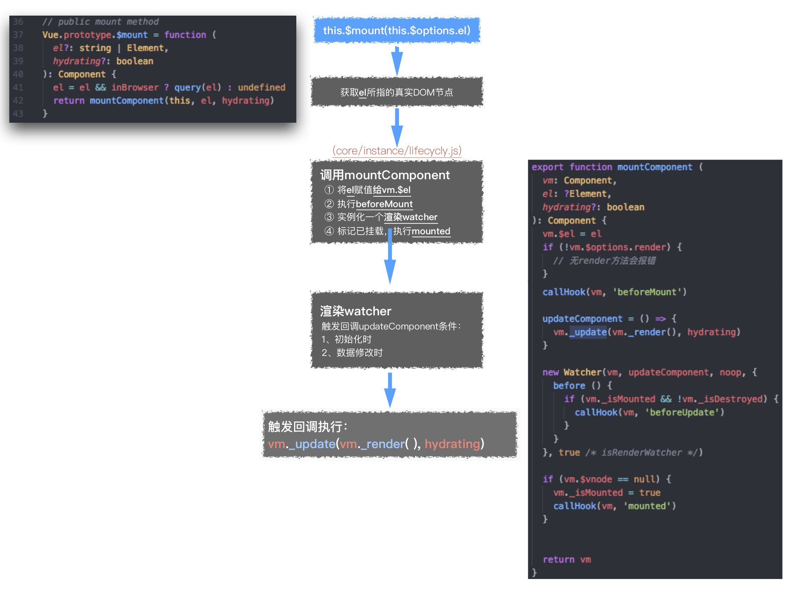
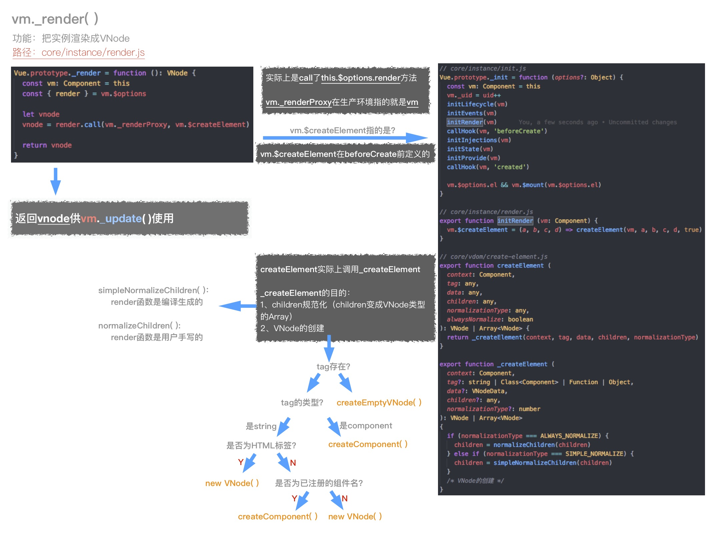
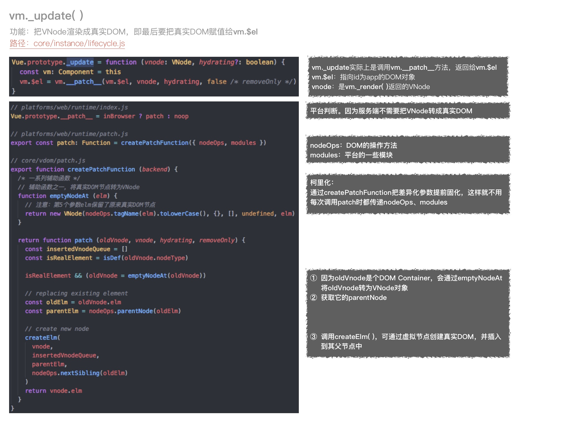
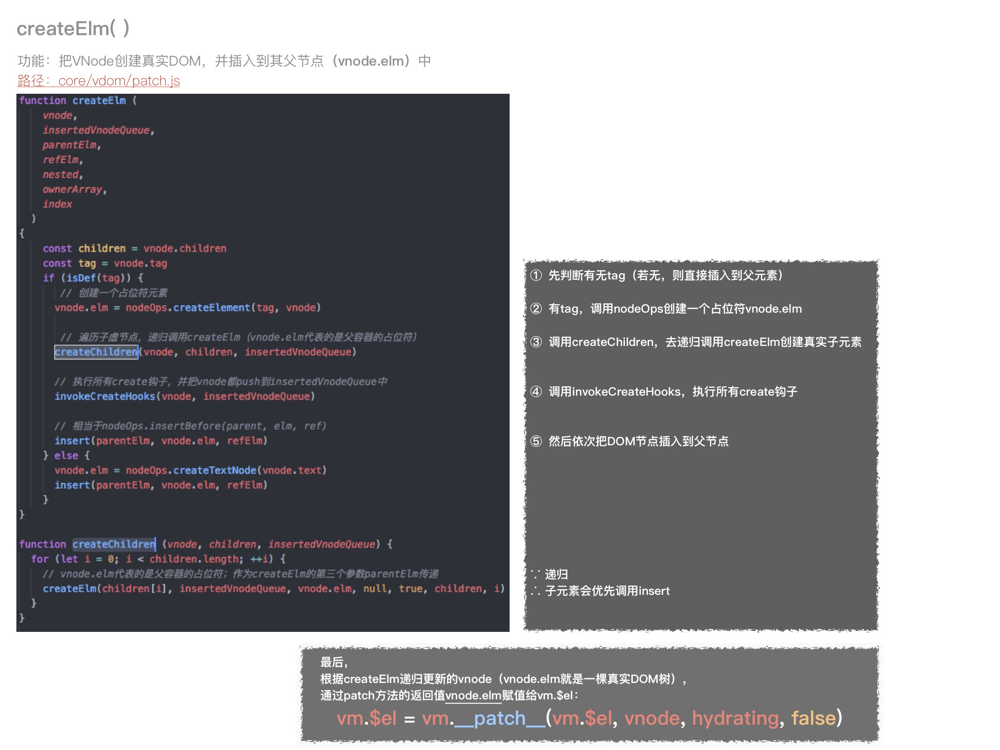

# Data Driven
> Vue.js的核心思想：数据驱动
> 
> 更新时间： 2019-03-27

数据驱动有**两部分**内容：
 - `模板（template）`和 `数据（data）`如何渲染成`最终的DOM`
 - `数据的变化`，驱动`视图的变化`（后面再介绍）

## new Vue发生了什么（如何渲染最终的DOM）
 - 执行 `new Vue()`
 ```js
 // src/core/instance/index.js
    import { initMixin } from './init'
    import { stateMixin } from './state'
    import { renderMixin } from './render'
    import { eventsMixin } from './events'
    import { lifecycleMixin } from './lifecycle'
    import { warn } from '../util/index'

    function Vue (options) {
        if (process.env.NODE_ENV !== 'production' &&
            !(this instanceof Vue)
        ) {
            warn('Vue is a constructor and should be called with the `new` keyword')
        }
        this._init(options)
    }

    initMixin(Vue)
    stateMixin(Vue)
    eventsMixin(Vue)
    lifecycleMixin(Vue)
    renderMixin(Vue)

    export default Vue
 ```

 - 执行`this._init(options)`
 ```js
 // src/core/instance/init.js
    Vue.prototype._init = function (options?: Object) {
        const vm: Component = this
        // a uid
        vm._uid = uid++

        let startTag, endTag
        /* istanbul ignore if */
        if (process.env.NODE_ENV !== 'production' && config.performance && mark) {
            startTag = `vue-perf-start:${vm._uid}`
            endTag = `vue-perf-end:${vm._uid}`
            mark(startTag)
        }

        // a flag to avoid this being observed
        vm._isVue = true
        // merge options
        if (options && options._isComponent) {
            // optimize internal component instantiation
            // since dynamic options merging is pretty slow, and none of the
            // internal component options needs special treatment.
            initInternalComponent(vm, options)
        } else {
            vm.$options = mergeOptions(
                resolveConstructorOptions(vm.constructor),
                options || {},
                vm
            )
        }
        /* istanbul ignore else */
        if (process.env.NODE_ENV !== 'production') {
            initProxy(vm)
        } else {
            vm._renderProxy = vm
        }
        // expose real self
        vm._self = vm
        initLifecycle(vm)
        initEvents(vm)
        initRender(vm)
        callHook(vm, 'beforeCreate')
        initInjections(vm) // resolve injections before data/props
        initState(vm)
        initProvide(vm) // resolve provide after data/props
        callHook(vm, 'created')

        /* istanbul ignore if */
        if (process.env.NODE_ENV !== 'production' && config.performance && mark) {
            vm._name = formatComponentName(vm, false)
            mark(endTag)
            measure(`vue ${vm._name} init`, startTag, endTag)
        }

        if (vm.$options.el) {
            vm.$mount(vm.$options.el)
        }
    }
 ```
  - 初始化：分配`uid`、合并`options`
  - 执行`init`方法（例如：initState -> initData/initProps/initMethods -> initData中，对_data作proxy -> 对data作observe）
  ```js
    // src/core/instance/state.js
    export function initState (vm: Component) {
        vm._watchers = []
        const opts = vm.$options
        if (opts.props) initProps(vm, opts.props)
        if (opts.methods) initMethods(vm, opts.methods)
        if (opts.data) {
            initData(vm)
        } else {
            observe(vm._data = {}, true /* asRootData */)
        }
        if (opts.computed) initComputed(vm, opts.computed)
        if (opts.watch && opts.watch !== nativeWatch) {
            initWatch(vm, opts.watch)
        }
    }

    function initData (vm: Component) {
        let data = vm.$options.data
        data = vm._data = typeof data === 'function'
            ? getData(data, vm)
            : data || {}
        if (!isPlainObject(data)) {
            data = {}
            process.env.NODE_ENV !== 'production' && warn(
            'data functions should return an object:\n' +
            'https://vuejs.org/v2/guide/components.html#data-Must-Be-a-Function',
            vm
            )
        }
        // proxy data on instance
        const keys = Object.keys(data)
        const props = vm.$options.props
        const methods = vm.$options.methods
        let i = keys.length
        while (i--) {
            const key = keys[i]
            if (process.env.NODE_ENV !== 'production') {
                if (methods && hasOwn(methods, key)) {
                    warn(
                        `Method "${key}" has already been defined as a data property.`,
                        vm
                    )
                }
            }
            if (props && hasOwn(props, key)) {
                process.env.NODE_ENV !== 'production' && warn(
                    `The data property "${key}" is already declared as a prop. ` +
                    `Use prop default value instead.`,
                    vm
                )
            } else if (!isReserved(key)) {
                proxy(vm, `_data`, key)
            }
        }
        // observe data
        observe(data, true /* asRootData */)
    }
    export function proxy (target: Object, sourceKey: string, key: string) {
        sharedPropertyDefinition.get = function proxyGetter () {
            return this[sourceKey][key]
        }
        sharedPropertyDefinition.set = function proxySetter (val) {
            this[sourceKey][key] = val
        }
        Object.defineProperty(target, key, sharedPropertyDefinition)
    }
  ```
  - 调用`$mount`

### initData的大致思路
 - 用两个变量（`临时变量data`、`vm._data`）来存储`data函数`返回的对象。
    - `getData`作用是，若`data是Function`，就返回data函数返回的那个对象
    - `vm._data`主要是代理时用到
 - 先拿到data里的`key`，再拿到props、methods拿到`key`。要保证让他们不能冲突（因为最终都会挂载到`vm`这个实例上，通过`this`可以访问到）
 - 再对那些`不冲突data里的属性`调用：`proxy(vm, '_data', key)`
 - 在`proxy`里，通过`defineProperty`，对`vm`这个对象`新增一个key属性`，并将它的`属性描述`里的getter、setter指向`this[sourceKey][key]`里的getter、setter。这样做是为了使得访问`this.name`可以拿到`this._data.name`，也就是`this.$options.data`

## Vue实例挂载的实现
### 首先是$mount方法
`vm.$mount`挂载的目标，就是把 **模板** 渲染成 **最终的DOM**。








