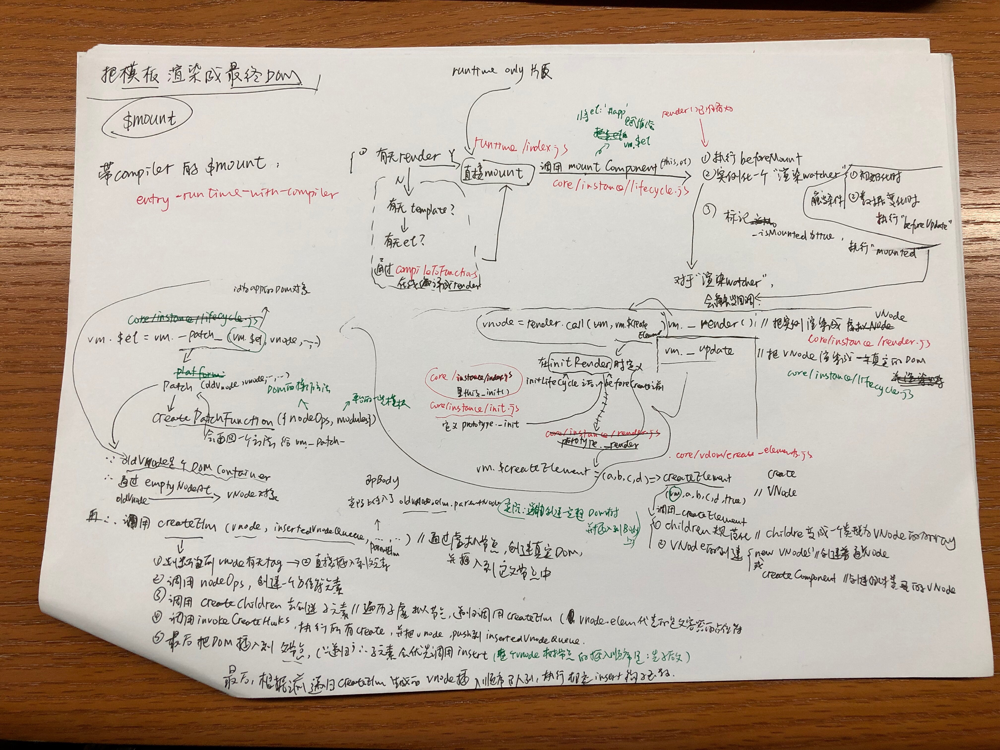

# Data Driven
> Vue.js的核心思想：数据驱动
> 
> 更新时间： 2019-04-04

数据驱动有**两部分**内容：
 - `模板（template）`和 `数据（data）`如何渲染成`最终的DOM`
 - `数据的变化`，驱动`视图的变化`（后面再介绍）

## new Vue发生了什么（如何渲染最终的DOM）

### initData的大致思路
 - 用两个变量（`临时变量data`、`vm._data`）来存储`data函数`返回的对象。
    - `getData`作用是，若`data是Function`，就返回data函数返回的那个对象
    - `vm._data`主要是代理时用到
 - 先拿到data里的`key`，再拿到props、methods拿到`key`。要保证让他们不能冲突（因为最终都会挂载到`vm`这个实例上，通过`this`可以访问到）
 - 再对那些`不冲突data里的属性`调用：`proxy(vm, '_data', key)`
 - 在`proxy`里，通过`defineProperty`，对`vm`这个对象`新增一个key属性`，并将它的`属性描述`里的getter、setter指向`this[sourceKey][key]`里的getter、setter。这样做是为了使得访问`this.name`可以拿到`this._data.name`，也就是`this.$options.data`

## Vue实例挂载的实现
### 挂载前说一下
在`/public/index.html`下，会有个`

`这个dom节点。那么这个节点就是 **下面要展开一系列挂载过程** 的一个挂载点。

细心发现，`app.vue`里面也有一个`

`。实际上组件里的这个`id="app"`，`app`也可以换成其他的，也不影响使用。它是起到 **障眼法（即看起来和挂载前的DOM节点一样）** 的作用

### 首先是$mount方法
`vm.$mount`挂载的目标，就是把 **模板** 渲染成 **最终的DOM**。

【前情提要】`compoler`版本的`$mount`会先缓存原型上的`$mount`，最后调用`mount.call(this, el)`。只是中间加入了一些判断，使得`el`或者`template`都能符合规范地转成`render`方法（通过“在线编译”——`compileToFunctions方法`）

附草稿：

