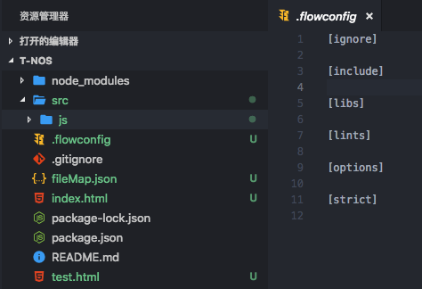
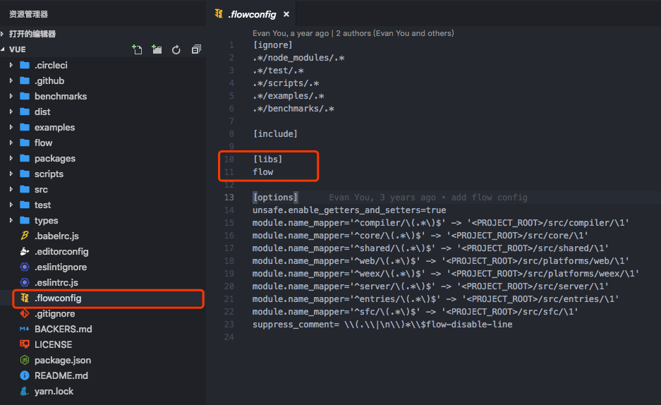
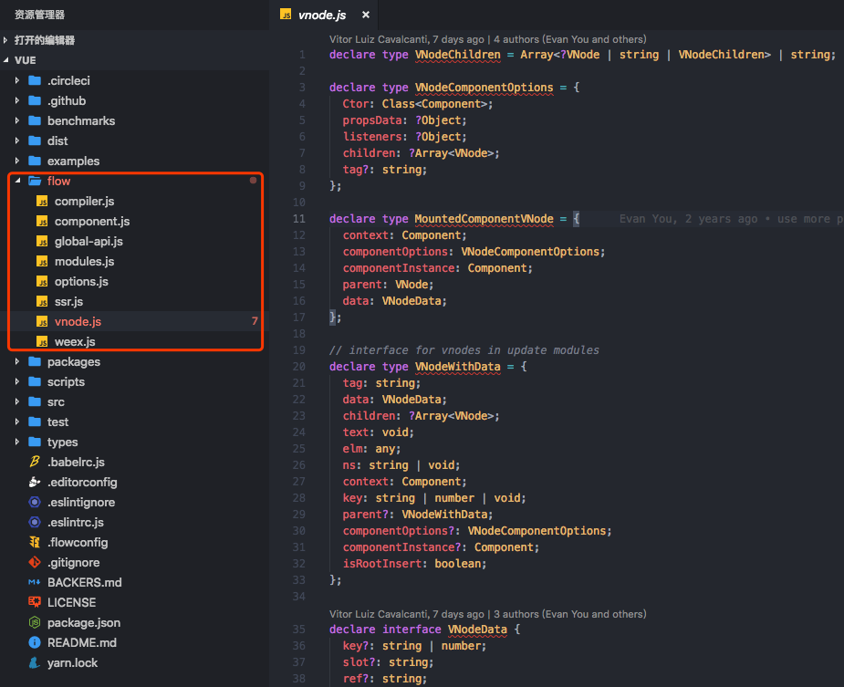
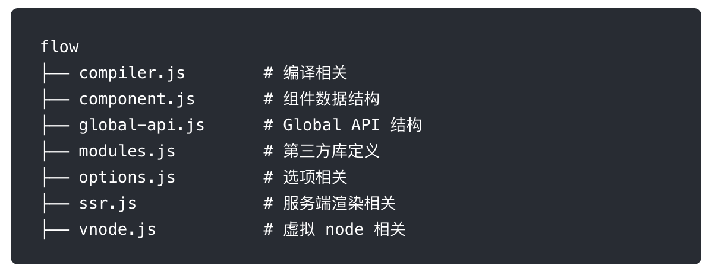

## flow
> Vue.js 在做 2.0 重构的时候，在 ES2015 的基础上，除了 ESLint 保证代码风格之外，也引入了 Flow 做静态类型检查。之所以选择 Flow，主要是因为 Babel 和 ESLint 都有对应的 Flow 插件以支持语法，可以完全沿用现有的构建配置，非常小成本的改动就可以拥有静态类型检查的能力。
> 
> 更新时间： 2019-03-25

首先在文件开头声明`/*@flow*/`，意思是`需要flow来检查这个文件`（否则会跳过）

### 安装Flow
 - 安装Flow
> npm install -g flow-bin

 - 随后，通过`flow init`来创建`.flowconfig`文件
> flow init



 - 直接执行`flow`（若`.flowconfig`里什么都没配置，就是检查当前文件夹下的js文件）

### 两种工作方式
#### 类型推断：通过变量的使用上下文去推断变量类型，然后根据这些推断来检查类型
 ```js
 /*@flow*/

function split(str) {
  return str.split(' ')
}

split(11)
 ```
#### 类型注释：实现注释号我们期待的类型，Flow会基于这些注释来判断
 ```js
 /*@flow*/

function add(x: number, y: number): number {
  return x + y
}

add('Hello', 11)
 ```
**常见的类型注释有哪些？**
 - 数组（注释的格式`Array<T>`，其中`T`代表数组中每项的数据类型）
 ```js
 /*@flow*/
 var arr: Array<number> = [1, 2, 3]
 ```
 - 类和对象
 ```js
 /*@flow*/
 class Bar {
   // 1、类型检查——类的自身属性
   x: string
   y: string | number
   z: boolean

   // 2、类型检查——构造函数的参数
   constructor(x: string, y: string | number) {
     this.x = x
     this.y = y
     this.z = false
   }
 }

 var bar: Bar = new Bar('hello', 4)

   // 3、类型检查——对象的属性
 var obj: { 
   a: string, 
   b: number, 
   c: Array<string>,
   d: Bar 
  } = {
    a: 'Hello',
    b: 11,
    c: ['Hello', 'world'],
    d: new Bar('hello', 3)
  }
 ```
 - Null
 任意类型`T`可以为`null`或`undefined`
 ```js
 /*@flow*/
 var foo: ?string = null
 ```
 在这里，`foo`可以为字符串，也可以为`null`。

### 类型校验——自定义类型
在Vue.js的主目录下有`.flowconfig`文件，它是Flow的配置文件：



在`[libs]`里声明了`flow`，即对应的是`flow文件夹`





